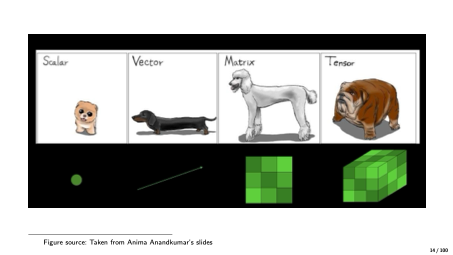
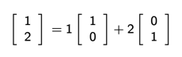
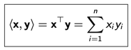
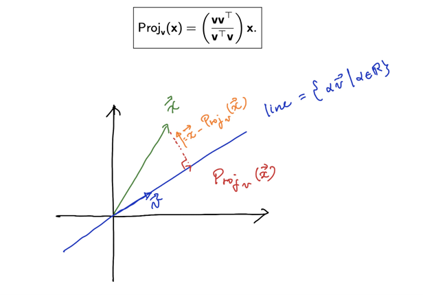

# 1일차 - 25년 7월 4일

## 선형대수학
- 연립방정식 소개


## 머신러닝에서 선형대수 중요 이유
- 데이터는 벡터와 행렬의 형태로 표현됩니다.
- 모델은 입력과 출력을 연결하며, 이러한 관계는 종종 선형 방정식으로 나타납니다.
- 이러한 선형 방정식 역시 벡터와 행렬의 형태로 표현됩니다.
- 예시로는, 표현 학습을 위한 저차원 임베딩, 스펙트럴 학습 등이 있습니다.


## 백터
``` 
Scalar (R): x - 하나의 숫자
Vector (Rn ): x (xi ) - 여러개의 숫자 모음
Matrix (Rm×n ): X (Xi ,j ) - 여려개의 벡토 모음
Tensor (Rm×n×k×···): X (Xi ,j,k ) - 3D 맥트리스
```


- Physicist(물리학자) : 화살표

### 기본 백터

``` 
3 열 백터

x = [ 1 ]
    [ 5 ]
    [ -1 ]


3행 백터

X^T = [1, 5, -1]
```

### 벡터 공간

```
Definition
A vector space, denoted by V, is a collection of objects, called vectors, which is closed under
vector addition (+) and scalar multiplication (·), such that the following axioms hold for any
x,y,z ∈Vand α,β ∈R:
- x + y ∈Vand αx ∈V(closed under vector addition and scalar multiplication)

- x + y= y + x (commutativity)
- x + (y + z) = (x + y) + z (associativity)
- α(x + y) = αx + αy and (α+ β)x = αx + βx (distributivity)
- ∃0 ∈Vsuch that 0 + x = x and 1x = x (identity element)
- for any x ∈V, ∃(−x) ∈Vsuch that x + (−x) = 0 (inverse element)
```


### Matrix (행렬)
1. 행렬(Matrix): 2개의 숫자 배열 혹은 벡터 모음 
- Images
- User-item matrices
- Sensor readings over time
2. 행렬(Matrix): 함수 - 선형변환( linear transformation ): y= Ax.


### Inverse (A⁻¹) and Transpose (Aᵀ)

``` 

정의 1: 역행렬 (Inverse)

정방행렬 A ∈ ℝⁿˣⁿ에 대해, 행렬 B ∈ ℝⁿˣⁿ가
AB = BA = I 를 만족할 때,
이 B를 A의 역행렬(inverse) 이라고 하며,
기호로는 A⁻¹로 표기합니다.

⸻

정의 2: 전치행렬 (Transpose)

A ∈ ℝᵐˣⁿ인 행렬에 대해,
B ∈ ℝⁿˣᵐ이며 각 원소가 bᵢⱼ = aⱼᵢ인 경우,
이 B를 A의 전치행렬(transpose) 이라고 하며,
기호로는 Aᵀ로 표기합니다.

```

### 🔁 역행렬 (Inverse)의 성질
- AA^{-1} = A^{-1}A = I
  → 역행렬과의 곱은 항등행렬이 된다.
- )^{-1} = B^{-1}A^{-1}
  → 곱의 역행렬은 각 역행렬의 역순 곱이다.
- (A + B)^{-1} \ne A^{-1} + B^{-1}
  → 행렬의 합의 역행렬은 각각의 역행렬의 합과 같지 않다.

⸻

### 🔁 전치행렬 (Transpose)의 성질
- (A^\top)^\top = A
   → 전치의 전치는 원래 행렬이다.
- (A + B)^\top = A^\top + B^\top
   → 덧셈의 전치는 각 항의 전치의 합이다.
- (AB)^\top = B^\top A^\top
   → 곱의 전치는 각 항의 전치의 역순 곱이다.

## Rank 
- 행렬에서 선형적으로 독립적인 행 OR 열의 최대 개수
- RANK(A) = RANK(A^\top) 

## Norm
- 벡터 크기 측정, 벡터 거리, 두개의 백터 비교 할때 방법
- 벡터 크기를 측정하는 역할이다.

### ◼️ 유클리드 노름 (Euclidean norm, ℓ₂ norm)
- 수식:
``` 
‖x‖₂ = √(x₁² + x₂² + ... + xₙ²) = √(xᵀx)
```

- 의미: 벡터의 직선 거리(유클리드 거리)
-  피타고라스 정리에 기반한 거리 계산 방식

### ◼️ 맨해튼 노름 (Manhattan norm, ℓ₁ norm)
- 수식:
``` 
‖x‖₁ = |x₁| + |x₂| + ... + |xₙ|
```

- 의미: 각 축 방향으로 이동한 거리의 총합 (도시의 격자길을 걷는 느낌)
-  희소성(sparsity)을 유지하기 위해 자주 사용됨 (예: L1 정규화)

### Dot product in R^n 
- 중요한 부분 외우기



```latex
\langle \mathbf{x}, \mathbf{y} \rangle = \mathbf{x}^\top \mathbf{y} = \sum_{i=1}^{n} x_i y_i
```

## Orthogonality
- 직교셩 
- 두 벡터 X와 Y가 다음 조건 만족시 두 벡터는 직교하다.
```
⟨x, y⟩ = 0  ⟺  x ⊥ y
```

- 정규직교 (orthogonality)
``` 
‖x‖ = ‖y‖ = 1
```

### Orthogonality Projections
- 



### Projection
- 

