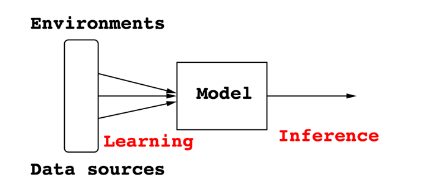
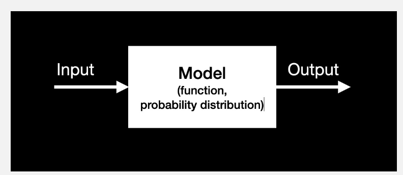

# 2일차 - 25년 7월 2일


## AI 발전사

- Aitificial Intelligence (인공지능)
- Machine Learning (머신러닝)
- Deep Learning (딥러닝)

> AI는 말이 AI지 실제로는 Machine Learning, Deep Learning??


## 머신러닝(ML) 관련 수학(Math)

- 책 참조 : MATHEMATICS FOR MACHINE LEARNING


## 머신러닝(Machine Learning)



- Learning (or training): 학습 데이터를 이용한 모델 학습 (직접 배운다.)
- Inference (about unknowns): 테스트 데이터에 대한 추론 (모르는 것의 대해 답을 준다.)

> 설명: 환경과 데이터 자원을 배워서 모델로 주입시키고 이후 답을 준다.


### 머신러닝 3요소

- Data (데이터)
- Models (모델): 함수라고 표현한다.
```LaTeX
Functions \( f_\theta(x) \) or probability distributions \( p_\theta(y \mid x) \)
```



>> The model receives **Input**, processes it using a **Function** or **Probability Distribution**, and produces an **Output**.
- Algorithms: A(data) = model
\( \mathcal{A}(\text{data}) = \text{model} \)

#### 머신러닝 모델 선택 시 데이터의 유형에 따라 모델의 종류(패밀리)를 결정한다. 
- **Tabular data**: 엑셀이나 데이터베이스처럼 행과 열로 정리된 데이터 → Decision Trees, Gradient Boosting, Linear Models 등 사용
- **Image, text, or audio data**: 비정형 데이터 → CNN, RNN, Transformer, 또는 딥러닝 기반 모델 사용


### Tabular Data for Regression (Tabular Data 회귀)

|     | crim     | zn   | indus | chas | nox  | rm    | age   | dis    | rad | tax | ptratio | black   | lstat | medv |
|-----|----------|------|-------|------|------|-------|-------|--------|-----|-----|---------|---------|--------|------|
| 189 | 0.08370  | 45.0 | 3.44  | 0    | 0.437| 7.185 | 38.9  | 4.5667 | 5   | 398 | 15.2    | 396.90  | 5.39   | 34.9 |
| 310 | 2.63548  | 0.0  | 9.90  | 0    | 0.544| 4.973 | 37.8  | 2.5194 | 4   | 304 | 18.4    | 350.45  | 12.64  | 16.1 |
| 147 | 2.36862  | 0.0  | 19.58 | 0    | 0.871| 4.926 | 95.7  | 1.4608 | 5   | 403 | 14.7    | 391.71  | 29.53  | 14.6 |
| 471 | 4.03841  | 0.0  | 18.10 | 0    | 0.532| 6.229 | 90.7  | 3.0993 | 24  | 666 | 20.2    | 395.33  | 12.87  | 19.6 |
| 410 | 51.13580 | 0.0  | 18.10 | 0    | 0.597| 5.757 | 100.0 | 1.4130 | 24  | 666 | 20.2    | 2.60    | 10.11  | 15.0 |
| 445 | 10.67180 | 0.0  | 18.10 | 0    | 0.740| 6.459 | 94.8  | 1.9879 | 24  | 666 | 20.2    | 43.06   | 23.98  | 11.8 |
| 83  | 0.03551  | 25.0 | 4.86  | 0    | 0.426| 6.167 | 46.7  | 5.4007 | 4   | 281 | 19.0    | 390.64  | 7.51   | 22.9 |
| 457 | 8.20058  | 0.0  | 18.10 | 0    | 0.713| 5.936 | 80.3  | 2.7792 | 24  | 666 | 20.2    | 3.50    | 16.94  | 13.5 |
| 225 | 0.52693  | 0.0  | 6.20  | 0    | 0.504| 8.725 | 83.0  | 2.8944 | 8   | 307 | 17.4    | 382.00  | 4.63   | 50.0 |
| 212 | 0.21719  | 0.0  | 10.59 | 1    | 0.489| 5.807 | 53.8  | 3.6526 | 4   | 277 | 18.6    | 390.94  | 16.03  | 22.4 |


### 📌 Machine Learning Taxonomy (기계학습 분류 체계)

기계학습은 피드백 방식과 목표에 따라 다음과 같이 분류된다.

| 유형                           | 피드백 종류                   | 목표                                       | 주요 키워드                  |
|--------------------------------|-------------------------------|--------------------------------------------|-------------------------------|
| Supervised Learning (지도학습) | Instructive feedback (정답 제공)   | Regression & Classification (예측, 분류)     | 공연 선호 예측 등             |
| Unsupervised Learning (비지도학습) | No feedback (피드백 없음)       | Representation & Clustering (특징추출, 군집화) | 아티스트 유형 군집화 등       |
| Reinforcement Learning (강화학습) | Evaluative feedback (보상 기반) | Sequential Decision Making (의사결정)       | 추천 최적화, 행동 전략 학습 등 |


#### 🔹 추가 개념

- **Semi-supervised Learning**
  - 일부만 정답(라벨) 있음
  - 예: 100개 중 10개 라벨 → 나머지 추정
- **Self-supervised Learning**
  - 스스로 학습을 위한 문제 생성 (라벨 없음)
  - 예: GPT처럼 일부 가려진 입력 예측

#### 🎯 Clnewze 사업 연결 예시

| 알고리즘 유형        | 활용 예 |
|---------------------|---------|
| 지도학습 (Supervised) | 악보 장르 분류, 공연 추천, 사용자 선호 예측 |
| 비지도학습 (Unsupervised) | 유저 유형 군집화, 공연 클러스터링 |
| 강화학습 (Reinforcement) | 추천 최적화, 광고 노출 전략 학습 |


#### ✅ 요약

- 지도학습: 라벨 있는 데이터 → 예측/분류  
- 비지도학습: 라벨 없는 데이터 → 패턴/군집  
- 강화학습: 보상 기반 → 최적 행동 유도

➡️ Clnewze 플랫폼에서는 지도 + 비지도 학습이 주가 될 것이며,  
   추후 강화학습은 사용자 맞춤 추천 최적화에 고려할 수 있음.


### Resurgence of Deep Learning (딥러닝 부활)

- 딥러닝은 2006년 Hinton 등의 논문 이후 본격적인 성능 향상과 함께 재조명됨.
  > Hinton et al. (2006), "A fast learning algorithm for deep belief nets"

### Deep Neural Networks (DNNs)

#### ✅ 수식 구조

- 딥러닝의 기본은 여러 층(Layer)을 가진 신경망
- 수식 예:
``` 
f(xₙ; W) = softmax(W³ φ(W² φ(W¹ xₙ)))
```
- `W¹`, `W²`, `W³`: 각 층의 가중치
- `φ`: 활성화 함수 (ReLU 등)
- `softmax`: 출력층에서 확률 값으로 변환

#### ✅ 구조 설명

- 입력(Input) → 은닉층(Dense #1, #2) → 출력(Softmax)
- 각 노드는 앞 층과 완전히 연결됨 (Fully-connected)

#### 🔹 딥러닝 아키텍처 종류

| 모델 | 용도 |
|------|------|
| **Fully-connected nets** | 회귀, 분류 문제 (기본 DNN 구조) |
| **Convolutional Neural Networks (CNNs)** | 이미지 분석 |
| **Recurrent Neural Networks (RNNs), LSTM** | 시계열, 음성, 텍스트 데이터 |
| **Transformer** | 자연어 처리, 시퀀스 전체 병렬 학습 |

---

#### 🎯 클뉴즈/음악 플랫폼에서의 응용 가능성

| 구조 | 활용 예 |
|------|---------|
| DNN / Fully-connected | 공연 예매 수요 예측, 전문가 매칭 |
| CNN | 악보 이미지 인식/변환 |
| RNN, LSTM | 악보 재생, 사용자 피드백 기반 시퀀스 예측 |
| Transformer | 사용자 행동 기반 공연 추천, 챗봇, 문맥 기반 태그 예측 |
