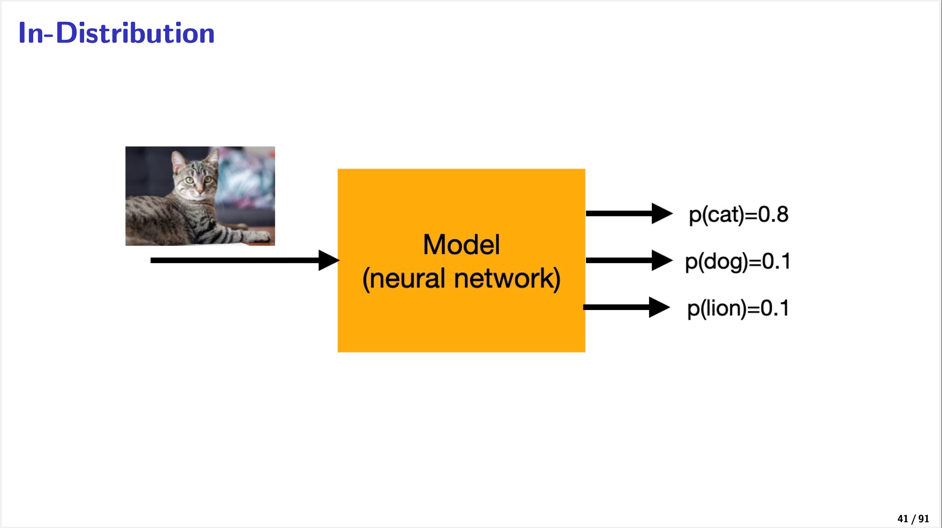
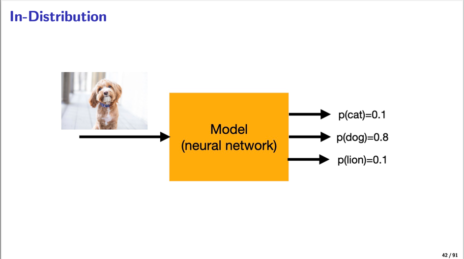
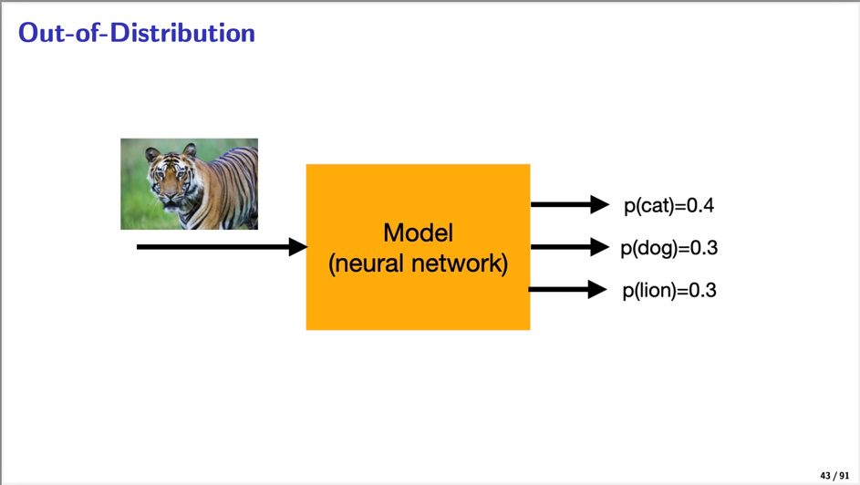
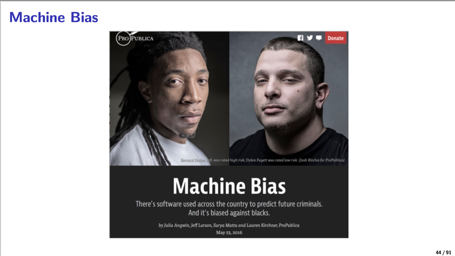
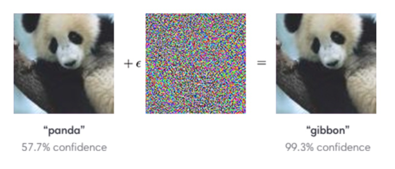
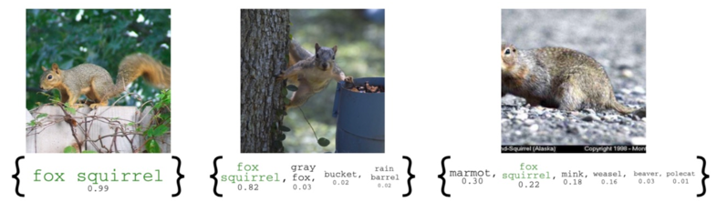
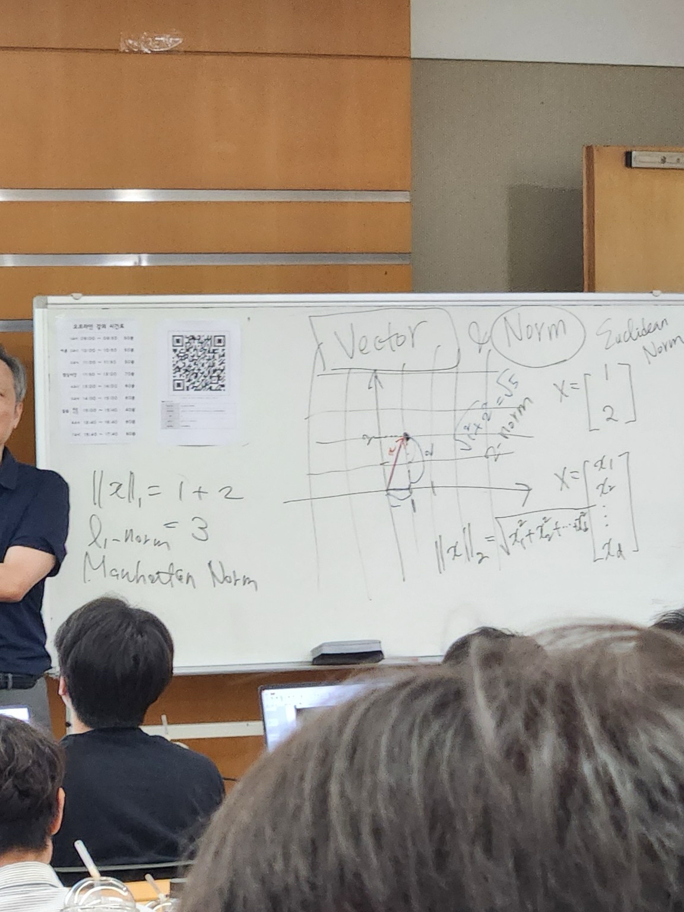
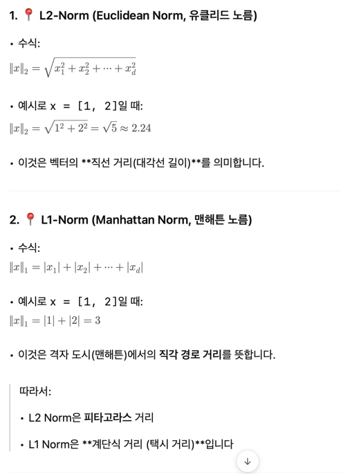

# 2일차 - 25년 7월 2일


## AI 발전사

- Aitificial Intelligence (인공지능)
- Machine Learning (머신러닝)
- Deep Learning (딥러닝)

> AI는 말이 AI지 실제로는 Machine Learning, Deep Learning??


## 머신러닝(ML) 관련 수학(Math)

- 책 참조 : MATHEMATICS FOR MACHINE LEARNING


## 머신러닝(Machine Learning)


- Learning (or training): 학습 데이터를 이용한 모델 학습 (직접 배운다.)
- Inference (about unknowns): 테스트 데이터에 대한 추론 (모르는 것의 대해 답을 준다.)

> 설명: 환경과 데이터 자원을 배워서 모델로 주입시키고 이후 답을 준다.


### 머신러닝 3요소

- Data (데이터)
- Models (모델): 함수라고 표현한다.
```LaTeX
Functions \( f_\theta(x) \) or probability distributions \( p_\theta(y \mid x) \)
```


>> The model receives **Input**, processes it using a **Function** or **Probability Distribution**, and produces an **Output**.
- Algorithms: A(data) = model
\( \mathcal{A}(\text{data}) = \text{model} \)

#### 머신러닝 모델 선택 시 데이터의 유형에 따라 모델의 종류(패밀리)를 결정한다. 
- **Tabular data**: 엑셀이나 데이터베이스처럼 행과 열로 정리된 데이터 → Decision Trees, Gradient Boosting, Linear Models 등 사용
- **Image, text, or audio data**: 비정형 데이터 → CNN, RNN, Transformer, 또는 딥러닝 기반 모델 사용


### Tabular Data for Regression (Tabular Data 회귀)

|     | crim     | zn   | indus | chas | nox  | rm    | age   | dis    | rad | tax | ptratio | black   | lstat | medv |
|-----|----------|------|-------|------|------|-------|-------|--------|-----|-----|---------|---------|--------|------|
| 189 | 0.08370  | 45.0 | 3.44  | 0    | 0.437| 7.185 | 38.9  | 4.5667 | 5   | 398 | 15.2    | 396.90  | 5.39   | 34.9 |
| 310 | 2.63548  | 0.0  | 9.90  | 0    | 0.544| 4.973 | 37.8  | 2.5194 | 4   | 304 | 18.4    | 350.45  | 12.64  | 16.1 |
| 147 | 2.36862  | 0.0  | 19.58 | 0    | 0.871| 4.926 | 95.7  | 1.4608 | 5   | 403 | 14.7    | 391.71  | 29.53  | 14.6 |
| 471 | 4.03841  | 0.0  | 18.10 | 0    | 0.532| 6.229 | 90.7  | 3.0993 | 24  | 666 | 20.2    | 395.33  | 12.87  | 19.6 |
| 410 | 51.13580 | 0.0  | 18.10 | 0    | 0.597| 5.757 | 100.0 | 1.4130 | 24  | 666 | 20.2    | 2.60    | 10.11  | 15.0 |
| 445 | 10.67180 | 0.0  | 18.10 | 0    | 0.740| 6.459 | 94.8  | 1.9879 | 24  | 666 | 20.2    | 43.06   | 23.98  | 11.8 |
| 83  | 0.03551  | 25.0 | 4.86  | 0    | 0.426| 6.167 | 46.7  | 5.4007 | 4   | 281 | 19.0    | 390.64  | 7.51   | 22.9 |
| 457 | 8.20058  | 0.0  | 18.10 | 0    | 0.713| 5.936 | 80.3  | 2.7792 | 24  | 666 | 20.2    | 3.50    | 16.94  | 13.5 |
| 225 | 0.52693  | 0.0  | 6.20  | 0    | 0.504| 8.725 | 83.0  | 2.8944 | 8   | 307 | 17.4    | 382.00  | 4.63   | 50.0 |
| 212 | 0.21719  | 0.0  | 10.59 | 1    | 0.489| 5.807 | 53.8  | 3.6526 | 4   | 277 | 18.6    | 390.94  | 16.03  | 22.4 |


### 📌 Machine Learning Taxonomy (기계학습 분류 체계)

기계학습은 피드백 방식과 목표에 따라 다음과 같이 분류된다.

| 유형                           | 피드백 종류                   | 목표                                       | 주요 키워드                  |
|--------------------------------|-------------------------------|--------------------------------------------|-------------------------------|
| Supervised Learning (지도학습) | Instructive feedback (정답 제공)   | Regression & Classification (예측, 분류)     | 공연 선호 예측 등             |
| Unsupervised Learning (비지도학습) | No feedback (피드백 없음)       | Representation & Clustering (특징추출, 군집화) | 아티스트 유형 군집화 등       |
| Reinforcement Learning (강화학습) | Evaluative feedback (보상 기반) | Sequential Decision Making (의사결정)       | 추천 최적화, 행동 전략 학습 등 |


#### 🔹 추가 개념

- **Semi-supervised Learning**
  - 일부만 정답(라벨) 있음
  - 예: 100개 중 10개 라벨 → 나머지 추정
- **Self-supervised Learning**
  - 스스로 학습을 위한 문제 생성 (라벨 없음)
  - 예: GPT처럼 일부 가려진 입력 예측

#### 🎯 Clnewze 사업 연결 예시

| 알고리즘 유형        | 활용 예 |
|---------------------|---------|
| 지도학습 (Supervised) | 악보 장르 분류, 공연 추천, 사용자 선호 예측 |
| 비지도학습 (Unsupervised) | 유저 유형 군집화, 공연 클러스터링 |
| 강화학습 (Reinforcement) | 추천 최적화, 광고 노출 전략 학습 |


#### ✅ 요약

- 지도학습: 라벨 있는 데이터 → 예측/분류  
- 비지도학습: 라벨 없는 데이터 → 패턴/군집  
- 강화학습: 보상 기반 → 최적 행동 유도

➡️ Clnewze 플랫폼에서는 지도 + 비지도 학습이 주가 될 것이며,  
   추후 강화학습은 사용자 맞춤 추천 최적화에 고려할 수 있음.


### Resurgence of Deep Learning (딥러닝 부활)

- 딥러닝은 2006년 Hinton 등의 논문 이후 본격적인 성능 향상과 함께 재조명됨.
  > Hinton et al. (2006), "A fast learning algorithm for deep belief nets"

### Deep Neural Networks (DNNs)

#### ✅ 수식 구조

- 딥러닝의 기본은 여러 층(Layer)을 가진 신경망
- 수식 예:
``` 
f(xₙ; W) = softmax(W³ φ(W² φ(W¹ xₙ)))
```
- `W¹`, `W²`, `W³`: 각 층의 가중치
- `φ`: 활성화 함수 (ReLU 등)
- `softmax`: 출력층에서 확률 값으로 변환

#### ✅ 구조 설명

- 입력(Input) → 은닉층(Dense #1, #2) → 출력(Softmax)
- 각 노드는 앞 층과 완전히 연결됨 (Fully-connected)

#### 🔹 딥러닝 아키텍처 종류

| 모델 | 용도 |
|------|------|
| **Fully-connected nets** | 회귀, 분류 문제 (기본 DNN 구조) |
| **Convolutional Neural Networks (CNNs)** | 이미지 분석 |
| **Recurrent Neural Networks (RNNs), LSTM** | 시계열, 음성, 텍스트 데이터 |
| **Transformer** | 자연어 처리, 시퀀스 전체 병렬 학습 |

---

#### 🎯 클뉴즈/음악 플랫폼에서의 응용 가능성

| 구조 | 활용 예 |
|------|---------|
| DNN / Fully-connected | 공연 예매 수요 예측, 전문가 매칭 |
| CNN | 악보 이미지 인식/변환 |
| RNN, LSTM | 악보 재생, 사용자 피드백 기반 시퀀스 예측 |
| Transformer | 사용자 행동 기반 공연 추천, 챗봇, 문맥 기반 태그 예측 |


### Sequence to Sequence (Seq2Seq)

> 입력 시퀸스 -> 고정된 벡터(컨텍스트) -> 출력 시퀀스로 변환하는 딥러닝 구조

- 영어 → 프랑스어 번역
- 질문 → 답변
- 음성 → 텍스트
- 악보 → 코드 시퀀스
- 유저 행동 시퀀스 → 다음 추천 시퀀스

``` 
Input: A → B → C → <EOS>
                ↓
        [Encoder RNN 구조]  
                ↓
        [Context Vector] → 초기 hidden 상태로 넘김
                ↓
        <Decoder RNN 구조>
                ↓
Output: W → X → Y → Z → <EOS>
```

| 영역  | 설명 |
|------|---------|
| A, B, C | 입력 시퀀스 (예: 문장, 음, 동작 등) End Of Sequence, 입력 시퀀스 종료 기호 | 
| Encoder | 입력 시퀀스를 압축해 고정된 컨텍스트 벡터로 변환 | 
| Decoder | 컨텍스트 벡터를 기반으로 출력 시퀀스 생성 | 
| W, X, Y, Z |예측된 출력 시퀀스 (예: 번역된 문장, 답변 등) |
| Decoder 입력 | 예측된 이전 토큰을 다음 입력으로 사용함 (auto-regressive) |


#### 대규모 시퀀스 데이터 처리 적합한 모델

- Transformer models (트랜스포머 모델 시대) 
- 예) chatGPT, BERT, LaMDA 


### 딥러닝 분석 방법 (사진으로 이해하기)

#### 1번 고양이인경우



#### 2번 강아지인경우




### 3번 호랑이인 경우



### 4번 바이오 머신




### Adversarial Attack

- 딥러닝 모델을 속이기 위한 공격 기법
- 입력에 아주 미세한 조작을 가해 AI 모델이 잘못된 출력을 내게 유도하는 공격




#### ⚠️ 왜 위험한가?

| 분야         | 위험 사례                                      |
|--------------|-------------------------------------------------|
| 자율주행     | 정지 표지판에 스티커 붙이면 '속도 제한'으로 인식 |
| 얼굴 인식    | 조작된 얼굴로 다른 사람으로 인식됨              |
| 콘텐츠 필터링 | 금지 이미지가 우회됨                            |
| 추천 시스템  | 유저 데이터 조작으로 비정상적인 추천 발생 가능  |


#### 🔧 주요 공격 기법

| 기법명     | 설명 |
|------------|------|
| **FGSM** (Fast Gradient Sign Method) | 가장 기본적인 공격, 그래디언트를 따라 한 번만 조작 |
| **PGD** (Projected Gradient Descent) | 여러 번 반복해 더 강력한 공격 수행 |
| **CW Attack** | 모델을 혼란스럽게 만드는 최적화 기반 공격 |
| **Adversarial Patch** | 실제 물리적 스티커나 이미지로 공격 (ex. 자율주행 공격) |


#### 🛡️ 방어 기법 (Adversarial Defense)

| 방법 | 설명 |
|------|------|
| **Adversarial Training** | 일부러 공격된 데이터를 학습에 포함 |
| **Gradient Masking** | 공격용 그래디언트 계산을 어렵게 함 |
| **Input Preprocessing** | 노이즈 제거, 압축, 필터링 등 전처리 수행 |


#### 🎯 Clnewze/음악 사업 적용 가능 시나리오

| 응용 가능성 | 설명 |
|-------------|------|
| 악보 분석 공격 | 일부러 노트값을 조작해 장르 분류 오작동 유도 |
| 추천 시스템 조작 | 유저 로그를 조작해 이상한 공연이 상위 노출되게 함 |
| 스트리밍 AI 우회 | 음원에 미세한 노이즈 추가해 저작권 탐지 회피 가능 |


#### ✳️ 요약

- **Adversarial Attack**은 AI가 **작은 입력 변화에 취약하다는 점**을 이용한 공격 기법.
- **보안, 자율주행, 추천 시스템, 음악 플랫폼** 모두 위험에 노출될 수 있음.
- 클뉴즈 같은 서비스도 향후 **추천·분석 모델에 방어 기법 적용** 고려해야 함.


### Uncertainty Quantification (UQ)

- 모델의 예측이 얼마나 신뢰할 수 있는지 판단

#### Point Prediction vs Prediction set/interval


| 예측 유형          | 설명 | 예시 |
|----------------|------|------|
| Regression     | 평균값 µ와 분산 var(µ)을 같이 출력 | 예: 키 예측 170 ± 5cm |
| Classification | 클래스 확률 벡터 p로 출력하고 최대 확률값과 entropy로 불확실성 판단 | 예: 고양이 90%, 개 5%, 사자 5% → Entropy 낮음 = 확신 있음 |

- Regression: 
Output mean y= µ with its variance var(µ)

- Classification: 
Output label y with its confidence, maxk pk , where the uncertainty of p is summarized its entropy H(p).

#### 활용 분야
1. 🧠 Semantic Segmentation
   - 단위로 객체를 분류할 때, 모호한 경계는 불확실성이 높음
    	→ 예: 건물 vs 도로 경계에서 모델이 헷갈리는 경우

2. ⚠️ Out-of-Distribution (OOD) Detection
   - 데이터와 다른 데이터가 들어왔을 때 경고
    	→ 예: 고양이/개 학습 모델에 공룡 이미지 들어오면 “신뢰 불가” 표시

3. 🏥 Healthcare Application
   -  예측에 확신 없으면 인간에게 의뢰
     	→ 예: CT 사진 분석 시 신뢰도 낮으면 의사에게 넘김


#### Conformal Prediction (적합예측)



| 이미지                           | 예측 결과                  | 해석 |
|-------------------------------|------------------------|------|
| 🐿️ 왼쪽 squirrel               | {fox squirrel} (0.99)  | 확신 99% → 모델이 거의 확신 | 
| 🐿️ 중간 squirrel               | {fox squirrel, gray, fox, bucket...} | 확신 떨어짐 → 여러 개 label 포함              |
| 🐿️ 오른쪽 squirrel              | {marmot, squirrel, mink, ...} | 더 불확실 → 예측 결과가 넓어짐            |

> 📌 정확한 1개 결과만 말하는 게 아니라
> 📌 **“이 안에 정답이 있을 확률이 X%다”**라는 **신뢰 집합(Set)**을 줌


### Meta-Learning (Learning how to learm) - 메타러닝

- Model-Agnostic Meta-Learning (MAML)
- Reptile
- shot Learning (e.g., Matching Networks, Prototypical Networks)


#### Single-Task, Multi-Task, and Meta-Learning 비교

| 종류 | 설명 | 예시 |
|------|-------|------|
| Single-task Learning | 하나의 작업만 학습함 | “이 화풍은 모네일까?“만 학습 |
| Multi-task Learning  | 여러 작업을 동시에 학습함 | 모네, 세잔, 고흐 화풍을 동시에 학습 |
| Meta-Learning | 여러 작업의 학습 방법 자체를 학습 | 새 화풍을 봐도 빠르게 적응하도록 “학습하는 방법”을 학습 |

- 의사 코드
```python
# 의사코드 수준 - Meta-Learning 학습 구조 (MAML 예시)
for each task in tasks:
    # 1. 각 task에서 모델 복사본 생성
    model_task = clone(model)
    
    # 2. task-specific 데이터로 inner update
    loss = loss_fn(model_task(X_train_task), y_train_task)
    loss.backward()
    model_task.update_params()  # gradient step
    
    # 3. meta update (원래 모델을 개선)
    meta_loss = loss_fn(model_task(X_val_task), y_val_task)
    meta_loss.backward()

meta_optimizer.step()

```

### Meta-Learning (Learning how to learn)

> "Meta-Learning 은 **'어떻게 학습할지 학습하는 것'** 입니다."


#### Why Meta-Learning? (왜 메타 러닝일까?)
- Deep Learning은 data-hungry (데이터를 매우 많이 요구함)
- Meta-Learning은 기존 경험을 재사용하여 적은 데이터로도 빠르게 적응함
- 목표: Few-Shot Learning 및 AutoML (자동화된 머신러닝)


[//]: # (#### 예시: 스타일 분류 문제)

[//]: # ()
[//]: # (###### Task: “Query 이미지는 Monet인가, Cezanne인가?”)

[//]: # ()
[//]: # (```html)

[//]: # (<div align="center">)

[//]: # (  )

[//]: # (</div>)

[//]: # (```)

[//]: # (```html)

[//]: # (<div align="center">)

[//]: # (  )

[//]: # (</div>)

[//]: # (```)

[//]: # ()
[//]: # (```html )

[//]: # (<div align="center">)

[//]: # (  )

[//]: # (</div>)

[//]: # (```)


### Linear Probing
- 모든 레이어 학습이 아닌 내가 자기고 있는 레이어를 마지막 학습한걸 활용한다.
- 예시: ChatGPT도 보면 가장 최근에 대화 내용을 활용하여 답변 가능


---------
## [리뷰 - 2025년 7월 4일 (선형대수)]

### Vector & Norm

```python 
import numpy as np
import matplotlib.pyplot as plt

# 벡터 정의
v = np.array([3, 4])

# L2 Norm (유클리디안 노름)
l2_norm = np.linalg.norm(v)

# L1 Norm (맨해튼 노름)
l1_norm = np.sum(np.abs(v))

# L∞ Norm (최댓값 노름)
linf_norm = np.max(np.abs(v))

# 결과 출력
print(f"L2 Norm: {l2_norm}")
print(f"L1 Norm: {l1_norm}")
print(f"L∞ Norm: {linf_norm}")

# 시각화
origin = [0], [0]
plt.quiver(*origin, v[0], v[1], angles='xy', scale_units='xy', scale=1, color='r')
plt.text(v[0], v[1], f"|v|={l2_norm:.2f}", fontsize=12)

plt.xlim(0, 5)
plt.ylim(0, 5)
plt.grid()
plt.gca().set_aspect('equal', adjustable='box')
plt.title("Vector and L2 Norm")
plt.xlabel("X")
plt.ylabel("Y")
plt.show()
```


🧠 화이트보드 내용 요약 및 해석

1. 🔺 벡터의 개념
	•	Vector라고 적힌 왼쪽 부분에는 격자(grid) 위에 화살표가 그려져 있고, x 벡터가 시각화되어 있습니다.
	•	이 벡터는 (1, 2)로 보이며, x축으로 1, y축으로 2만큼 간 위치를 가리킵니다.
	•	화살표로 그려진 벡터는 방향과 크기를 모두 가지는 2차원 벡터입니다.

2. 📐 Norm 설명
	•	오른쪽에는 “Euclidean Norm”이라 쓰여 있고, 수식은 다음과 같이 표현되어 있습니다:

\|x\|_2 = \sqrt{x_1^2 + x_2^2 + \cdots + x_d^2}

즉, L2 노름으로, 벡터의 크기(길이)를 계산하는 방식입니다.

3. 📊 벡터 표현식

x = \begin{bmatrix}
x_1 \\
x_2 \\
\vdots \\
x_d
\end{bmatrix}
	•	이는 d차원 벡터를 행렬 형식으로 표현한 것입니다.
	•	예: x = [1, 2]라면

\|x\|_2 = \sqrt{1^2 + 2^2} = \sqrt{5}

⸻

#### 🔧 Python 예제 (해당 강의 내용을 그대로 코드로 구현)

```python
import numpy as np
import matplotlib.pyplot as plt

# 벡터 정의
x = np.array([1, 2])

# L2 Norm (Euclidean norm)
l2_norm = np.linalg.norm(x)

# 시각화
origin = [0], [0]
plt.quiver(*origin, x[0], x[1], angles='xy', scale_units='xy', scale=1, color='blue', label='Vector x')

# 벡터의 끝에 라벨 추가
plt.text(x[0], x[1], f"|x|={l2_norm:.2f}", fontsize=12, color='black', ha='left')

plt.xlim(-1, 3)
plt.ylim(-1, 3)
plt.gca().set_aspect('equal', adjustable='box')
plt.grid(True)
plt.title("Vector x and Euclidean Norm")
plt.xlabel("x1")
plt.ylabel("x2")
plt.legend()
plt.show()


```

📌 핵심 개념 요약:

| 개념	| 설명 |
|-------|------|
| 벡터	| 방향과 크기를 가진 수학적 객체 |
| L2 Norm	| 벡터의 길이 계산 방식: 피타고라스 정리 기반 |
| 용도	| 거리 계산, 유사도 측정, 정규화 등 |




