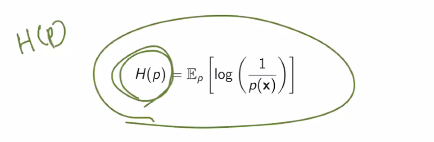
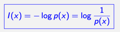
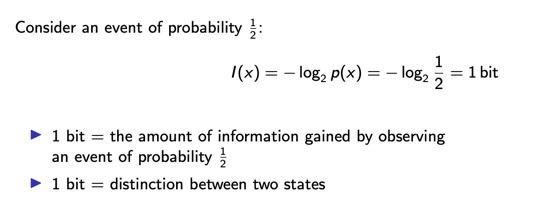
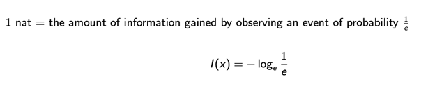

# 6일차 - 250710

## 5일차 - 250709 이어서 작성
## (Shannon Entropy) - 세넌 엔트로피
- Average information (평균 정보)
- 
$$
\begin{aligned}
H(p) &= \mathbb{E}_p[I(x)] \\
     &= \mathbb{E}_p[-\log p(x)] \\
     &= -\sum_{x \in \mathcal{X}} p(x) \log p(x)
\end{aligned}
$$




### Information



### Bit (binary digit)



### Nat (Natural unit of information)



### Excample: Entropo 1 - Sunny 50%, Rainy 50% 확률
$$
H(p) = -\left( \frac{1}{2} \log_2 \frac{1}{2} + \frac{1}{2} \log_2 \frac{1}{2} \right)
= -\left( \frac{1}{2} \cdot (-1) + \frac{1}{2} \cdot (-1) \right)
= 1 \text{ bit}
$$


### Example: Entropy (Cont'd) - Sunny 75%, Rainy 25% 확률
$$
H(p) = -\left( \frac{3}{4} \log_2 \frac{3}{4} + \frac{1}{4} \log_2 \frac{1}{4} \right)
= -\left( \frac{3}{4} \log_2 \frac{3}{4} + \frac{1}{4} \cdot (-2) \right)
\approx 0.81 \text{ bit}
$$


### Information Theory
1.	**최대 데이터 압축(ultimate data compression)**은?
   → 엔트로피 H
2.	**통신의 최대 전송률(ultimate transmission rate)**은?
   → 채널 용량 C

3. 활용용도
   - 생태학적 감각 처리 이론(ecological sensory processing) 설명에도 유용
   - 비지도 학습(unsupervised learning) 목표를 설명하는 데도 핵심적인 역할을 함


### Information and Entropy

- 🔹 정보(Information)의 정의
	- 정보는 놀람, 불확실성, 예측 불가능성으로 이해할 수 있음

$$
I = -\log p_i
$$

	- 여기서 p_i는 사건 i가 일어날 확률
    - 즉:
	    - 드문 사건: 높은 정보량 (surprise ↑)
	    - 자주 일어나는 사건: 낮은 정보량 (surprise ↓)

- 🔹 엔트로피(Entropy)의 정의
	- 정보의 평균값 (Average Information)

$$
H = \mathbb{E}[I] = - \sum_{i=1}^{N} p_i \log p_i
$$

	- 즉, 엔트로피는 확률 분포의 불확실성을 측정하는 지표이며, 정보 이론의 핵심 개념입니다.

# Shannon Entropy
## 정의

주어진 이산 확률 변수 \( X \)와 그 값들의 집합 \( \mathcal{X} \)에 대해,  
**Shannon Entropy**는 평균 정보량(불확실성의 척도)으로 정의된다.

$$
H(p) = - \sum_{x \in \mathcal{X}} p(x) \log p(x) = \mathbb{E}_p[-\log p(x)]
$$


## 성질 (Properties)

- \( H(p) \geq 0 \)  
  (모든 항이 0 이상의 값을 가지므로)

- \( H(p) = 0 \)  
  ↳ 어떤 \( x \in \mathcal{X} \)에 대해 \( \mathbb{P}(X = x) = 1 \)일 때만 가능

- 엔트로피는 **모든 결과가 균등할 때 최대**


## 시각적 예시

- 분포 \( p = [0.8, 0.1, 0.1] \) → 불균형 → \( H(p) \) 작음  
- 분포 \( q = [\frac{1}{3}, \frac{1}{3}, \frac{1}{3}] \) → 균등 → \( H(q) \) 큼

$$
H(p) < H(q)
$$


### 🐎 예제: 말 경주와 엔트로피

8마리의 말이 경주에 참여하고, 각 말이 이길 확률은 다음과 같이 매우 불균등하다:

$$
\left( \frac{1}{2}, \frac{1}{4}, \frac{1}{8}, \frac{1}{16}, \frac{1}{64}, \frac{1}{64}, \frac{1}{64}, \frac{1}{64} \right)
$$

이제 질문은 다음과 같다:

> "이긴 말을 다른 사람에게 전달하려면 몇 비트가 필요할까?"


#### 🔺 균등하게 생각하면 틀린 답을 낸다

모든 말이 같은 확률로 이긴다고 가정하면,  
총 8가지 경우 → \( \log_2 8 = 3 \)비트 필요.

하지만 실제 확률은 **편중되어 있음**  
→ 즉, **더 자주 일어나는 말은 더 짧게**,  
→ **드물게 이기는 말은 더 길게** 표현하는 게 유리.


#### ⚙️ 효율적 표현 방식 (Variable-length Encoding)

확률에 따라 다음과 같이 비트 문자열을 배정하면:

```
말 1: 0
말 2: 10
말 3: 110
말 4: 1110
말 5~8: 111100, 111101, 111110, 111111
```

이렇게 하면 평균 표현 길이는 **2비트** 수준으로 줄어든다.  
이는 고정 3비트 방식보다 효율적이다.


#### 📉 평균 정보량 (엔트로피 계산)

엔트로피는 다음과 같이 계산된다:

$$
\begin{aligned}
H &= - \left( 
\frac{1}{2} \log_2 \frac{1}{2}
+ \frac{1}{4} \log_2 \frac{1}{4}
+ \frac{1}{8} \log_2 \frac{1}{8}
+ \frac{1}{16} \log_2 \frac{1}{16}
+ 4 \cdot \frac{1}{64} \log_2 \frac{1}{64}
\right) \\
&= 2 \text{ bits}
\end{aligned}
$$


#### 🧠 핵심 메시지

- **엔트로피는 평균 비트 수의 이론적 최소값**
- 즉, 아무리 코딩을 잘해도 평균적으로 **2비트보다 더 적게** 표현할 수는 없음
- 이는 "스무고개"와 같은 문제에서 **최소 질문 수의 하한선**으로도 해석 가능


---

## 📊 Differential Entropy

연속 확률 변수 \( X \)에 대해,  
**Differential Entropy**는 다음과 같이 정의된다:

$$
H(p) = - \int p(x) \log p(x) \, dx = \mathbb{E}_p[-\log p(x)]
$$


### 📌 주요 특성 (Properties)

- 경우에 따라 **음수가 될 수도 있음**
- **고정된 분산**을 가진 분포 중에서는  
  → **가우시안 분포(Gaussian)**가 **최대 엔트로피**를 가짐
- 단변량 가우시안 \( X \sim \mathcal{N}(\mu, \sigma^2) \)일 때:

  $$
  H(X) = \frac{1}{2} \log (2\pi e \sigma^2)
  $$

- 다변량 가우시안 \( X \sim \mathcal{N}(\mu, \Sigma) \)일 때:

  $$
  H(X) = \frac{1}{2} \log \left( (2\pi e)^d \cdot |\Sigma| \right)
       = \frac{1}{2} \log \left( 2\pi e \right)^d |\Sigma|
       = \frac{1}{2} \log |2\pi e \Sigma|
  $$


### 🧮 계산 예시: \( H(\mathcal{N}(\mu, \Sigma)) \)

다변량 정규분포의 PDF:

$$
p(x) = \frac{1}{(2\pi)^{d/2} |\Sigma|^{1/2}} 
\exp\left( -\frac{1}{2}(x - \mu)^T \Sigma^{-1} (x - \mu) \right)
$$


#### 🔽 엔트로피 계산 절차:

$$
\begin{aligned}
H(X) 
&= \mathbb{E}[-\log p(x)] \\
&= \mathbb{E}\left[ \frac{1}{2} \log |2\pi \Sigma| + \frac{1}{2}(x - \mu)^T \Sigma^{-1}(x - \mu) \right] \\
&= \frac{1}{2} \log |2\pi \Sigma| + \frac{1}{2} \operatorname{tr}\left( \Sigma^{-1} \mathbb{E}[(x - \mu)(x - \mu)^T] \right) \\
&= \frac{1}{2} \log |2\pi \Sigma| + \frac{1}{2} \operatorname{tr}(\Sigma^{-1} \Sigma) \\
&= \frac{1}{2} \log |2\pi \Sigma| + \frac{1}{2} \cdot d \\
&= \frac{1}{2} \log \left( (2\pi e)^d |\Sigma| \right)
\end{aligned}
$$

#### ✅ 결론

$$
H(\mathcal{N}(\mu, \Sigma)) = \frac{1}{2} \log |2\pi e \Sigma|
$$

→ 가우시안 분포는 주어진 공분산 내에서 **최대 differential entropy**를 가진다.


### 🔗 Joint Entropy (결합 엔트로피)

두 개의 이산 확률 변수 \( X \), \( Y \)가 있을 때,  
그 결합 엔트로피는 다음과 같이 정의됩니다:

$$
H(X, Y) = - \sum_{x \in \mathcal{X}} \sum_{y \in \mathcal{Y}} p(x, y) \log p(x, y)
$$

이 식은 다음과 같이 전개됩니다:


#### 📐 전개 (Chain Rule 유도 과정)

1. **연쇄법칙 적용을 위해 분리**:

$$
p(x, y) = p(x) \cdot p(y \mid x)
$$

따라서,

$$
\begin{aligned}
H(X, Y)
&= - \sum_{x} \sum_{y} p(x, y) \log \left( p(x) \cdot p(y \mid x) \right) \\
&= - \sum_{x} \sum_{y} p(x, y) \log p(x) - \sum_{x} \sum_{y} p(x, y) \log p(y \mid x) \\
&= - \sum_{x} p(x) \log p(x) - \sum_{x} p(x) \sum_{y} p(y \mid x) \log p(y \mid x) \\
&= H(X) + \sum_{x} p(x) H(Y \mid X = x)
\end{aligned}
$$


#### ✅ Chain Rule for Entropy

결과적으로 다음과 같은 **연쇄 법칙(chain rule)**이 성립합니다:

$$
H(X, Y) = H(X) + H(Y \mid X)
$$


#### 📏 성질 (Properties)

- \( H(X, Y) \leq H(X) + H(Y) \)  
  → 독립일 경우 등호 성립

- \( H(Y \mid X) \leq H(Y) \)  
  → 조건부 정보는 항상 전체 정보보다 작거나 같다

> 💡 위 두 부등식은 수학적으로도 중요한 불평등이며,  
> 정보 이론의 주요 정리인 **subadditivity**와 **conditioning reduces entropy**를 의미합니다.

---


# Cross Entropy

## 📌 정의

분포 \( p(x) \) (true distribution)에 대해,  
\( q(x) \) (estimated distribution)를 기준으로 인코딩했을 때 필요한 **평균 정보량**은 다음과 같이 정의된다:

$$
H(p, q) = \mathbb{E}_p[-\log q(x)] = - \sum_x p(x) \log q(x)
$$

- 이는 "실제는 \( p \), 하지만 모델이 \( q \)라고 믿고 있을 때"  
  우리가 **얼마나 잘못 인코딩했는가?**를 측정하는 개념이다.

---

# 🌤️ 예시: 날씨 예측

### 실제 확률 (True \( p \)):

- Sunny: 75%  
- Rainy: 25%

### 모델 예측 (Estimated \( q \)):

- Sunny: 50%  
- Rainy: 50%

---

### 🔸 Entropy (자체 엔트로피):

$$
H(p) = - \left( \frac{3}{4} \log_2 \frac{3}{4} + \frac{1}{4} \log_2 \frac{1}{4} \right)
= \frac{3}{4} \log_2 \frac{4}{3} + \frac{1}{4} \log_2 4
\approx 0.81 \text{ bit}
$$

---

### 🔹 Cross Entropy:

$$
H(p, q) = - \left( \frac{3}{4} \log_2 \frac{1}{2} + \frac{1}{4} \log_2 \frac{1}{2} \right)
= \frac{3}{4} \log_2 2 + \frac{1}{4} \log_2 2 = 1 \text{ bit}
$$

→ 모델이 잘못된 분포 \( q \)를 사용했기 때문에 정보량(비트 수)이 증가.

---

# 🧠 예시: Cross Entropy Error in Classification

### 문제: 3-class classification  
(target = Tiger, Lion, Cat)

---

## 예시 1

- 실제 클래스: Tiger → \( y = [1, 0, 0] \)
- 모델 출력 \( \hat{y} = [0.7,\ 0.2,\ 0.1] \)

### Cross Entropy Error:

$$
- \sum_{i=1}^3 y_i \log \hat{y}_i = - \log 0.7 \approx 0.36
$$

---

## 예시 2

- 실제 클래스: Tiger → \( y = [1, 0, 0] \)
- 모델 출력 \( \hat{y} = [0.5,\ 0.3,\ 0.2] \)

### Cross Entropy Error:

$$
- \log 0.5 = 0.69
$$

→ 정답 확률이 낮을수록 loss는 커짐


#### ✅ 핵심 요약

- Cross Entropy는 모델이 **틀린 분포로 얼마나 비효율적으로 인코딩했는가**를 측정
- DNN에서는 **예측 확률 분포 \( \hat{y} \)**와 **실제 정답 분포 \( y \)** 간의 거리로 해석
- 정확히 예측할수록 (예: 정답 확률이 1에 가까울수록) cross-entropy는 **0에 가까워진다**


---

# 🔀 KL Divergence (Kullback-Leibler Divergence)

## 📘 개념

- KL Divergence는 두 확률 분포 \( p(x) \), \( q(x) \) 사이의 차이를 측정하는 방법
- 1951년, Kullback과 Leibler에 의해 제안됨
- 주로 "정답은 \( p \), 예측은 \( q \)"인 상황에서 \( q \)가 \( p \)와 얼마나 다른지를 나타냄


## 🧮 정의

### 이산 확률 변수의 경우:
$$
D_{KL}(p \| q) = \sum_x p(x) \log \frac{p(x)}{q(x)}
$$

### 연속 확률 변수의 경우:
$$
D_{KL}(p \| q) = \int p(x) \log \frac{p(x)}{q(x)} dx
$$


## 📌 주요 성질

- 비대칭: \( D_{KL}(p \| q) \neq D_{KL}(q \| p) \)
- 항상 0 이상 (Gibbs' inequality): \( D_{KL}(p \| q) \geq 0 \)
- \( D_{KL}(p \| q) = 0 \) ⟺ \( p = q \)
- 확률 분포 공간에서 convex 함수

---

# 📊 엔트로피와 KL Divergence 관계

엔트로피는 균등분포로부터 얼마나 벗어났는지를 KL Divergence로 해석 가능:

$$
\begin{aligned}
H(p)
&= \sum_x p(x) \log \frac{1}{p(x)} \\
&= \log |\mathcal{X}| - D_{KL}\left(p \| \text{unif} \right)
\end{aligned}
$$

- 즉, **분포가 균등할수록 엔트로피는 최대**  
- \( p(x) \)가 치우칠수록 \( H(p) \)는 작아지고, \( D_{KL} \)는 커짐


## 🔍 KL Divergence 직관 요약

- \( p \)와 \( q \) 모두 높으면 → 👍 OK
- \( p \)는 높은데 \( q \)는 낮으면 → 😢 페널티 발생
- \( p \)가 낮으면 → 🫤 영향 없음
- \( D_{KL} = 0 \)이면 → \( p = q \)


## 🔁 예시: KL(p‖q) vs KL(q‖p)

분포 예시:
- \( p = [\frac{1}{3}, \frac{1}{3}, \frac{1}{3}, \varepsilon] \)
- \( q = [\frac{1}{4}, \frac{1}{4}, \frac{1}{4}, \frac{1}{4}] \)

계산 결과:

- \( D_{KL}(p \| q) \)은 작음 (근사 잘함)
- \( D_{KL}(q \| p) \)은 큼 (근사 실패)

→ KL은 비대칭이므로, **예측이 정답 분포보다 넓으면** 문제 없음  
   반대로 **예측이 좁은데 정답이 넓으면** 큰 페널티 발생

---


# 📐 KL Divergence: 가우시안 간의 거리

## 1. 단변량 Gaussian (\( \mathcal{N}(\mu, \sigma^2) \)):

\( p = \mathcal{N}(\mu_1, \sigma_1^2),\quad q = \mathcal{N}(\mu_2, \sigma_2^2) \)

$$
D_{KL}(p \| q) = \frac{1}{2} \left(
\frac{\sigma_1^2}{\sigma_2^2}
+ \frac{(\mu_2 - \mu_1)^2}{\sigma_2^2}
+ \log \frac{\sigma_2^2}{\sigma_1^2}
- 1
\right)
$$


## 2. 다변량 Gaussian (\( \mathcal{N}(\mu, \Sigma) \)):

\( p = \mathcal{N}(\mu_1, \Sigma_1),\quad q = \mathcal{N}(\mu_2, \Sigma_2) \)

$$
D_{KL}(p \| q) = \frac{1}{2} \left[
\text{tr}(\Sigma_2^{-1} \Sigma_1)
+ (\mu_2 - \mu_1)^T \Sigma_2^{-1} (\mu_2 - \mu_1)
- D + \log \frac{|\Sigma_2|}{|\Sigma_1|}
\right]
$$

→ \( D \): 차원의 수


## ➕ 기타 Divergence 종류 (More Divergences)

- **Bregman divergence (1967)**  
- **f-divergence (Csiszár, Ali-Silvey, 1960s)**  
- **α-divergence (Chernoff, Amari, 1950s~)**

이들은 KL을 일반화하거나, 다른 목적에 맞게 설계된 거리 측정 방식이다.


---


# 🎯 Maximum Likelihood & Kullback Matching

## 📌 Likelihood

확률 밀도 함수가 파라미터 \( \theta \)에 따라 정해진다고 할 때,  
전체 데이터셋에 대한 likelihood는 다음과 같다:

- 조건부 모델 (supervised learning):

$$
\prod_{n=1}^{N} p(y_n \mid x_n, \theta)
$$

- 비지도 모델 (unsupervised learning):

$$
\prod_{n=1}^{N} p(x_n \mid \theta)
$$


## 🧮 Maximum Likelihood Estimation (MLE)

### 지도 학습:
$$
\theta_{\text{ML}} = \arg\max_\theta \sum_{n=1}^{N} \log p(y_n \mid x_n, \theta)
$$

### 비지도 학습:
$$
\theta_{\text{ML}} = \arg\max_\theta \sum_{n=1}^{N} \log p(x_n \mid \theta)
$$


## 🎯 직관: 모델 분포 ≈ 데이터 분포

MLE은 결국 **모델 분포가 실제 데이터 분포와 가까워지도록** \( \theta \)를 찾는 과정이다.

예를 들어:

$$
p(y \mid x, \theta) \approx p_{\text{data}}(y \mid x), \quad
p(x \mid \theta) \approx p_{\text{data}}(x)
$$


## 📐 MLE = KL Divergence 최소화 관점 (Kullback Matching)

MLE은 사실상 **모델 분포가 데이터 분포에 가까워지도록**  
**KL Divergence를 최소화하는 과정**으로 해석 가능:

### 데이터의 경험적 분포:

$$
\tilde{p}(x) = \frac{1}{N} \sum_{n=1}^N \delta(x - x_n)
$$

### 모델 분포:

$$
p(x \mid \theta)
$$


## 🧮 목표 식: MLE을 KL 관점으로 표현

MLE은 다음을 최소화하는 것과 같다:

$$
\theta_{\text{ML}} = \arg\min_\theta D_{KL}\left(\tilde{p}(x) \| p(x \mid \theta)\right)
$$

이를 수식으로 전개하면:

$$
\begin{aligned}
\theta_{\text{ML}} 
&= \arg\min_\theta \int \tilde{p}(x) \log \frac{\tilde{p}(x)}{p(x \mid \theta)} dx \\
&= \arg\max_\theta \int \tilde{p}(x) \log p(x \mid \theta) dx \\
&= \arg\max_\theta \frac{1}{N} \sum_{n=1}^N \log p(x_n \mid \theta)
\end{aligned}
$$


## ✅ 결론

MLE은 단순한 최대화가 아닌,  
**데이터 분포와 모델 분포 간의 KL Divergence를 최소화하는 과정**이다.

따라서 MLE은 **"Kullback-Leibler Matching"**의 시각으로 해석될 수 있으며,  
이러한 관점은 **Information Theory와 Machine Learning의 연결고리**를 제공한다.


---

# 🔗 Mutual Information (상호 정보량)

## 📘 정의

Mutual Information은 두 확률 변수 \( X \)와 \( Y \) 간의 **정보 공유 정도**를 측정하는 값이다.  
이는 결합 분포 \( p(x, y) \)와 주변 분포 \( p(x)p(y) \) 사이의 KL Divergence로 정의된다:

$$
I(X; Y) = D_{KL}(p(x, y) \| p(x)p(y)) = \mathbb{E}_{p(x, y)} \left[ \log \frac{p(x, y)}{p(x)p(y)} \right]
$$

---

## 📊 이산 및 연속 확률 변수 표현

- 이산 변수의 경우:

$$
I(X; Y) = \sum_{x \in \mathcal{X}} \sum_{y \in \mathcal{Y}} p(x, y) \log \frac{p(x, y)}{p(x)p(y)}
$$

- 연속 변수의 경우:

$$
I(X; Y) = \int \int p(x, y) \log \frac{p(x, y)}{p(x)p(y)} dx\,dy
$$

---

## 🎯 직관적 해석: 불확실성의 감소량

Mutual Information은 "어떤 변수 하나를 알았을 때, 다른 변수에 대한 **불확실성이 얼마나 줄어드는가**"를 측정한다.

$$
I(X; Y) = H(Y) - H(Y \mid X) = H(X) - H(X \mid Y)
$$

- \( H(Y) \): \( Y \)에 대한 전체 불확실성  
- \( H(Y \mid X) \): \( X \)를 알았을 때 \( Y \)에 남아있는 불확실성  
- \( I(X; Y) \): \( X \)를 통해 줄어든 \( Y \)의 불확실성

→ 즉, **정보 공유 정도 = 불확실성 감소 정도**

---

## 🟠 베지 다이어그램 해석

- 원 \( H(X) \), \( H(Y) \) 각각은 두 변수의 정보량
- 겹친 부분 \( I(X; Y) \)는 상호 정보량
- 나머지는 조건부 엔트로피:  
  - \( H(X \mid Y) \), \( H(Y \mid X) \)

``` 
      H(X)
    ________
   |        | 
   | H(X|Y) |         H(Y)
   |_______ |_______ ______
            |       |
            | H(Y|X)|
            |_______|
            ^     
            I(X;Y)
```

## ✅ 성질

- \( I(X; Y) \geq 0 \)
- \( I(X; Y) = 0 \) ⟺ \( X \perp Y \) (독립)
- 대칭성: \( I(X; Y) = I(Y; X) \)

## 📌 결론

Mutual Information은 엔트로피, 조건부 엔트로피, KL Divergence의 관점 모두로 정의 가능하며,  
**두 변수 간의 의존성, 정보 교환량, 독립성 여부를 판단하는 핵심 지표**로 쓰인다.


---

# Vector Calculus and Optimization
- 미분값 기반으로 학습
- 딥러닝 및 머신러닝에서 주로 사용

``` 
이 구조는 단순한 나열이 아니라:
	1.	스칼라 최적화 → 벡터 최적화 → 모델 파라미터 최적화
	2.	미분 가능성 → 벡터 미분 → 수치 해석 필요성
	3.	실제 사용되는 알고리즘까지 연결
```

## 📌 예제 1: 단순 함수 최적화

### 문제 정의:
함수 \( f(x) = (x - 1)^2 + 3 \)의 최소값을 찾고자 함.

$$
\arg\min_x f(x) = \arg\min_x \left[(x - 1)^2 + 3\right]
$$

### 해석:

미분하여 최솟값 찾기:

$$
\frac{d f(x)}{dx} = 2(x - 1) = 0 \quad \Rightarrow \quad x = 1
$$


## 📌 예제 2: 선형 방정식 (Least Squares)

### Goal:
다음을 최소화하는 \( x \)를 구하라:

$$
\arg\min_x \|Ax - b\|_2^2 \quad \text{(where } A \in \mathbb{R}^{m \times n},\ m > n \text{)}
$$

### 해석:

벡터 미분을 사용해 gradient 0이 되는 \( x \)를 찾는다:

$$
\frac{d}{dx} \|Ax - b\|_2^2 = 0
$$

### 해:

$$
x = (A^\top A)^{-1} A^\top b \quad \text{(Least Squares Solution)}
$$

→ 벡터 미적분 필요!


## 📌 예제 3: Neural Network 파라미터 최적화

### Goal:
학습 데이터 \( \{(x_n, y_n)\}_{n=1}^N \) 에 대해, 신경망 \( f(x; \theta) \)의 파라미터 \( \theta \)를 튜닝하라.

### 목적함수 (Square Loss):

$$
\arg\min_\theta \frac{1}{2N} \sum_{n=1}^{N} \left( y_n - f(x_n; \theta) \right)^2
$$


### 현실적 고려:

- \( f(x; \theta) \)는 비선형이므로 **해석적 해(closed-form)** 존재하지 않음
- 따라서 **수치적 최적화(numerical optimization)** 필요


## 🔁 최적화 알고리즘

- 반복 최적화 방식:

$$
\theta^{(0)} \to \theta^{(1)} \to \theta^{(2)} \to \cdots \to \theta^{(k)}
$$

- 사용되는 방법:
  - Gradient Descent (GD)
  - Stochastic Gradient Descent (SGD)
  - Newton's Method 등


# 🔧 Derivative & Partial Derivative

## 📘 1. 미분의 정의 (Univariate Derivative)

단일 변수 함수 \( f(x) \)의 도함수는 다음과 같이 정의된다:

$$
\frac{df(x)}{dx} = \lim_{h \to 0} \frac{f(x + h) - f(x)}{h}
$$


## ✏️ 예제: \( f(x) = x^2 \)

$$
\frac{df(x)}{dx} = \lim_{h \to 0} \frac{(x + h)^2 - x^2}{h}
= \lim_{h \to 0} \frac{2xh + h^2}{h}
= \lim_{h \to 0} (2x + h) = 2x
$$


## 🔢 미분 기본 규칙

- **곱의 법칙 (Product Rule):**

$$
(f(x)g(x))' = f'(x)g(x) + f(x)g'(x)
$$

- **몫의 법칙 (Quotient Rule):**

$$
\left(\frac{f(x)}{g(x)}\right)' = \frac{f'(x)g(x) - f(x)g'(x)}{(g(x))^2}
$$

- **합의 법칙 (Sum Rule):**

$$
(f(x) + g(x))' = f'(x) + g'(x)
$$

- **합성함수 미분 (Chain Rule):**

$$
(g(f(x)))' = g'(f(x)) \cdot f'(x)
$$


## 🧠 예제: Chain Rule

함수 \( h(x) = (2x + 1)^4 \) 을 미분하라.

- \( g(f) = f^4 \), \( f(x) = 2x + 1 \)

$$
h'(x) = g'(f(x)) \cdot f'(x) = 4(2x + 1)^3 \cdot 2 = 8(2x + 1)^3
$$


## 🔍 로그, 지수, 역수 미분 예시

- \( f(x) = x \log x \)

$$
\frac{d}{dx}[x \log x] = \log x + 1
$$

- \( f(x) = e^{wx + b} \)

$$
\frac{d}{dx}[e^{wx + b}] = w e^{wx + b}
$$

- \( f(x) = \frac{1}{x} \)

$$
\frac{d}{dx}\left[\frac{1}{x}\right] = -\frac{1}{x^2}
$$


## 🌐 편미분 (Partial Derivative)

다변수 함수 \( f(x_1, x_2, ..., x_d) \)의 변수 \( x_i \)에 대한 편미분 정의:

$$
\frac{\partial f}{\partial x_i} = \lim_{h \to 0} \frac{f(x_1, ..., x_i + h, ..., x_d) - f(x_1, ..., x_i, ..., x_d)}{h}
$$


## 📘 예제: 편미분

함수 \( f(x_1, x_2) = x_1^2 x_2 + x_1 x_2^2 \)

- \( \frac{\partial f}{\partial x_1} = 2x_1 x_2 + x_2^2 \)
- \( \frac{\partial f}{\partial x_2} = x_1^2 + 2x_1 x_2 \)


## 🧩 편미분 기본 규칙

- **곱의 법칙:**

$$
\frac{\partial}{\partial x}[f(x)g(x)] = \frac{\partial f}{\partial x}g(x) + f(x)\frac{\partial g}{\partial x}
$$

- **합의 법칙:**

$$
\frac{\partial}{\partial x}[f(x) + g(x)] = \frac{\partial f}{\partial x} + \frac{\partial g}{\partial x}
$$

- **Chain Rule (Multivariable):**  
  \( f : \mathbb{R}^m \to \mathbb{R} \), \( g : \mathbb{R}^n \to \mathbb{R}^m \)

$$
\frac{\partial}{\partial x} (f \circ g)(x) = \left[ \frac{\partial f}{\partial g} \right] \cdot \left[ \frac{\partial g}{\partial x} \right]
$$


## 📘 예제: 다변수 체인룰

함수 \( f: \mathbb{R}^2 \to \mathbb{R}^2 \), \( g: \mathbb{R}^2 \to \mathbb{R} \)

- 성분별 계산:

$$
\frac{\partial (g \circ f)}{\partial x_1} = \frac{\partial g}{\partial f_1} \cdot \frac{\partial f_1}{\partial x_1} + \frac{\partial g}{\partial f_2} \cdot \frac{\partial f_2}{\partial x_1}
$$

$$
\frac{\partial (g \circ f)}{\partial x_2} = \frac{\partial g}{\partial f_1} \cdot \frac{\partial f_1}{\partial x_2} + \frac{\partial g}{\partial f_2} \cdot \frac{\partial f_2}{\partial x_2}
$$

- 행렬로 표현하면:

$$
\left(\frac{d}{dx} (g \circ f)(x)\right)^\top = \left(\frac{\partial g}{\partial f}\right)^\top J_f
$$

→ 여기서 \( J_f \)는 \( f \)의 Jacobian 행렬


