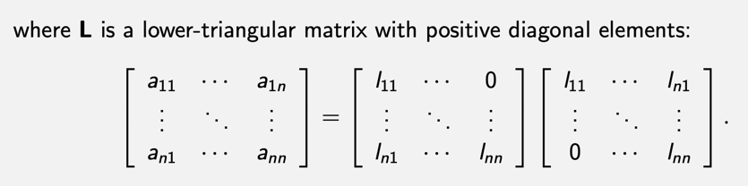
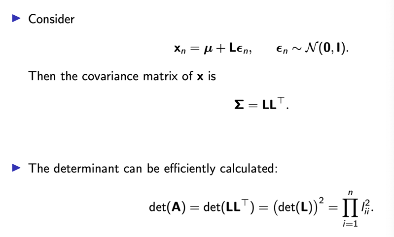

# 3일차 - 250707

## Linear Algebra: Revisited
- Linear equation: Ax = b
- Eigenvalue equation: Ax = λx

## Matrix Decomposition (행렬 분해)
- 행렬 X를 여러 행렬의 곱으로 분해하여 데이터의 구조나 패턴의 분석하는 기법
- x = UV^T
- X = UΣV^T

### 1. Clustering (클러스터링)
- 비지도 학습(Unsupervised Learning)
- 목적: 비슷한 데이터끼리 묶기
- 입력: 라벨 없는 데이터
- 출력: 클러스터 번호 OR 그룹화 결과
- 활용: K-Means, DBSCAN, Gaussian Mixture Model(GMM)

### 2. Eigenvalues (고유값) & Eigenvectors (고유벡터)
- 대상: 정사각형 A
- 활용: PCA(주성분 분석), 스펙트럼 그래프 이론, 공분산 행렬 해석, 네트워크 중심성 분석 등

### 3. EEG Spectral Decomposition
- 놔파(EEG)의 주파수 성분을 분해하여 분석하는 과정 (Fourier Transform / Wavelet Transform)

### 4. PCA (Principal component analysis)
- 고차원 데이터를 저차원 으로 투영하여, 정보 손실을 최소화하며 데이터의 주요 특징을 추출하는 차원 축소 기법

## Determinant (행렬식)
- 정사각 행렬 A ∈Rn×n 의 행렬식은 열 벡터로 이루어진 평행사변형의 부피에 해당하는 실수로 매핑하는 함수입니다.
- det(A) 또는 |A|로 표기됩니다.

### 행렬식의 속성
det(A) = i∏r 고유값 ( 여기서 are A 의 고유값임 )
det(AB)=det(A)det(B)
det(A⊤)= det(A)
det(A−1)= 1/det(A)
det(α) det(A)= αndet(A)

### Trace (추적)

The trace of a square matrix A ∈ ℝⁿˣⁿ is defined as **\text{tr}(\mathbf{A}) = \sum_{i=1}^{n} a_{ii},**
i.e., the trace is the sum of the diagonal entries of A.
	•	▶ tr(A + B) = tr(A) + tr(B)
	•	▶ tr(αA) = α tr(A)
	•	▶ tr(AB) = tr(BA) for A ∈ ℝⁿˣᵏ, B ∈ ℝᵏˣⁿ
	•	▶ tr(Iₙ) = n
	•	▶ tr(A) = ∑ⁿ_{i=1} λᵢ (where λᵢ are eigenvalues of A)
	•	▶ xᵀ y = tr(x yᵀ)

### Cholesky Factorization (콜레스키 분해)
- A = LL^T

## Eigendecomposition (고유 분해)

### Eigenvalues & Eigenvectors (고유값 & 고유벡터)
- 행렬 A ∈ ℝd×d 가 정방행렬(정사각형 행렬)일 때,
- λ ∈ ℝ 이 A의 고유값(eigenvalue) 이고,
- u ∈ ℝd \ {0} (영벡터가 아닌 벡터) 가 A의 고유벡터(eigenvector) 가 되기 위한 조건은 다음 식을 만족하는 것이다:
- Au= λu

- \mathbf{U} = [\mathbf{u}_1, \ldots, \mathbf{u}_d] 는 고유벡터들을 열벡터로 갖는 행렬이고,
- \mathbf{\Lambda} 는 대각선 성분에 고유값 \lambda_1, \ldots, \lambda_d 가 들어있는 대각 행렬(diagonal matrix) 이다.

### Spectral Decomposition (스펙트럴분해)
행렬 A ∈ ℝd×d 가 대칭 행렬(symmetric) 이라면,
	•	모든 고유값(λ)은 실수(real) 이고,
	•	직교 정규(orthonormal) 한 고유벡터 집합 \{ \mathbf{u}_1, \dots, \mathbf{u}_d \} 이 존재한다.

1. \mathbf{A} = \mathbf{U} \mathbf{\Sigma} \mathbf{U}^\top
2. \mathbf{A} = \lambda_1 \mathbf{u}_1 \mathbf{u}_1^\top + \lambda_2 \mathbf{u}_2 \mathbf{u}_2^\top + \cdots + \lambda_d \mathbf{u}_d \mathbf{u}_d^\top

### Power Iteration (거듭제곱 반복법)
- 거듭제곱 반복법은 행렬 C ∈Rd×d 의 최대 고유값 ( 최대 고유값과 연관됨 ) 을 찾는 고전적인 방법

### Deflation (디플레이션)

## SVD(Singular Value Decomposition) - 특이값 분해
- 행렬 X를 회전(U) → 크기 조절(Σ) → 다시 회전(Vᵀ) 이렇게 변환하는 과정 
- X의 본질적인 구조를 벡터 방향 + 중요도(특이값) 로 분해하는 것!
- \mathbf{X} = \mathbf{U} \mathbf{\Sigma} \mathbf{V}^\top

#### 조건
- r \leq \min(D, N)
- 특이값(σ)은 항상 0 이상:
\sigma_1 \geq \sigma_2 \geq \cdots \geq \sigma_r \geq 0
- \sigma_i: singular values (스칼라 값, 중요도라 보면 됨)

## NMF(Nonnegative Matrix Factorization) - 음수 행렬 분해
- 행렬 안에 음수가 없는 데이터(예: 이미지, 단어빈도, 신호 등)을 두 개의 작은 행렬로 곱셈 분해하는 방법
- X ≈UV^⊤
- 방법: 전체적 표현, 부분 기반 표현, 비 음수 데이터
- 예시: Document, Spectrogram, Image, Gene Expression
 
## CRU Decomposition (CRU 분해)
- 

-------
그럼 이제까지 배운 행렬 분해 개념 전체를 보기 쉽게 Markdown 형태로 깔끔하게 정리해 줄게.

⸻

📚 행렬 분해(Matrix Decomposition) 개념 총정리

행렬 분해는 복잡한 데이터를 이해하기 쉬운 작은 부분으로 나누는 수학적 방법이다.

⸻

🔑 1. Eigendecomposition (고유값 분해)
	•	정의
정사각행렬 A \in \mathbb{R}^{n\times n} 를 다음과 같이 분해하는 것:
A = U\Lambda U^{-1}
	•	주요 용어
	•	Eigenvalue (고유값): 벡터의 크기만 변화시키는 값 \lambda
	•	Eigenvector (고유벡터): 고유값 방향으로 변하는 벡터 x
	•	수학적 표현
Ax = \lambda x
	•	특징
	•	반드시 정사각형 행렬만 분해 가능
	•	행렬이 대칭일 경우, 고유벡터가 직교하고 모든 고유값은 실수
	•	스펙트럴 분해 가능:
A = \sum_{i}\lambda_i u_i u_i^T
	•	활용 분야
	•	PCA(주성분 분석), 네트워크 분석, 추천 시스템

⸻

🔑 2. SVD (Singular Value Decomposition, 특이값 분해)
	•	정의
모든 형태의 행렬 X \in \mathbb{R}^{D\times N}을 다음과 같이 분해:
X = U\Sigma V^T
	•	주요 용어
	•	Singular Values (특이값): 행렬의 중요도를 나타내는 값 \sigma_i
	•	Singular Vectors (특이벡터): U와 V는 각각 직교행렬
	•	특징
	•	정사각형이 아닌 행렬도 분해 가능
	•	정보 압축과 차원 축소에 활용
	•	가장 효율적인 행렬 근사화 가능 (Low-rank Approximation)
	•	활용 분야
	•	이미지 압축, 데이터 압축, 추천 시스템, PCA와 밀접한 관련

⸻

🔑 3. NMF (Nonnegative Matrix Factorization, 음수 없음 행렬 분해)
	•	정의
모든 원소가 0 이상의 값인 행렬 X \in \mathbb{R}^{D\times N}를 다음과 같이 분해:
X \approx UV^T,\quad U, V \geq 0
	•	특징
	•	행렬을 “구성 요소(U)“와 “가중치(V)“로 해석 가능
	•	모든 원소가 음수가 아니기 때문에 직관적으로 이해하기 쉬움
	•	최적화 문제
\min_{U,V \geq 0}\|X - UV^T\|^2
	•	활용 분야
	•	텍스트 분석, 문서 클러스터링, 추천 시스템, 얼굴 이미지 분석, EEG 분석

⸻

🔑 4. CUR Decomposition (CUR 분해)
	•	정의
행렬을 전체가 아니라 일부 행과 열만을 선택해 분해:
A \approx C U R
	•	주요 용어
	•	C: 원본 행렬에서 선택한 열(column)
	•	R: 원본 행렬에서 선택한 행(row)
	•	U: 선택된 행과 열의 교차 영역으로 계산된 행렬
	•	특징
	•	매우 큰 행렬에서 효과적으로 적용 가능
	•	분해 과정이 직관적이고 해석이 쉬움
	•	데이터의 실제 값 유지 가능
	•	활용 분야
	•	대규모 데이터 분석, 생체 데이터 분석, 추천 시스템

⸻

🔍 세부 용어 정리

용어	의미
정사각 행렬	행과 열의 수가 같은 행렬
직교 행렬	Q^T Q = I, 모든 벡터가 서로 수직(직교)
대칭 행렬	A = A^T, 대각선을 중심으로 대칭적
특이값 (Singular)	SVD에서 행렬의 중요도를 나타내는 값
고유값 (Eigenvalue)	벡터의 크기만 변화시키는 값
고유벡터 (Eigenvector)	특정 방향에서 크기만 변하는 벡터
음수 없음 (Nonnegative)	모든 원소가 0 이상의 값을 가지는 행렬
Rank	행렬 내 독립적인 정보의 개수(차원)
행렬식 (Determinant)	행렬의 부피를 나타내며, 행렬의 가역성 결정
Trace	행렬 대각선 성분들의 합

⸻

📌 실생활 활용 예시 (쉽고 재미있게!)
	•	SVD: 사진 압축하기 (가야금 전문가 사진을 원본의 10% 크기로!)
	•	NMF: 텍스트 분석 (가야금 전문가 방송에서 주로 쓰는 표현 분석)
	•	PCA: 유저 취향 분석 (음악 플랫폼 서비스에서 공연, 레슨, 악보 관심사 구분)
	•	Eigenvector Centrality: 팬덤 네트워크에서 핵심 인물 찾기

⸻

🧠 결론

행렬 분해는 데이터의 구조를 파악하거나 압축하는 강력한 도구이며, 이론 자체는 어려워도 실제 응용하면 매우 흥미롭고 유용한 개념이야. 앞으로 음악 플랫폼나 가야금 전문가와 관련된 예제를 통해 직접 체험해보면 더 재미있을 거야!

필요하면 직접 코드로 보여줄 수 있으니 언제든 말해줘! 🚀