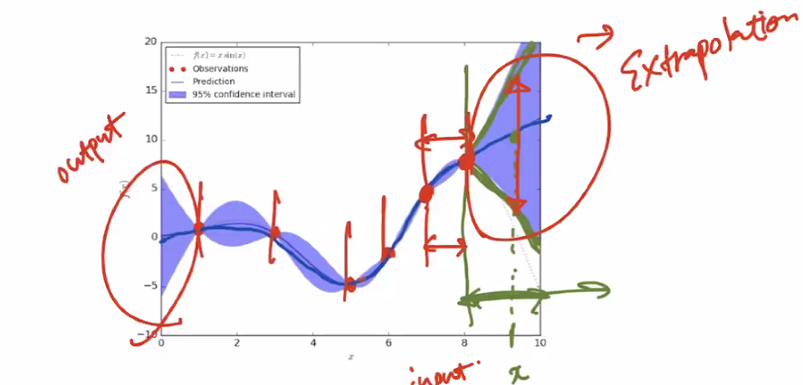
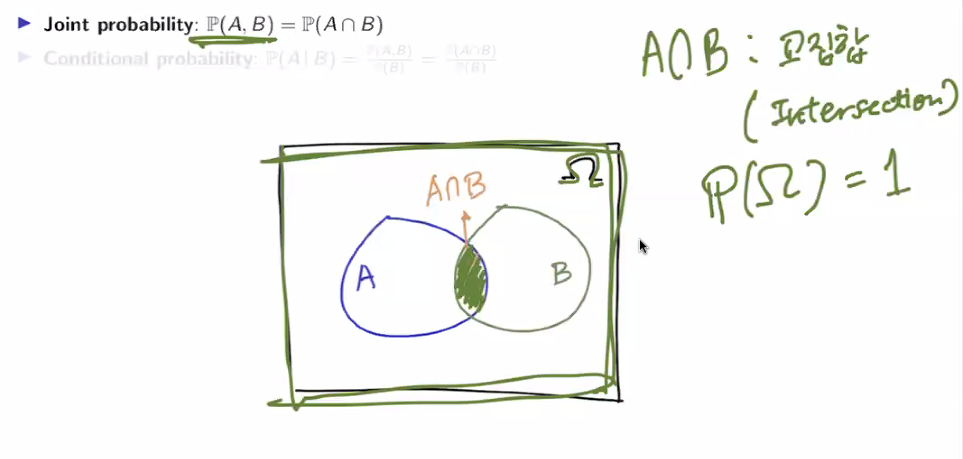
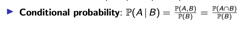
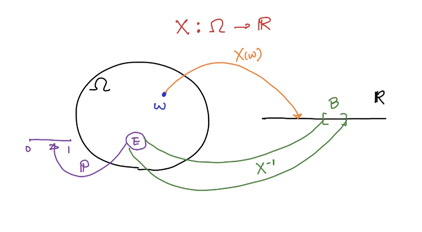
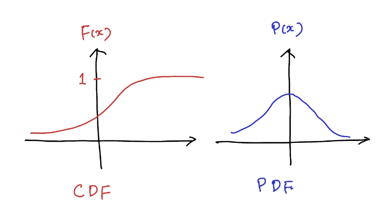

# 4일차 - 250708
- 부제 : 확률 관련
- 
# DETERMINISTIC vs Stochastic(random) - 결정론적 VS 확률론적(무작위)

## Probability Theory - 확률이론
- Randomness(무작위성) 설명하기 위해 사용되는 수학적 이론

## Predictive Uncertainty - 예측 불확실성
- Aleatoric uncertainty (데이터 기반 불확실성)
  - Data uncertainty - 데이터 자체 내재된 불확실성
  - Caused by inherent `class overlap or noise` in the data (클래스 간 겹침, 측정 노이드, 센서 오류)
  - Irreducible uncertainty (감소불가, 모델 개선해도 사라지지 않음)
  - 예시1: 흐릿한 이미지로 인해 고양이와 개가 구분되지 않음 
  - 예시2: 의료이미지에 찍힌 노이즈로 인한 진단 혼동
- Epistemic uncertainty (모델 기반 불확실성)
  - Model uncertainty or Knowledge uncertainty - 모델이 충분히 학습하지 못한 영역에 대한 불확실성
  - Cause by: the model's inherent `lack of knowledge about inputs` from regions far from the training data (학습 데이터 포함되지 않는 영역, 모델 파라미터에 대한 불확실성)
  - Can be reduced by observing more data (감소 가능, 더 많은 데이터 수집 OR 모델 구조 개선으로 감소 가능)
  - 예시1: 학습 데이터에 없는 새로운 날씨 조건에서 자율주행 차량의 판단 오류 
  - 예시2: 드문질병에 대한 의학 모델의 낮은 신뢰도

## 확률 이론 예시
1. Motivating 1 - Semantic Segmentation  (의미 분할)
2. Motivating 2 - Gaussian Process Regression (가우시안 프로세스 회귀)


3. Construct a ML model (input x and output y) such that:
   - Regression: Outputs E [y |x].
   - Classification: Outputs P (y= k|x).

- E: expectation - 기대값, 평균


## Probabilisty Distribution & ML (확률 분포 & 머신러닝)
- 실제로 우리는 오직 경험적 분포에 접근할 수 있습니다 :
- In practice, we have access to only empirical distributions:
  - supervised case: pd (y|x).
  - unsupervised case: pd (x).

.
- 머신러닝에서 우리는 모델 ( 매개변수화된 분포 ) 를 구축합니다
- In ML, we build a model (parameterized distribution) such that
  - 지도 학습 사례 : pθ(y|x) ≈pd(y|x).
  - 비지도 학습 사례 : pθ(x) ≈pd(x).


## Probability Space (확률 공간)

(\Omega, \mathcal{F}, \mathbb{P})


## Sample Space (표본 공간)
	•	Set: 객체들의 집합. 각 객체는 element.
	•	Sample Space (Ω): 어떤 실험에서 가능한 모든 결과(outcomes) 의 집합.
	•	Event: Sample space의 부분집합(subset). 여러 이벤트 집합의 모음은 \subseteq 2^\Omega (멱집합의 부분집합) 형태로 표현 가능.


✅ Example 1: Tossing a single coin
	•	Experiment: 동전 1번 던지기
	•	Outcomes: 앞면(H), 뒷면(T)
	•	Sample Space (Ω): {H, T}
	•	Event: {H} 또는 {T}
→ 각각 특정한 한 가지 결과를 의미하는 사건


✅ Example 2: Tossing a coin twice
	•	Experiment: 동전 2번 던지기
	•	Outcomes: HH, HT, TH, TT
	•	Sample Space (Ω): {HH, HT, TH, TT}
	•	Event: “적어도 한 번 앞면” = {HH, HT, TH}
→ 사건은 여러 결과(outcomes)로 이루어질 수 있음


## Field (Algebra) vs σ-Algebra

✅ Field (Algebra) \mathcal{M}
	•	부분집합의 모음
	•	닫힘 조건 (유한 연산에 대해 닫힘):
	1.	\emptyset \in \mathcal{M}, \Omega \in \mathcal{M}
	2.	여집합 닫힘: E \in \mathcal{M} \Rightarrow E^c \in \mathcal{M}
	3.	유한 합집합 닫힘: E, F \in \mathcal{M} \Rightarrow E \cup F \in \mathcal{M}


✅ σ-Algebra \mathcal{F}
	•	Field보다 더 강한 조건
	•	가산 연산에 대해 닫힘:
	1.	\emptyset \in \mathcal{F}, \Omega \in \mathcal{F}
	2.	여집합 닫힘
	3.	가산 합집합 닫힘: E_i \in \mathcal{F} \Rightarrow \bigcup_{i=1}^\infty E_i \in \mathcal{F}


## Joint and Conditional Probabilities





## Independence (독립성)
- P(A, B) = P(A) P(B)
- P(A|B) = P(A)
- B의 값은 A의 발생에 영향 안미쳠

[img.png](250708_4.png)


## 🎴 카드 뽑기 확률 예제 (Playing Card Probability)

### 🟢 조건
- 일반 카드 덱 1세트: 총 52장
- 4가지 무늬(Suit): Spades, Hearts, Diamonds, Clubs
- 각 무늬당 13장 (2~10, J, Q, K, A)


### 🔸 1. 빨간 카드를 뽑을 확률은?
- Hearts(♥), Diamonds(♦) → 총 26장
- 전체 52장 중 26장이므로

\[
P(\text{Red}) = \frac{26}{52} = \frac{1}{2}
\]


### 🔸 2. '5'이면서 빨간 카드일 확률은?
- 5♥, 5♦ → 2장만 해당됨

\[
P(5 \cap \text{Red}) = \frac{2}{52} = \frac{1}{26}
\]


### 🔸 3. 빨간 카드를 뽑았을 때, 그 카드가 '5'일 확률은?

조건부 확률 사용:

\[
P(5 \mid \text{Red}) = \frac{P(5 \cap \text{Red})}{P(\text{Red})} = \frac{1}{26} \div \frac{1}{2} = \frac{1}{13}
\]


### 🟡 보조 설명: 확률 분해

- 모든 카드 숫자 A ∈ {2, 3, ..., K, A}에 대해  
  각각 빨간색/검정색으로 나뉘며 확률은 다음과 같다:

| 카드 숫자 | 빨간색 확률 | 검정색 확률 |
|-----------|--------------|--------------|
| 2         | 1/26         | 1/26         |
| 3         | 1/26         | 1/26         |
| ...       | ...          | ...          |
| K         | 1/26         | 1/26         |
| A         | 1/26         | 1/26         |

- 예: `P(A = 5)` 계산
  - 빨간 5 → 1/26
  - 검정 5 → 1/26
  - 따라서:

\[
P(A = 5) = \frac{1}{26} + \frac{1}{26} = \frac{1}{13}
\]


## Random Variables (무작위 변수)



P(X ∈B) = P ({ω∈Ω|X (ω) ∈B})
= P ◦X−1(B)


### 🪙 Coin Tossing Example
- Head일 경우: `X = 0`  
- Tail일 경우: `X = 1`
- 확률:  
  \[
  \mathbb{P}(X = 0) = \frac{1}{2}
  \]

---

### 🔊 Random Noise Example
- 확률 밀도 함수 \( p(x) \)를 가진 연속 확률 변수 \( X \in \mathbb{R} \)
- 다음 범위에서의 확률:
  \[
  \mathbb{P}(-1 \leq X \leq 1) = \int_{-1}^{1} p(x) \, dx
  \]


### 🧠 개념 및 정의

- **표기법**:  
  \[
  X = X(\omega)
  \]  
  → 샘플 공간의 원소 \( \omega \)에 대한 함수로서의 X

- **중요한 개념 정리**:
  - A *Random Variable* is **neither random nor a variable**.
  - 실제로는, \( X \)는 **결정론적 함수(deterministic function)** 이다.
  - 여기서 "random"이란 표현은,  
    **샘플 공간 \( \Omega \)에서 어떤 원소 \( \omega \)를 선택하는 과정의 무작위성**을 나타냄.


### 📌 정리 메모
- 확률 변수는 함수이다.
- 확률은 **입력 ω의 무작위성(randomness)** 에 의해 발생함.
- \( X(\omega) \)는 ω가 결정되면 항상 같은 값을 갖는다 (결정론적).


## 📊 확률 분포 (Probability Distribution)

### 1. 🔢 Discrete Random Variables (이산 확률 변수)

- **정의**:  
  이산 확률 변수는 **유한하거나 셀 수 있는 무한 개수**의 값을 가질 수 있는 변수입니다.

- **예시**:  
  \[
  X \in \{1, 2, \dots, K\}
  \]

- **확률 질량 함수 (PMF)**:  
  각 값에 확률을 부여하는 함수  
  \[
  p(x) = \mathbb{P}(X = x)
  \]

- **그래프 예시**:  
  각 x값에 대해 확률이 막대 그래프로 표현됨 (점 형태의 확률)


### 2. 🌊 Continuous Random Variables (연속 확률 변수)

- **정의**:  
  연속 확률 변수는 **셀 수 없이 무한한 실수 값**을 가질 수 있는 변수입니다.

- **예시**:  
  \[
  X \in \mathbb{R} \quad \text{or} \quad X \in [0,1]
  \]

- **누적 분포 함수 (CDF)**:  
  \[
  F(x) = \mathbb{P}(X \leq x)
  \]

- **확률 밀도 함수 (PDF)**:  
  \[
  p(x) = \frac{dF(x)}{dx}
  \]  
  → 특정 값의 확률은 0이며, **구간 단위의 확률**을 계산함.

- **그래프 예시**:  
  연속적인 곡선 형태의 함수로 표현됨.


### 📌 참고 요약

| 구분 | 정의 | 예시 | 확률 함수 |
|------|------|------|-----------|
| 이산형 | 셀 수 있는 값 | 주사위, 동전 | PMF: \( p(x) = \mathbb{P}(X = x) \) |
| 연속형 | 실수 전체 또는 구간 | 키, 시간 | PDF: \( p(x) = \frac{dF(x)}{dx} \) |




## Joint Distribution (결합 확률 분포)
- 이산 확률 변수:
  p(x₁, x₂) = P(X₁ = x₁, X₂ = x₂)

- 연속 확률 변수:
  p(x₁, x₂) = ∂²F(x₁, x₂) / ∂x₁∂x₂  
  F(x₁, x₂) = P(X₁ ≤ x₁, X₂ ≤ x₂)

- 표기법:  
  p(x) = p(x₁, x₂)


## Marginal / Conditional Probability
- Marginal Probability (주변 확률)
- 한 변수의 전체 확률 분포를 얻기 위해 다른 변수의 값을 합산 또는 적분

P(X = x) = ∑ P(X = x, Y = y)  
P(Y = y) = ∑ P(X = x, Y = y)

- Conditional Probability (조건부 확률)
- 어떤 조건 하에서 특정 사건이 일어날 확률

P(X = x | Y = y) = P(X = x, Y = y) / P(Y = y)  
(단, P(Y = y) ≠ 0)


## Bayes'Theorem (베이즈 정리)
- 베이즈 정리 기본형
P(A | B) = P(B | A) * P(A) / P(B)

- 전체 베이즈 정리 (여러 Aᵢ에 대해)
P(Aⱼ | B) = [P(B | Aⱼ) * P(Aⱼ)] / ∑ᵢ P(B | Aᵢ) * P(Aᵢ)


- 수식
p(θ | 𝒟) = [ p(𝒟 | θ) * p(θ) ] / p(𝒟)

- 용어 해석
- p(θ | 𝒟)     : posterior (사후 확률)
- p(𝒟 | θ)     : likelihood (우도)
- p(θ)         : prior (사전 확률)
- p(𝒟)         : evidence 또는 marginal likelihood (주변 가능도)

- 자연어 해석
- prior         : 학습 전 우리가 가진 가정 (ex: θ는 간단할 것 같다)
- likelihood    : 모델이 현재 θ일 때, 주어진 데이터를 얼마나 잘 설명하는지
- posterior     : 학습을 통해 θ에 대한 "업데이트된" 확률 분포
- evidence      : 모든 가능한 θ에 대해 모델이 데이터를 얼마나 잘 설명하는지 (정규화 상수)


- 머신러닝에서 의미
- prior         : 학습 전 우리가 가진 가정 (ex: θ는 간단할 것 같다)
- likelihood    : 모델이 현재 θ일 때, 주어진 데이터를 얼마나 잘 설명하는지
- posterior     : 학습을 통해 θ에 대한 "업데이트된" 확률 분포
- evidence      : 모든 가능한 θ에 대해 모델이 데이터를 얼마나 잘 설명하는지 (정규화 상수)
- 


## 📘 Mean(평균), Variance(분산), Covariance(공분산)

### ✅ 1. Mean (평균)

#### ✔ Sample Mean (표본 평균)
10명의 시험 점수 예시  
`80, 70, 60, 50, 100, 90, 80, 80, 70, 90`

표본 평균 (Empirical average):

```
μ̂ = (1/10) * (80 + 70 + 60 + 50 + 100 + 90 + 80 + 80 + 70 + 90)  
   = 77
```

#### ✔ 확률 기반 평균 (Expected Value, 기대값)

점수별 확률 분포를 가정하고 계산:

```
P(X=100) = 1/10  
P(X=90) = 2/10  
P(X=80) = 3/10  
P(X=70) = 2/10  
P(X=60) = 1/10  
P(X=50) = 1/10

μ = Σ x * P(x)  
  = (1/10)*100 + (2/10)*90 + (3/10)*80 + (2/10)*70 + (1/10)*60 + (1/10)*50  
  = 77
```

#### ✔ 일반적인 기대값 수식

```
이산형: E[X] = Σ x * p(x)  
연속형: E[X] = ∫ x * p(x) dx
```

#### ✔ 벡터 평균

```
벡터 x ∈ ℝ^D 일 때, 평균 벡터:

E[x] = [ E[x₁], E[x₂], ..., E[x_D] ]ᵀ ∈ ℝ^D
```


### ✅ 2. Variance (분산)

#### ✔ 정의

```
이산형: Var(X) = E[(X - μ)²] = Σ (x - μ)² * p(x)  
연속형: Var(X) = ∫ (x - μ)² * p(x) dx
```

#### ✔ 다른 표현 (2차 모멘트 기반)

```
Var(X) = E[X²] - (E[X])²
```


### ✅ 3. Covariance (공분산)

#### ✔ 두 변수 X, Y의 공분산

```
Cov(X, Y) = E[(X - μₓ)(Y - μᵧ)]  
           = E[XY] - E[X]E[Y]
```

#### ✔ 공분산 행렬

```
두 벡터 x ∈ ℝ^Dₓ, y ∈ ℝ^Dᵧ 일 때:

Cov(x, y) = E[(x - μₓ)(y - μᵧ)ᵀ] ∈ ℝ^{Dₓ × Dᵧ}

자기 자신과의 공분산 (분산 행렬):

Cov(x, x) = E[(x - μₓ)(x - μₓ)ᵀ] ∈ ℝ^{Dₓ × Dₓ}
```


### ✅ 4. 특수 성질 요약

```
- 공분산 행렬은 대칭이다: Σ = Σᵀ  
- 공분산 행렬은 positive semi-definite  
- 두 변수 X₁, X₂가 uncorrelated → off-diagonal = 0
```


### ✅ 5. 기대값 선형성 (Expectation and Linear Transform)

```
E[αx + βy] = αE[x] + βE[y]

y = Ax + b 라면,  
E[y] = A * E[x] + b  
Cov(y) = A * Cov(x) * Aᵀ
```


### ✅ 6. 반복 기대값 법칙 (Law of Iterated Expectations)

```
E[X] = E[ E[X | Y] ]
```


### ✅ 7. 분산 분해 법칙 (Law of Total Variance)

```
Var(X) = Var(E[X | Y]) + E[Var(X | Y)]

- Var(E[X | Y])   : between-group variance  
- E[Var(X | Y)]   : within-group variance
```


### ✅ 8. Mode (최빈값)

```
- 가장 자주 나오는 값
- 이산형: 가장 자주 출현하는 x
- 연속형: p(x) 밀도 함수의 최대값 위치
```


