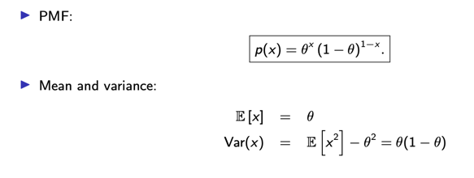
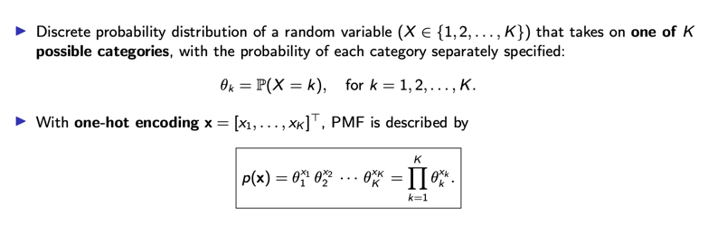
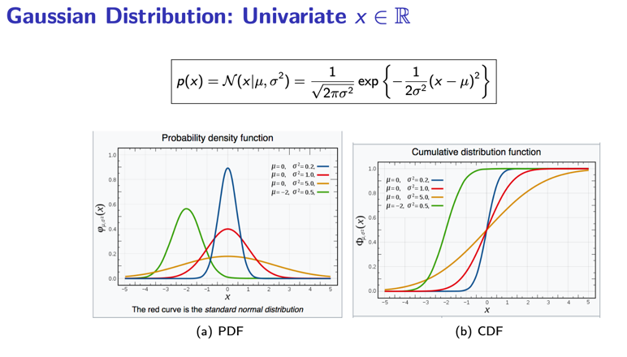
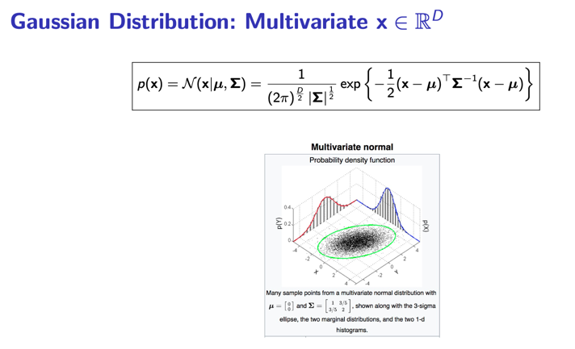
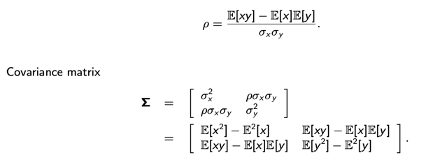
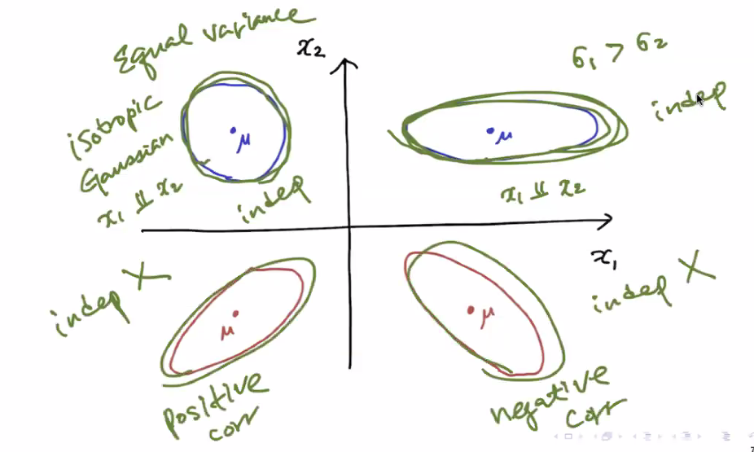
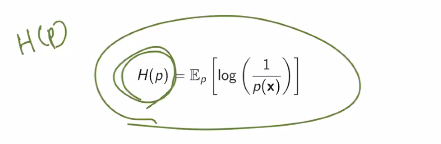
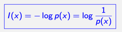
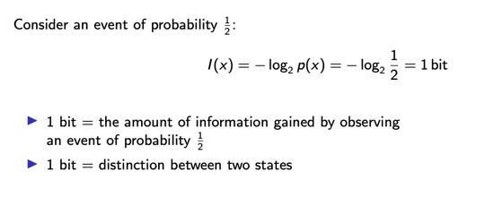
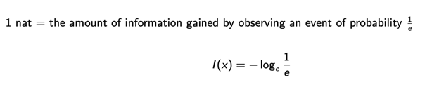

# 5일차 - 250709

## Statistical Independence (통계적 동립)

###  📘 통계적 독립 (Statistical Independence)

#### ✅ 개념

- 두 확률 변수 X와 Y가 서로 독립이라는 뜻은, 
- 한 변수가 어떤 값을 가져도 다른 변수의 확률에 영향을 주지 않는다는 것이에요.

#### ✅ 수식 조건
$$
p(x, y) = p(x) \cdot p(y)
$$

#### ✅ 의미하는 바
- X를 알고 있어도 Y의 확률은 그대로다:
$$
p(y \mid x) = p(y)
$$
- 반대도 마찬가지:
$$
p(x \mid y) = p(x)
$$
- 두 변수의 합의 분산은 각 분산의 합이 된다:
$$
\mathrm{Var}(X + Y) = \mathrm{Var}(X) + \mathrm{Var}(Y)
$$

### 📘 비상관성 (Uncorrelatedness)

#### ✅ 개념

- 두 변수가 상관관계가 없다는 건,
- X가 커지거나 작아진다고 해서 Y의 평균이 같이 오르내리지 않는다는 뜻이에요.

#### ✅ 수식 조건

$$
\mathbb{E}[XY] = \mathbb{E}[X] \cdot \mathbb{E}[Y]
$$

즉, 두 변수의 곱에 대한 평균이
각 변수 평균의 곱과 같으면 “상관 없음”으로 간주해요.

#### 📌 관계 정리
- 독립 ⇒ 상관 없음 ✔
  -> 독립이면 무조건 상관도 없어요.
- 없음 ⇏ 독립 ✖
  -> 하지만 상관이 없다고 해서 독립이라고 볼 수는 없어요.
      (비선형 관계 등 다른 의존성이 있을 수 있음)

## Bernoulli (베르누이 분포)
- Discrete (이산) 
- 값의 종류: 0 또는 1 (Binary random variable)
- 예시: 동전 던지기 (앞/뒤), 정답/오답
- 특징: 성공확률 P에 따라 1 또는 0
- 수식:
$$
P(X = 1) = p,\quad P(X = 0) = 1 - p
$$

## Categorical (범주형 분포)
- Discrete (이산)
- 값의 종류: 여러 개의 정수 범주 (예: 0 ~K)
- 예시: 주사위, 과일 종류 분류, 클래스 분류
- 특징: 여러 범주 중 하나 선택

## Gaussian(가우시안 분포)
- continuous (연속)
- 실수 전체 영역 R
- 예시: 키, 몸무게, 센서 오차, 시험 점수
- 특징: 평균과 분산으로 형태 결정

- σ^2 : variance (분산)
- µ : mean (평균)

- Σ : 
- µ : mean vector (평균 벡터)

### Correlation coefficient

### Properties of Gaussian Distribution (가우시안 분포 속성)

#### ✅ 주요 성질 요약

- 평균(mean)과 공분산(covariance)만으로 완전히 정의됨
- **중심극한정리(Central Limit Theorem)** 적용됨
- 선형 변환 후에도 여전히 Gaussian
- 주변 분포(Marginal)와 조건 분포(Conditional) 모두 Gaussian
- 공분산 행렬을 대각화(diagonalize)하는 선형 변환 존재  
  → **Whitening, Data Sphering**
- 같은 평균과 공분산을 갖는 분포 중 **최대 엔트로피(maximum entropy)** 가짐

#### ✅ 정규분포 벡터의 합

##### 두 독립 Gaussian 랜덤 벡터

- $$\mathbf{x} \sim \mathcal{N}(\mu_x, \Sigma_x)$$  
- $$\mathbf{y} \sim \mathcal{N}(\mu_y, \Sigma_y)$$  

##### 합의 분포
- $$\mathbf{z} = \mathbf{x} + \mathbf{y} \sim \mathcal{N}(\mu_x + \mu_y, \Sigma_x + \Sigma_y)$$

#### ✅ 평균 계산
$$
\mathbb{E}[\mathbf{z}] = \mathbb{E}[\mathbf{x}] + \mathbb{E}[\mathbf{y}]
$$

#### ✅ 공분산 계산
$$
\begin{aligned}
\mathrm{Cov}(\mathbf{z}) &= \mathbb{E}[\mathbf{z} \mathbf{z}^\top] - \mathbb{E}[\mathbf{z}] \mathbb{E}[\mathbf{z}]^\top \\
&= \mathbb{E}[(\mathbf{x} + \mathbf{y})(\mathbf{x} + \mathbf{y})^\top] - (\mu_x + \mu_y)(\mu_x + \mu_y)^\top \\
&= \mathbb{E}[\mathbf{x}\mathbf{x}^\top] + \mathbb{E}[\mathbf{y}\mathbf{y}^\top] + \mathbb{E}[\mathbf{x}\mathbf{y}^\top] + \mathbb{E}[\mathbf{y}\mathbf{x}^\top] \\
&\quad - (\mu_x\mu_x^\top + \mu_y\mu_y^\top + \mu_x\mu_y^\top + \mu_y\mu_x^\top) \\
&= \Sigma_x + \Sigma_y \quad \text{(독립일 때 cross term은 0)}
\end{aligned}
$$

---

# 📘 정보 이론 주제 정리 (Information Theory Topics)

- ▶️ **Information and Shannon entropy**  
  정보량과 셰넌 엔트로피

- ▶️ **Cross entropy**  
  크로스 엔트로피 (예측 분포와 실제 분포 간의 차이를 측정)

- ▶️ **Relative entropy (Kullback-Leibler divergence)**  
  상대 엔트로피 (쿨백-라이블러 발산)

- ▶️ **Kullback matching and maximum likelihood estimation**  
  쿨백 정합(KL 정합) 및 최대우도추정(MLE)

- ▶️ **Mutual information**  
  상호 정보량 (두 변수 간 공유되는 정보의 양)

## (Shannon Entropy) - 세넌 엔트로피
- Average information (평균 정보)

### ✅ 정의
$$
H(X) = -\sum_x p(x) \log p(x)
$$

### Information

### Bit (binary digit)

### Nat (Natural unit of information)

---

## 📘 Mutual Information (상호 정보량)

- 두 확률 변수 X, Y 사이의 **의존성**을 측정하는 지표
- 정보 이론에서 **정보 공유 정도**를 의미

### ✅ 수식 정의

$begin:math:display$
I(X; Y) = \\sum_{x, y} p(x, y) \\log \\frac{p(x, y)}{p(x)p(y)}
$end:math:display$

또는 연속형에서는,

$begin:math:display$
I(X; Y) = \\int \\int p(x, y) \\log \\left( \\frac{p(x, y)}{p(x)p(y)} \\right) dx\\, dy
$end:math:display$

### ✅ 의미

- $begin:math:text$ I(X; Y) = 0 $end:math:text$ ⇔ X와 Y가 **독립**
- $begin:math:text$ I(X; Y) > 0 $end:math:text$ ⇔ X를 알면 Y에 대해 추가 정보를 알 수 있음

### ✅ 성질 요약

- 항상 0 이상: $begin:math:text$ I(X; Y) \\geq 0 $end:math:text$
- 대칭적: $begin:math:text$ I(X; Y) = I(Y; X) $end:math:text$
- Mutual Information은 KL divergence의 특수한 형태:

$begin:math:display$
I(X; Y) = D_{\\text{KL}}(p(x, y) \\| p(x)p(y))
$end:math:display$

## 📘 Cross Entropy (교차 엔트로피)

- 실제 분포 $begin:math:text$ p(x) $end:math:text$와 예측 분포 $begin:math:text$ q(x) $end:math:text$ 사이의 차이
- 분류 문제의 **손실 함수(Loss)**로 자주 사용

### ✅ 수식 정의

$begin:math:display$
H(p, q) = - \\sum_x p(x) \\log q(x)
$end:math:display$

- 실제 정답 분포는 one-hot encoding이고, 예측 분포는 softmax일 경우에 많이 사용됨

### ✅ 의미

- **예측이 정답에 가까울수록 낮은 값**
- KL Divergence와 관련:

$begin:math:display$
H(p, q) = H(p) + D_{\\text{KL}}(p \\| q)
$end:math:display$

즉, cross entropy는 "정확한 엔트로피 + 추가로 발생하는 오차"의 합

## 📘 Kullback-Leibler Divergence (KL 발산)

- 두 분포 $begin:math:text$ p(x), q(x) $end:math:text$ 간의 차이를 측정하는 정보 이론 지표
- 한 분포를 다른 분포로 얼마나 비효율적으로 설명하는지 나타냄

### ✅ 수식 정의

$begin:math:display$
D_{\\text{KL}}(p \\| q) = \\sum_x p(x) \\log \\left( \\frac{p(x)}{q(x)} \\right)
$end:math:display$

### ✅ 성질

- 항상 0 이상: $begin:math:text$ D_{\\text{KL}}(p \\| q) \\geq 0 $end:math:text$
- 비대칭: $begin:math:text$ D_{\\text{KL}}(p \\| q) \\neq D_{\\text{KL}}(q \\| p) $end:math:text$
- $begin:math:text$ D_{\\text{KL}}(p \\| q) = 0 $end:math:text$ ⇔ $begin:math:text$ p = q $end:math:text$

## 📘 Maximum Likelihood Estimation (MLE)

- 관측 데이터를 가장 잘 설명하는 **모수 추정 방법**

### ✅ 목표 함수

$begin:math:display$
\\theta^* = \\arg\\max_\\theta \\prod_{i=1}^n p(x_i \\mid \\theta)
$end:math:display$

또는 로그 우도 (log-likelihood) 사용:

$begin:math:display$
\\theta^* = \\arg\\max_\\theta \\sum_{i=1}^n \\log p(x_i \\mid \\theta)
$end:math:display$

### ✅ 특징

- 계산이 간단하고 직관적
- 데이터가 많을수록 좋은 추정
- Cross Entropy 최소화와도 연결됨

## 📘 Central Limit Theorem (중심극한정리)

- **어떤 분포를 따르더라도**, 표본 평균의 분포는 점점 **정규분포에 가까워짐**

### ✅ 수식 요약

$begin:math:display$
\\frac{1}{\\sqrt{n}} \\sum_{i=1}^n (X_i - \\mu) \\xrightarrow{d} \\mathcal{N}(0, \\sigma^2)
$end:math:display$

- i.i.d. 조건 필요
- 평균과 분산이 존재해야 함

---

