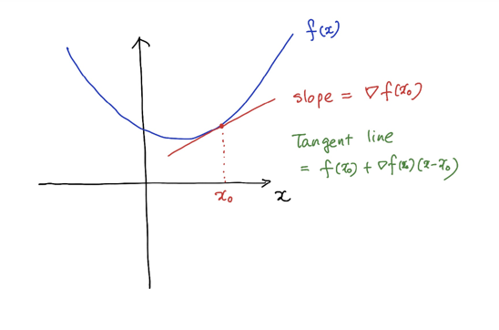
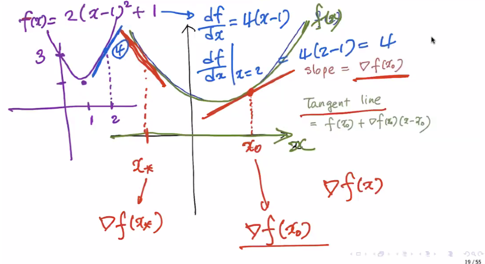

# 7일차 - 250711

# 🧠 Gradient, Jacobian & Hessian
## 🌟 개요

- **Gradient (∇f)**: 스칼라 함수 \( f : \mathbb{R}^d \to \mathbb{R} \)의 1차 미분 벡터
- **Jacobian (J)**: 벡터 함수 \( f : \mathbb{R}^n \to \mathbb{R}^m \)의 1차 미분 행렬
- **Hessian (H)**: 스칼라 함수의 2차 미분 (2차 편미분) 행렬




## 📐 Gradient

### 정의:
$$
\nabla f(x) = \left[ \frac{\partial f}{\partial x_1}, \cdots, \frac{\partial f}{\partial x_d} \right]^T \in \mathbb{R}^d
$$

→ Gradient는 **함수가 가장 빠르게 증가하는 방향**  
→ 경사 하강법(Gradient Descent)에서 중요한 역할


### 예시: \( f(\theta) = \theta^\top x \)

- \( f(\theta) = \sum \theta_i x_i \)
- 각 파라미터에 대해 편미분: \( \frac{\partial f}{\partial \theta_i} = x_i \)
- 결과:

$$
\nabla_\theta f(\theta) = x
$$


### 예시: \( f(\theta) = \theta^\top A \theta \) (A symmetric)

- \( \frac{\partial f}{\partial \theta_k} = 2 \sum_j A_{kj} \theta_j \)
- 결과:

$$
\nabla_\theta f(\theta) = 2A\theta
$$


## 🟦 Jacobian Matrix

### 정의:
벡터 함수 \( f : \mathbb{R}^n \to \mathbb{R}^m \)의 Jacobian은:

$$
J = \begin{bmatrix}
\frac{\partial f_1}{\partial x_1} & \cdots & \frac{\partial f_1}{\partial x_n} \\
\vdots & \ddots & \vdots \\
\frac{\partial f_m}{\partial x_1} & \cdots & \frac{\partial f_m}{\partial x_n}
\end{bmatrix} \in \mathbb{R}^{m \times n}
$$

→ 각 행은 각 출력 \( f_i \)의 gradient


### 예시: 선형 변환

함수:
- \( y_1 = -2x_1 + x_2 \)
- \( y_2 = x_1 + x_2 \)

Jacobian:

$$
J = \begin{bmatrix}
\frac{\partial y_1}{\partial x_1} & \frac{\partial y_1}{\partial x_2} \\
\frac{\partial y_2}{\partial x_1} & \frac{\partial y_2}{\partial x_2}
\end{bmatrix}
=
\begin{bmatrix}
-2 & 1 \\
1 & 1
\end{bmatrix}
$$


## 🔷 Hessian Matrix

### 정의:

스칼라 함수 \( f : \mathbb{R}^d \to \mathbb{R} \)에 대해, Hessian은 다음과 같다:

$$
H = \nabla^2 f(x) = \left[ \frac{\partial^2 f}{\partial x_i \partial x_j} \right]_{i,j=1}^{d} \in \mathbb{R}^{d \times d}
$$

→ \( H = \frac{\partial}{\partial x} \left( \nabla f(x)^\top \right) \)

- 대칭행렬 (symmetric)
- convexity 판별에 사용됨: \( H \succeq 0 \Rightarrow \) convex


## 🔁 정리 요약

| 개념 | 정의역 | 치역 | 크기 | 의미 |
|------|--------|------|------|------|
| Gradient | \( \mathbb{R}^d \to \mathbb{R} \) | \( \mathbb{R}^d \) | \( d \times 1 \) | 방향과 기울기 |
| Jacobian | \( \mathbb{R}^n \to \mathbb{R}^m \) | \( \mathbb{R}^{m \times n} \) | \( m \times n \) | 방향별 편미분 행렬 |
| Hessian | \( \mathbb{R}^d \to \mathbb{R} \) | \( \mathbb{R}^{d \times d} \) | \( d \times d \) | 2차 곡률 정보 |


## 📌 추가 Tip

- Gradient는 Jacobian의 특수한 경우  
- Hessian은 Gradient의 Gradient  
- 최적화 이론에선 Gradient는 방향, Hessian은 곡률


# 📌 보충: Gradient, Jacobian, Hessian의 실제 의미 및 활용


## 📐 Gradient와 방향 미분 (Directional Derivative)

Gradient는 함수가 **어느 방향으로 얼마나 빠르게 증가하는가**를 알려준다.

어떤 단위벡터 방향 \( \mathbf{v} \) 에 대한 방향 미분은:

$$
D_{\mathbf{v}} f(x) = \nabla f(x)^\top \mathbf{v}
$$

- Gradient 방향: 가장 빠르게 증가하는 방향
- -Gradient 방향: 가장 빠르게 감소하는 방향


## 🚀 Gradient Descent 알고리즘

최적화에서 가장 기본이 되는 gradient 활용:

$$
x^{(t+1)} = x^{(t)} - \eta \nabla f(x^{(t)})
$$

- \( \eta \): learning rate
- 목적: 함수 \( f(x) \)를 최소화
- Gradient는 **오르막 방향**이므로, 반대로 이동하면 빠르게 내려간다


## 🧭 Jacobian의 기하적 해석

Jacobian 행렬은 벡터 함수 \( f : \mathbb{R}^n \to \mathbb{R}^m \)이  
입력 공간을 **어떻게 변형시키는지**를 나타낸다.

특히 좌표계 변환에서 면적/부피 변화율은 다음으로 표현됨:

$$
\text{변환 후 부피} = |\det J(x)| \cdot \text{변환 전 부피}
$$

- \( \det J(x) \)가 0이면 국소적으로 접힘이 일어남
- 확률 분포 변환, 정규화 등에서 필수


## 📊 Hessian과 최적화 조건 (2차 도함수의 역할)

Hessian 행렬 \( \nabla^2 f(x) \)는 함수의 **곡률**을 측정한다.

최적화 문제에서 다음과 같은 조건 판별에 사용된다:

| 조건 | 의미 |
|------|------|
| \( \nabla^2 f(x) \succ 0 \) | Local minimum (strict) |
| \( \nabla^2 f(x) \succeq 0 \) | Local minimum (maybe saddle) |
| \( \nabla^2 f(x) \prec 0 \) | Local maximum |
| Hessian indefinite | Saddle point |


### 💡 Newton’s Method

Hessian과 Gradient를 함께 사용하는 2차 최적화 알고리즘:

$$
x^{(t+1)} = x^{(t)} - [\nabla^2 f(x^{(t)})]^{-1} \nabla f(x^{(t)})
$$

- Gradient는 **방향**, Hessian은 **곡률(얼마나 가파른지)** 제공
- 정확하지만 비용이 큼


## 🧮 Gradient vs Jacobian 비교 요약

| 항목 | Gradient | Jacobian |
|------|----------|----------|
| 함수 | \( f : \mathbb{R}^d \to \mathbb{R} \) | \( f : \mathbb{R}^n \to \mathbb{R}^m \) |
| 결과 | \( \nabla f \in \mathbb{R}^d \) (열벡터) | \( J \in \mathbb{R}^{m \times n} \) |
| 역할 | 스칼라 함수의 기울기 | 벡터 함수의 모든 편미분 |
| 해석 | 가장 빠른 증가 방향 | 전체 벡터 필드의 변환 |


## 🔁 정리 요약

- **Gradient**는 경사 방향
- **Jacobian**은 다변수 벡터 함수의 미분을 행렬화한 것
- **Hessian**은 곡률을 측정하고 최적화 이론에 필수
- 모두가 **딥러닝, 최적화, 벡터 미적분**에서 핵심 도구


---


# 📐 Taylor Series Expansion

## 🔹 Taylor Series (단변수)

매우 매끄러운 함수 \( f \in C^\infty \), 즉 무한 번 미분 가능한 함수 \( f: \mathbb{R} \rightarrow \mathbb{R} \) 에 대해,  
점 \( x_0 \) 주변에서의 테일러 급수 전개는 다음과 같이 정의됩니다:

$$
f(x) = \sum_{k=0}^{\infty} \frac{1}{k!} \left. \frac{d^k f(x)}{dx^k} \right|_{x = x_0} (x - x_0)^k
$$


### 📌 예시: \( e^x \)의 테일러 전개 (원점 기준)

$$
e^x = \sum_{k=0}^\infty \frac{x^k}{k!} 
= 1 + x + \frac{x^2}{2} + \frac{x^3}{6} + \frac{x^4}{24} + \frac{x^5}{120} + \cdots
$$


## 🔹 1차 테일러 근사 (선형 근사 / Linearization)

함수 \( f : \mathbb{R}^d \to \mathbb{R} \)에 대해,  
점 \( x_0 \) 근처에서의 1차 테일러 전개는 다음과 같습니다:

$$
f(x) \approx f(x_0) + \nabla f(x_0)^\top (x - x_0)
$$

- \( \nabla f(x_0) \): \( x_0 \)에서의 gradient
- 해석: **함수를 접평면으로 근사**


## 🔷 2차 테일러 근사 (Quadratic Approximation)

함수 \( f : \mathbb{R}^d \to \mathbb{R} \)에 대해,  
점 \( x_0 \) 근처에서의 2차 테일러 전개는 다음과 같습니다:

$$
f(x) \approx f(x_0) + \nabla f(x_0)^\top (x - x_0) 
+ \frac{1}{2}(x - x_0)^\top \nabla^2 f(x_0) (x - x_0)
$$

- \( \nabla^2 f(x_0) \): Hessian matrix at \( x_0 \)
- 해석: **함수를 2차 곡면(paraboloid)으로 근사**


## 💡 활용 요약

| 차수 | 수식 형태 | 의미 |
|------|-----------|------|
| 0차  | \( f(x_0) \) | 상수 근사 |
| 1차  | \( f(x_0) + \nabla f(x_0)^\top(x - x_0) \) | 접선/평면 |
| 2차  | 위 + \( \frac{1}{2}(x - x_0)^T H(x_0)(x - x_0) \) | 곡률 포함 근사 |


## ✨ 실제 활용 예시

- **머신러닝**: 손실함수 근사, 뉴턴 방법
- **물리 시뮬레이션**: 잠정 해 근사
- **경제학/통계학**: 복잡한 함수에 대한 근사적 분석


---


# 🔧 Optimization: Gradient Descent
## 🎯 목표

매개변수 \( \theta \)에 대해, 주어진 손실 함수 \( \mathcal{J}(\theta) \)를 **최소화**하는 로컬 최솟값 찾기:

$$
\arg\min_{\theta} \mathcal{J}(\theta, X, y)
$$


## 📈 손실 함수 예시

- **선형 회귀**:

$$
\mathcal{J}(\theta, X, y) = \frac{1}{2N} \sum_{n=1}^N (y_n - \theta^\top x_n)^2
$$

- **로지스틱 회귀**:

$$
\mathcal{J}(\theta, X, y) = -\sum_{n=1}^N \left[y_n \log(\sigma(\theta^\top x_n)) + (1 - y_n) \log(1 - \sigma(\theta^\top x_n))\right]
$$

- **딥러닝 일반**:

$$
\mathcal{J}(\theta) = \frac{1}{2N} \sum_{n=1}^N (y_n - f(x_n; \theta))^2
$$


## 🔁 Gradient Descent 알고리즘

파라미터 \( \theta \)를 다음과 같이 반복적으로 갱신:

$$
\theta_{k+1} = \theta_k - \alpha \cdot \left. \frac{\partial \mathcal{J}}{\partial \theta} \right|_{\theta = \theta_k}
$$

- \( \alpha > 0 \): 학습률 (learning rate)
- 함수의 기울기를 따라 내려감 (최솟값으로 수렴)


## 🎨 시각적 직관

- 기울기 < 0 → 우측으로 이동  
- 기울기 > 0 → 좌측으로 이동  
- local minimum 근처에서는 진동하거나 느리게 수렴할 수 있음


## 📏 수렴 조건: 고정 step size일 때

### Theorem:

함수 \( \mathcal{J}(\theta) \)가 convex이고 gradient가 Lipschitz continuous라면:

$$
\|\nabla \mathcal{J}(\theta_1) - \nabla \mathcal{J}(\theta_2)\| \leq L \|\theta_1 - \theta_2\|
$$

- 일정한 step size \( \alpha \leq \frac{1}{L} \)이면, 다음이 보장됨:

$$
\mathcal{J}(\theta_k) - \mathcal{J}(\theta^*) \leq \frac{\|\theta_0 - \theta^*\|^2}{2 \alpha k}
$$

- 수렴 속도: \( \mathcal{O}(1/k) \)


## 🧮 Proximal Regularization View (정규화 관점)

### 1차 근사:

$$
\mathcal{J}(\theta) \approx \mathcal{J}(\theta_k) + \nabla \mathcal{J}(\theta_k)^\top (\theta - \theta_k)
$$

→ 선형 근사는 **하한(bound)**이 없으므로 최소값이 존재하지 않을 수 있음

### 정규화 추가:

$$
\mathcal{J}(\theta_k) + \nabla \mathcal{J}(\theta_k)^\top (\theta - \theta_k) + \frac{1}{2\alpha} \|\theta - \theta_k\|^2
$$

이를 최소화하면:

$$
\theta = \theta_k - \alpha \nabla \mathcal{J}(\theta_k)
$$

즉, **gradient descent의 수학적 유도 방식**


## 🧃 Batch vs Mini-batch vs SGD

### ⚙️ 전체 데이터 기준 (Full Batch):

$$
\theta_{k+1} = \theta_k - \alpha \left. \frac{\partial \mathcal{J}(\theta, X, y)}{\partial \theta} \right|_{\theta = \theta_k}
$$

- 정확하지만 느림
- 메모리 비효율적 (큰 데이터셋에서 어려움)


### ⚖️ Mini-Batch Gradient Descent:

전체 데이터를 여러 개의 mini-batch로 나누어 각 batch 기준으로 파라미터 갱신:

$$
\mathcal{J}^{(m)}(\theta) = \frac{1}{M} \sum_{i=1}^{M} \mathcal{J}(\theta; x_i^{(m)}, y_i^{(m)})
$$

업데이트:

$$
\theta_{k+1} = \theta_k - \alpha \left. \frac{\partial \mathcal{J}^{(m)}(\theta)}{\partial \theta} \right|_{\theta = \theta_k}
$$


### ⚡ Stochastic Gradient Descent (SGD)

- Mini-batch 사이즈 = 1
- 매우 빠르나 **노이즈 많음**
- 매 스텝마다 빠르게 반응하며, generalization 잘됨


## 📊 수렴 비교

| 방식        | 수렴 속도 | 메모리 | 노이즈 |
|-------------|------------|--------|--------|
| Full-Batch  | 느림       | 높음   | 없음   |
| Mini-Batch  | 적당함     | 적당함 | 약간   |
| SGD         | 빠름       | 매우 작음 | 큼     |


## 📌 요약

- Gradient Descent는 **기울기 반대 방향으로 이동**
- Fixed step size로도 수렴하려면 Lipschitz 조건 필요
- Regularization 관점에서 GD는 1차 근사의 정규화 최소화
- Mini-batch와 SGD는 실제 딥러닝에서 널리 사용됨

---

# 🚀 Advanced Optimization Algorithms
## ⏱️ Momentum

Gradient Descent에서 과거 방향을 관성처럼 활용하여 진동을 줄이고 수렴을 빠르게 함.

### Update Rule:

$$
v_{t} = \beta v_{t-1} + (1 - \beta)\nabla_\theta \mathcal{J}(\theta_t)  
$$

$$
\theta_{t+1} = \theta_t - \alpha v_t
$$

- \( \beta \in [0.5, 0.9] \): 관성 계수  
- 빠르게 좁은 골짜기 탈출 가능 (예: ravines)


## 🌀 Nesterov Accelerated Gradient (NAG)

Momentum의 미래값을 미리 예측하여 gradient를 측정.

### Update Rule:

$$
v_{t} = \beta v_{t-1} + \alpha \nabla_\theta \mathcal{J}(\theta_t - \beta v_{t-1})  
$$

$$
\theta_{t+1} = \theta_t - v_t
$$

- 기존 Momentum보다 overshooting 방지
- 실제로는 더 안정적으로 수렴


## 📉 RMSProp

Gradient의 이동 평균의 분산으로 학습률을 조정하여 학습률 폭주 방지.

### Update Rule:

$$
s_t = \beta s_{t-1} + (1 - \beta)(\nabla_\theta \mathcal{J}(\theta_t))^2
$$

$$
\theta_{t+1} = \theta_t - \frac{\alpha}{\sqrt{s_t + \epsilon}} \nabla_\theta \mathcal{J}(\theta_t)
$$

- \( \beta \approx 0.9 \), \( \epsilon \approx 10^{-8} \)
- 작은 gradient는 느리게, 큰 gradient는 빠르게 진행 → 안정적인 수렴


## 🧠 Adam (Adaptive Moment Estimation)

Momentum + RMSProp을 결합한 최적화 알고리즘.

### Update Rule:

- 1차 모멘텀 (평균):

$$
m_t = \beta_1 m_{t-1} + (1 - \beta_1)\nabla_\theta \mathcal{J}(\theta_t)
$$

- 2차 모멘텀 (분산):

$$
v_t = \beta_2 v_{t-1} + (1 - \beta_2)(\nabla_\theta \mathcal{J}(\theta_t))^2
$$

- 편향 보정:

$$
\hat{m}_t = \frac{m_t}{1 - \beta_1^t}, \quad \hat{v}_t = \frac{v_t}{1 - \beta_2^t}
$$

- 파라미터 업데이트:

$$
\theta_{t+1} = \theta_t - \frac{\alpha}{\sqrt{\hat{v}_t} + \epsilon} \hat{m}_t
$$

- 기본 설정: \( \beta_1 = 0.9, \beta_2 = 0.999, \epsilon = 10^{-8} \)


## 📊 Optimizer 요약

| 알고리즘      | 장점                                  | 단점                       |
|---------------|---------------------------------------|----------------------------|
| SGD           | 간단, 일반화 잘됨                    | 느린 수렴, 진동            |
| Momentum      | 빠른 수렴, 진동 억제                 | overshoot 가능성           |
| NAG           | 정확한 방향 예측, 안정적 수렴        | 약간 복잡                  |
| RMSProp       | 학습률 조절로 빠른 수렴              | 최적값 근처에서 진동 가능  |
| Adam          | 자동 조절 + 빠른 수렴, 가장 널리 쓰임 | overfit 가능성 있음        |


## 🧩 실전 적용 팁

- 딥러닝에서는 대부분 **Adam**으로 시작  
- **SGD + Momentum**은 regularization 성능이 좋음  
- **RMSProp**은 RNN이나 시계열에 강력  
- 학습률 \( \alpha \)은 여전히 중요한 하이퍼파라미터


## 📎 참고

- 딥러닝 모델 성능 튜닝 시 → Optimizer 외에도 **learning rate schedule**, **weight decay**, **batch size** 조절이 중요
- Optimizer 선택은 데이터셋 특성, 모델 구조, 목적에 따라 달라짐


---


# 🎯 Learning Rate Scheduling
## 🔧 왜 Learning Rate를 조절해야 하나?

- 고정된 학습률은 훈련 초반엔 빠르게 수렴하나,  
  **후반부에는 발산하거나 최적점 근처에서 진동**할 수 있음.
- 학습률을 **점차 줄이면** 더 안정적으로 수렴 가능.


## 📘 대표적인 Learning Rate Scheduler

### 1. Step Decay (계단식 감소)

$$
\alpha_t = \alpha_0 \cdot \gamma^{\left\lfloor \frac{t}{s} \right\rfloor}
$$

- 일정 step마다 학습률을 \( \gamma \)배로 줄임.
- 예: 10 epoch마다 0.1배 감소

> 장점: 간단하고 직관적  
> 단점: 불연속적인 변화로 수렴 불안정 가능


### 2. Exponential Decay

$$
\alpha_t = \alpha_0 \cdot e^{-\lambda t}
$$

- 매 epoch마다 지수적으로 감소  
- 연속적이고 부드러운 변화

> 장점: 더 자연스럽고 연속적인 감소  
> 단점: 너무 빠르게 작아지면 학습 멈춤


### 3. Cosine Annealing

$$
\alpha_t = \alpha_{min} + \frac{1}{2}(\alpha_0 - \alpha_{min}) \left(1 + \cos\left(\frac{t\pi}{T}\right)\right)
$$

- Cosine 곡선처럼 감소 → 부드럽고 느리게 줄어듦  
- \( T \): 전체 decay 주기

> 장점: 느리게 줄어들어 수렴 안정성 높음  
> 단점: 주기 결정이 필요


### 4. Reduce on Plateau

- validation loss가 **개선되지 않으면** 학습률 감소
- 예: 5 epoch 연속으로 loss 감소 X → 학습률 0.1배

> 장점: 자동 조절  
> 단점: 하이퍼파라미터가 많음 (patience, factor 등)


### 5. Warm-up (초기 학습률 상승)

- 초기 몇 step 동안 학습률을 **점차 증가**시켜 안정화

$$
\alpha_t = \frac{t}{T_{warmup}} \cdot \alpha_0 \quad \text{for } t \leq T_{warmup}
$$

- 이후는 Cosine Annealing 또는 Exponential Decay로 전환

> 장점: 대규모 모델에서 불안정 초기 수렴 방지  
> BERT, GPT 등 대부분 사용


## 🧪 실전 적용 전략

| 상황 | 추천 Learning Rate |
|------|--------------------|
| 기본 학습 | Step Decay, Reduce on Plateau |
| Fine-tuning | Cosine Annealing + Warm-up |
| 대규모 모델 | Linear Warm-up → Cosine Annealing |
| 고속 실험 | Exponential Decay |


## 📎 PyTorch 예시

```python
from torch.optim.lr_scheduler import StepLR, CosineAnnealingLR

scheduler = StepLR(optimizer, step_size=10, gamma=0.1)
# or
scheduler = CosineAnnealingLR(optimizer, T_max=50)
```

## 💡 요약
- 학습률 스케줄링은 최적화의 핵심!
- Cosine Annealing + Warm-up은 현대 딥러닝에서 사실상 표준
- overfitting 방지에도 도움됨


---

# ⏹️ Early Stopping & Weight Decay (L2 Regularization)
## 🛑 Early Stopping

### 📌 정의
> 학습 도중 **검증 성능이 더 이상 향상되지 않으면**  
> 조기 종료하는 기법.

### 🔍 목적
- **과적합 방지 (Overfitting Prevention)**
- **시간/자원 절약**


### 📐 작동 방식

1. 검증 지표(Validation loss 또는 Accuracy)를 모니터링
2. `patience` 기간 동안 개선 없으면 학습 종료

```python
# Pseudo-code
if val_loss < best_loss:
    best_loss = val_loss
    wait = 0
else:
    wait += 1
    if wait >= patience:
        stop_training()
```


### ⚙️ 주요 하이퍼파라미터

| 항목 | 설명 |
|------|------|
| `patience` | 몇 epoch 동안 개선 없을 때 멈출지 |
| `monitor` | 모니터링할 지표 (`val_loss`, `val_acc`) |
| `mode` | `min` 또는 `max` |
| `restore_best_weights` | 멈추기 직전 최적 가중치로 복구할지 |


## 🧪 PyTorch 예시 (Early Stopping 구현)

```python
class EarlyStopping:
    def __init__(self, patience=5):
        self.patience = patience
        self.counter = 0
        self.best_score = None

    def step(self, val_loss):
        if self.best_score is None or val_loss < self.best_score:
            self.best_score = val_loss
            self.counter = 0
        else:
            self.counter += 1
            if self.counter >= self.patience:
                return True  # Stop training
        return False
```


## 🏋️ Weight Decay (L2 Regularization)

### 📌 정의
> 모델의 **가중치 크기 자체에 패널티**를 부여해 과적합 방지


### 📐 수식

$$
J(\theta) = \text{Loss}(\theta) + \lambda \|\theta\|_2^2
$$

- $begin:math:text$ \\lambda $end:math:text$: 규제 강도 (weight decay 계수)


### 🤖 PyTorch 적용 방법

```python
optimizer = torch.optim.Adam(model.parameters(), lr=1e-3, weight_decay=1e-5)
```

> 대부분의 Optimizer는 `weight_decay` 파라미터 내장


### 🎯 차이점: L2 vs Dropout vs Early Stopping

| 기법 | 목적 | 방식 |
|------|------|------|
| L2 규제 | 모델 복잡도 억제 | 가중치 크기 줄임 |
| Dropout | 구조적 과적합 방지 | 일부 뉴런 비활성화 |
| Early Stopping | 과적합 시점 차단 | 모니터링 후 종료 |


## ✅ 요약

- **Early Stopping**: validation loss 기준 조기 종료  
- **Weight Decay**: 과도한 가중치 성장 방지  
- 둘 다 **과적합 방지에 핵심적인 역할**


---

# ⚙️ Newton's Method & Quasi-Newton

---

## 🧠 Newton's Method

### 📌 정의  
> Newton’s Method는 목적함수의 **이차 테일러 근사**를 기반으로 최소값을 찾는 최적화 기법입니다.


### 📐 Update Rule

$$
\theta_{k+1} = \theta_k - \alpha \left[ \nabla^2 J(\theta_k) \right]^{-1} \nabla J(\theta_k)
$$

- $begin:math:text$ \\alpha > 0 $end:math:text$: Step size (학습률)
- $begin:math:text$ \\nabla^2 J(\\theta_k) $end:math:text$: 해시안 행렬 (Hessian)
- **Positive definite** 조건 필요


### 📘 수식 유도 (2차 테일러 전개 기반)

$$
J(\theta) \approx J(\theta_k) + \nabla J(\theta_k)^T (\theta - \theta_k) + \frac{1}{2} (\theta - \theta_k)^T \nabla^2 J(\theta_k)(\theta - \theta_k)
$$

이걸 미분해서 stationary point 구하면:

$$
\nabla J(\theta_k) + \nabla^2 J(\theta_k)(\theta - \theta_k) = 0
$$

따라서:

$$
\theta = \theta_k - \left[ \nabla^2 J(\theta_k) \right]^{-1} \nabla J(\theta_k)
$$


### 📈 수렴 특성

- **Quadratic Convergence**: 초반 수렴이 빠름
- **Hessian이 양의 정부호일 경우**에만 수렴 보장


## 🖼️ 시각적 예시

- (a) Convex 함수 → 수렴 보장  
- (b) Non-convex 함수 → 수렴 실패 가능성 존재


## 🧩 Quasi-Newton Methods

### 📌 정의
> 해시안 $begin:math:text$ \\nabla^2 J(\\theta) $end:math:text$을 **직접 계산하지 않고**,  
> 이전 단계의 정보로 근사 행렬 $begin:math:text$ B_k $end:math:text$를 구성하여 사용하는 방식.


### 📐 조건

$$
B_{k+1}(s_k) = y_k \quad \text{where} \quad s_k = \theta_{k+1} - \theta_k,\quad y_k = \nabla J(\theta_{k+1}) - \nabla J(\theta_k)
$$

- **Positive-definite** 조건 필요: $begin:math:text$ x^T B_k x > 0 $end:math:text$


## 🔄 BFGS: Broyden–Fletcher–Goldfarb–Shanno

### 🎯 목적

$$
\min_{B_{k+1}} \|B_{k+1} - B_k\|_F \quad \text{subject to} \quad B_{k+1}s_k = y_k
$$


### 📐 업데이트 공식 (BFGS)

$$
B_{k+1} = B_k + \frac{y_k y_k^T}{y_k^T s_k} - \frac{B_k s_k s_k^T B_k}{s_k^T B_k s_k}
$$

또는, **역행렬 버전** 사용:

$$
B_{k+1}^{-1} = \left( I - \frac{s_k y_k^T}{y_k^T s_k} \right) B_k^{-1} \left( I - \frac{y_k s_k^T}{y_k^T s_k} \right) + \frac{s_k s_k^T}{y_k^T s_k}
$$


## ✅ 요약

| 기법 | 특징 | 수렴 속도 | 계산량 |
|------|------|------------|--------|
| Newton's Method | 정확한 해시안 사용 | 빠름 (Quadratic) | 무거움 |
| Quasi-Newton | 근사 해시안 사용 | 중간 | 가벼움 |
| BFGS | 대표적인 Quasi-Newton | 빠름 + 효율적 | ✅ |


---

# 🧠 L-BFGS & Conjugate Gradient Method
## 🪶 L-BFGS (Limited-memory BFGS)

### 📌 정의  
> BFGS는 해시안 근사를 위해 전체 행렬을 유지해야 하지만,  
> **L-BFGS는 최근 $begin:math:text$ m $end:math:text$개의 업데이트만 저장하여 메모리 사용을 줄이는 방식**입니다.  
> 특히 **고차원 최적화 문제**에서 매우 유용합니다.


### 🔁 핵심 아이디어

- **전체 해시안 행렬 $begin:math:text$ B_k $end:math:text$를 저장하지 않음**
- **최근 $begin:math:text$ m $end:math:text$개의 벡터 쌍 $begin:math:text$ (s_i, y_i) $end:math:text$**만 사용하여 근사
  - $begin:math:text$ s_i = \\theta_{i+1} - \\theta_i $end:math:text$
  - $begin:math:text$ y_i = \\nabla J(\\theta_{i+1}) - \\nabla J(\\theta_i) $end:math:text$


### ⚙️ 알고리즘 개요

1. 이전 $begin:math:text$ m $end:math:text$개의 $begin:math:text$ (s_i, y_i) $end:math:text$ 저장
2. Two-loop recursion으로 $begin:math:text$ B_k^{-1} \\nabla J(\\theta_k) $end:math:text$ 계산
3. 업데이트:

$$
\theta_{k+1} = \theta_k - \alpha_k \cdot d_k
$$

where $begin:math:text$ d_k = B_k^{-1} \\nabla J(\\theta_k) $end:math:text$


### ✅ 장점

- **메모리 효율**: $begin:math:text$ O(mn) $end:math:text$ 메모리만 사용 (기존 BFGS는 $begin:math:text$ O(n^2) $end:math:text$)
- 대규모 문제에 적합


## 🧭 Conjugate Gradient Method (CG)

### 📌 정의  
> 해시안이 **symmetric positive-definite**인 경우,  
> 최소값을 찾기 위해 선형 시스템을 **반복적으로 푸는 방식**입니다.


### 🔁 적용 시점

- 목적 함수가 **2차 함수(Quadratic Form)**:

$$
J(\theta) = \frac{1}{2} \theta^T A \theta - b^T \theta
$$


### 🧮 알고리즘 개요

초기값 $begin:math:text$ \\theta_0 $end:math:text$, 잔차 $begin:math:text$ r_0 = b - A \\theta_0 $end:math:text$, 방향 $begin:math:text$ p_0 = r_0 $end:math:text$

반복문:

1.  
$$
\alpha_k = \frac{r_k^T r_k}{p_k^T A p_k}
$$
2.  
$$
\theta_{k+1} = \theta_k + \alpha_k p_k
$$
3.  
$$
r_{k+1} = r_k - \alpha_k A p_k
$$
4.  
$$
\beta_k = \frac{r_{k+1}^T r_{k+1}}{r_k^T r_k}
$$
5.  
$$
p_{k+1} = r_{k+1} + \beta_k p_k
$$


### ✅ 특징

- **Hessian 직접 저장 불필요**
- **Memory 효율성**: 고차원에 적합
- **정확히 $begin:math:text$ n $end:math:text$회 반복하면 해를 얻음 (2차 함수일 경우)**


## 🧮 요약 비교

| 기법 | 저장 비용 | Hessian 필요 | 용도 |
|------|-----------|---------------|------|
| BFGS | $begin:math:text$ O(n^2) $end:math:text$ | 근사 저장 | 일반 목적 |
| L-BFGS | $begin:math:text$ O(mn) $end:math:text$ | 최근 $begin:math:text$ m $end:math:text$개만 저장 | 대규모 최적화 |
| CG | 적음 | 곱만 필요 (explicit 저장 X) | 2차 함수에 최적 |


