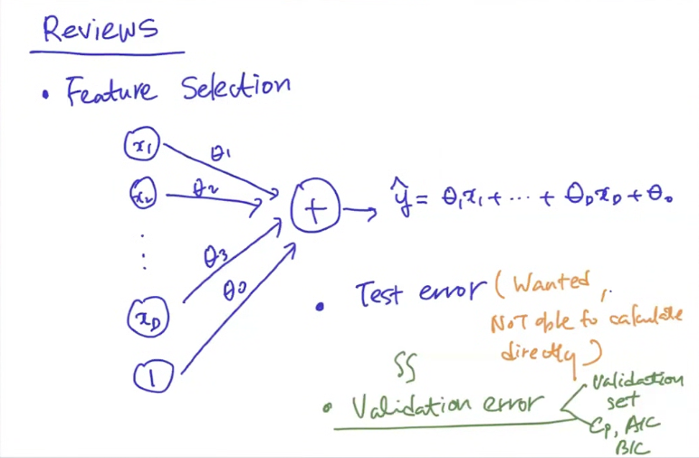
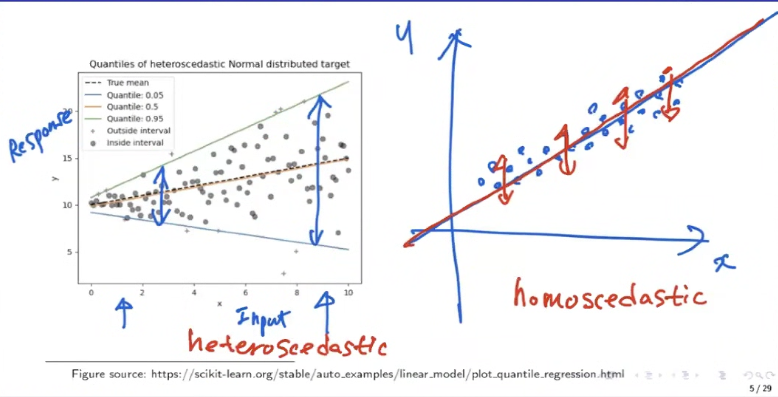
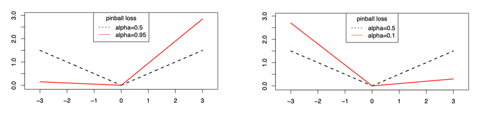

# 13일차 - 250718

# 📘 Reviews 정리 - Feature Selection



# Quantile Regression

## Point Prediction vs Prediction Sets/Intervals

* **Point prediction(포인트 예측)**: e.g. `50 mins` to airport (no uncertainty). 
  - 공항까지 50분 - 불확실성 없음
* **Prediction intervals(예측 구간)**: e.g. `50 \pm 5 mins`, gives uncertainty.
  -  $50 \pm 5$분 — 불확실성 포함.
* **Point prediction** returns a real value or label.
  - 한개의 값 or 레이블 예측
* **Prediction intervals/sets** return a set of labels or an interval.
  - 예측 구간/셋트는 값의 범위나 여러 개의 가능성 있는 값을 반환함


## OLS 와 Quantile Regression 비교



* **OLS (최소제곱법)**: Estimates conditional **mean** of response variable.
  - 반응 변수의 조건부 평균을 추정
* **Quantile Regression (분위수회귀)**: Estimates conditional **quantiles** (e.g., median).
  - 조건부 분위수 (예: 중앙값) 추정

  * Provides prediction **intervals** (e.g., 5% & 95% quantiles for 90% interval).
    -  5%, 95% 분위수를 구해 90% 예측 구간을 구성 가능

## `QuantileRegressor` Code (sklearn)

```python
from sklearn.linear_model import QuantileRegressor

quantiles = [0.05, 0.5, 0.95]
predictions = {}
out_bounds_predictions = np.zeros_like(y_true_mean, dtype=np.bool)

for quantile in quantiles:
    qr = QuantileRegressor(quantile=quantile, alpha=0)
    y_pred = qr.fit(X, y_normal).predict(X)
    predictions[quantile] = y_pred

    if quantile == min(quantiles):
        out_bounds_predictions = np.logical_or(out_bounds_predictions, y_pred >= y_normal)
    elif quantile == max(quantiles):
        out_bounds_predictions = np.logical_or(out_bounds_predictions, y_pred <= y_normal)
```


## What is a Quantile?

* Divides ordered data into equal-sized groups. 
  - (데이터 정렬 후 동일 크기의 그룹으로 나눔)
* Helps understand **spread** and **distribution** beyond averages. 
  - (평균 넘어서 분포의 구조나 퍼짐을 파악하는데 유용함)


## Types of Quantiles

* **Quartiles(4분위수)**: 4 parts

  * Q1: 25th percentile
  * Q2: 50th percentile (median)
  * Q3: 75th percentile
* **Deciles(10분위수)**: 10 parts (10%, ..., 90%) - 10개의 분위수
* **Percentiles(100분위수)**: 100 parts - 100개의 분위수


## How to Calculate a Quantile (분위수 계산 방법)

**Step 1: Order the data(데이터 정렬)**

Example: \$n = 9\$ values → {3, 6, 7, 8, 8, 10, 13, 15, 16}

**Step 2: Calculate Rank (분위수 위치 계산)**

$\text{Rank} = p \times (n + 1)$

For \$p = 0.25\$ (1st quartile):

$\text{Rank} = 0.25 \times (9 + 1) = 2.5$

**Why \$n+1\$?** Because data divides into \$n+1\$ intervals.

**Step 3: Determine Value (위치에 따라 보간법(inperpolate) 적용)**

* Interpolate between 2nd and 3rd values (2번째의 3번째 값 사이 보간):

$6 + 0.5 \times (7 - 6) = 6.5$

So, Q1 = 6.5


## Formal Definition (수식적 정의)

- $X$: random variable(랜덤 변수)
- $F(x)$: CDF(누적분포함수)
- $Q(p)$: quantile function (분위수 함수)

$F(x) = P(X \leq x)$

$Q(p) = F^{-1}(p) = \inf \{x \in \mathbb{R} \mid F(x) \geq p\}$


## Quantile Regression: Motivation (분위수 회기 출연 동기)

* More **robust** to outliers, non-Gaussian noise
  - 이상치에 강건함 (outlier에 영향 적음)
* Gives **prediction intervals**, not just points
  - 예측 구간을 직접 제공 가능
* Works with **heteroscedastic** data
  - 이분산성(heteroscedastic)이 있는 데이터에 적합


## Quantile Regression vs OLS

### OLS(최소제곱법):

$E[Y \mid X = x] = w_0 + w_1x_1 + \cdots + w_dx_d$

* Loss: **squared loss**

### Quantile Regression (분위수회귀):

$Q_\alpha(Y \mid X = x) = w_0(\alpha) + w_1(\alpha)x_1 + \cdots + w_d(\alpha)x_d$

* Loss: **pinball loss**


## Pinball Loss (핀볼 손실 함수)

For scalar $z$:

$$
\ell_\alpha(z) = \begin{cases}
  (\alpha - 1)z & \text{if } z \leq 0 \\
  \alpha z & \text{if } z > 0
\end{cases}
$$




## Error Function in Quantile Regression (분위수 회귀의 오차 함수)

$$
J(w_\alpha) = \sum_{n: y_n \geq w_\alpha^\top x_n} \alpha |y_n - w_\alpha^\top x_n| +
\sum_{n: y_n < w_\alpha^\top x_n} (1 - \alpha) |y_n - w_\alpha^\top x_n|
$$

* Minimization is via **linear programming** 
  - 선형계획법(linear programming)으로 최소화함
* For \$\alpha = 0.5\$, reduces to **LAD (Least Absolute Deviation)**
  - a = 0.5일 경우 최소 절대 편차(LAD)로 귀결됨


## Pinball Loss Intuition (직관적 이해: 핀볼 손실)

Let $q$: prediction(예측값 q), $y$: true value (실제값 y)

$$
\ell_{0.9}(q, y) = \begin{cases}
  0.9(y - q), & \text{if } y \geq q \\
  0.1(q - y), & \text{if } y < q
\end{cases}
$$

* Underprediction is penalized more when \$\alpha\$ is high
  - a가 클수록 과소예측(predicting too low)에 대한 패널티가 커짐
* Loss minimized when:
  - 손실은 다음 조건에서최소화 됨

$P(Y \leq q) = \alpha$

---

## Example: Food Expenditure vs Income

```python
import statsmodels.api as sm
import statsmodels.formula.api as smf

mod = smf.quantreg("foodexp ~ income", data)

quantiles = np.arange(0.05, 0.96, 0.1)

models = [
    [q, *mod.fit(q=q).params.values]
    for q in quantiles
]
```

* **OLS**: overestimates for low income
* **LAD**: slightly better
* **QR**: shows varying quantile lines (fan-shape)


## Outlier Examples

* **OLS**: strongly affected by outliers
* **LAD**: more stable
* **QR**: remains stable and spreads by quantile


## Heteroscedastic Noise

* Noise increases with input \$x\$
* **Spline regression** fits average trend
* **Quantile regression** captures uncertainty via multiple quantiles


## Important Note

**QR is not automatically valid on test data. Calibration is needed.**
