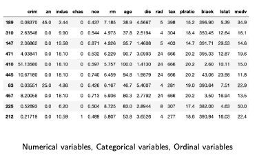

# 9일차 - 250714

## Linear algebraic equation
- 연립방정식(linear system)
- 솔루션 존재 X

## Linear Algebraic Equation

- 선형 연립방정식 (Linear system of equations)  
- 일반 형태: `Ax = b`  
  - `A`: 계수 행렬  
  - `x`: 미지수 벡터  
  - `b`: 상수 벡터  
- 여러 개의 일차방정식을 동시에 만족하는 해를 찾는 문제

## 해의 유형

1. **유일한 해 존재** (Unique solution)  
2. **무수히 많은 해 존재** (Infinite solutions)  
3. **해 없음** (No solution) ❗

## 해가 없는 조건

- 방정식 간 **모순**이 존재할 때  
  예:  
  `x + y = 1`  
  `x + y = 3` → 모순 → 해 없음

- 수학적 조건 (Rouché–Capelli 정리):  
  `rank(A) ≠ rank([A|b])` → 해 없음

$$
\text{rank}(A) \ne \text{rank}([A|b]) \Rightarrow \text{No solution}
$$

## 실무 예시

- 전기 회로 해석, 구조 분석, 경제 모델링 등  
- 해가 없다면 설계 오류 가능성 있음

---

# Regression (회귀)

## Linear Model

선형 모델(linear model)은 다음과 같은 수식으로 표현됩니다:

$$
y_n = w_1 x_{1,n} + w_2 x_{2,n} + \cdots + w_M x_{M,n} + w_0 + \epsilon_n
$$

- 여기서:
  - $$x_{j,n}$$: 입력 변수 (n번째 샘플의 j번째 특성)
  - $$w_j$$: 각 특성에 곱해지는 가중치 (모델이 학습하는 값)
  - $$w_0$$: 절편 (bias)
  - $$\epsilon_n$$: 오차(노이즈) 항
  - $$y_n$$: 예측값

### ✅ 특징

- **선형 변환(linear transformation)** 에 기반한 간단한 구조
- **분석적 해(analytical solution)** 가 존재하는 경우가 많아 계산이 빠름
- 각 변수의 영향력이 명확하게 드러나므로 **해석력(interpretability)** 이 좋음
- 실제 데이터에 약간의 노이즈가 섞여 있어도 대응 가능

### ✅ 선형 모델의 장점
- **선형 변환(linear transformation)** 에 기반하여 수학적으로 잘 정립되어 있음
- **해석적으로(analytically)** 해를 구할 수 있음 → 수치 해법보다 간단
- **해석력(interpretability)** 이 있음 → 각 변수의 영향력 해석 가능  
  (딥러닝보다 직관적)

### 📌 예시

만약 2개의 특성만 있다면, 모델은 다음과 같이 단순화됩니다:

$$
y_n = w_1 x_{1,n} + w_2 x_{2,n} + w_0 + \epsilon_n
$$

이 경우, 모델은 **2차원 평면상의 직선**을 학습하는 것과 같으며, 직관적으로 이해하기 쉽습니다.

---

## 선형 회귀(Linear Regression) 수식적 정의

### ✅ 목표:
- 입력 $$x_n$$에 대해 조건부 평균 $$E[y_n | x_n]$$을 예측하는 모델
- 이때 함수 $$f(x_n)$$는 입력 $$x_n$$의 **변형된 표현(기저함수, basis functions)** $$\phi(x_n)$$에 대한 선형 함수

### ✅ 수식 표현

$$
f(x_n) = \sum_{j=1}^{M} w_j \phi_j(x_n) + w_0 \phi_0(x) = \mathbf{w}^\top \boldsymbol{\phi}(x_n)
$$

- 여기서,
  - $$\phi_j(x_n)$$: 입력 $$x_n$$을 변형하는 **기저 함수**
  - $$\mathbf{w}$$: 각 기저함수에 대한 가중치 벡터

### ✅ 벡터 표현 정리

$$
\mathbf{w} = 
\begin{bmatrix}
w_0 \\
w_1 \\
\vdots \\
w_M
\end{bmatrix}
\in \mathbb{R}^{M+1}
$$

$$
\boldsymbol{\phi}(x_n) = 
\begin{bmatrix}
\phi_0(x_n) \\
\phi_1(x_n) \\
\vdots \\
\phi_M(x_n)
\end{bmatrix}
\in \mathbb{R}^{M+1}
$$

## 🔷 핵심 포인트 요약

- **입력 x**는 그대로 쓰지 않아도 됨 → **비선형 기저 함수**를 통해 변형 가능
- 하지만 **가중치와 기저함수 간의 관계는 선형**이므로,
  전체 모델은 여전히 **선형 회귀**로 분류됨
- 덕분에 비선형 문제도 일정 부분 처리 가능하면서도,
  **선형 모델의 수학적 단순성**은 유지 가능함

---

# Polynomial Regression (다항 회귀)

## ✅ 개념

다항 회귀는 선형 회귀의 확장으로, 입력값 $$ x $$에 대해 **다항식 형태의 함수**를 사용하여 예측 모델을 구성합니다.

$$
f(x_n) = \sum_{j=0}^{M} w_j \cdot x_n^j
$$

- 여기서:
  - $$ M $$: 다항식의 차수 (degree)
  - $$ w_j $$: 각 항의 가중치 (학습할 파라미터)
  - $$ x_n^j $$: 입력 $$x_n$$을 j제곱한 값

---

## ✅ 직관적 이해

- **선형 회귀 (M=1)**: 직선 형태로만 데이터를 설명
- **다항 회귀 (M > 1)**: 곡선 형태로도 모델링 가능  
  → 더 복잡한 데이터 분포를 잘 맞출 수 있음

---

## ✅ 슬라이드 그래프 설명

> 아래 네 개 그래프는 각각 다항 차수 $$M = 0, 1, 3, 9$$에 대한 회귀 결과를 보여줌.

| 차수(M) | 설명 |
|--------|------|
| **M=0** | 상수 함수 → 평균값으로만 예측 (직선도 아님) |
| **M=1** | 선형 회귀 (직선) → 단순한 데이터에 적합하지만, 곡선을 설명하지 못함 |
| **M=3** | 곡선을 어느 정도 따라감 (적절한 복잡도) |
| **M=9** | **과적합(overfitting)** 발생 → 훈련 데이터에는 잘 맞지만 일반화 성능이 떨어짐 |

- **초록 선**: 실제 데이터 생성 함수 (예: 사인 곡선)
- **파란 선**: 다항 회귀 모델의 예측 결과
- **동그라미 점**: 훈련 데이터 샘플

---

## ✅ 핵심 메시지

- 다항 차수가 너무 작으면 **과소적합(underfitting)**  
- 너무 크면 **과적합(overfitting)**  
- → 적절한 **모델 복잡도(M)** 선택이 중요

---

## ✅ 실제 적용 시 주의할 점

- 고차 다항식은 수치적으로 불안정할 수 있음
- 일반적으로는 **정규화** 또는 **정칙화 (Regularization)** 와 함께 사용

# Ordinary Least Squares (OLS)

- 선형 회귀에서 가장 기본적인 방법으로, **관측된 데이터와 모델 예측 값의 오차 제곱합을 최소화**하는 가중치 벡터 $$ \mathbf{w} $$ 를 구하는 방식입니다.

## 1. Least Squares Method

### ✅ 목적
훈련 데이터 
$$ \{(x_n, y_n)\}_{n=1}^N $$
에 대해, 다음의 오차 제곱합을 최소화하는 가중치 
$$\mathbf{w}$$
를 찾습니다.

$$
J(\mathbf{w}) = \sum_{n=1}^N \left( y_n - \mathbf{w}^T \boldsymbol{\phi}(x_n) \right)^2 = \| \mathbf{y} - \Phi \mathbf{w} \|^2
$$

- $$ \Phi $$: 
- **Design Matrix (설계 행렬)**  
  $$ \Phi \in \mathbb{R}^{N \times (M+1)} $$

$$
\Phi =
\begin{bmatrix}
\phi_0(x_1) & \phi_1(x_1) & \dots & \phi_M(x_1) \\
\phi_0(x_2) & \phi_1(x_2) & \dots & \phi_M(x_2) \\
\vdots & \vdots & \ddots & \vdots \\
\phi_0(x_N) & \phi_1(x_N) & \dots & \phi_M(x_N)
\end{bmatrix}
$$

## 2. Design Matrix: Tabular Data

- Design Matrix 
$$\Phi$$
는 실제 데이터를 행렬로 표현한 것
- 행: 샘플 (데이터 포인트)  
- 열: 피처 (특성) — 수치형, 범주형, 서열형 변수 포함

예: 아래는 여러 종류의 특성이 혼합된 테이블  
(슬라이드 참조)

## 3. Closed-form Solution (정해진 해 공식)

OLS의 해는 다음과 같이 주어진다:

$$
\mathbf{w}_{\text{opt}} = \arg \min_\mathbf{w} \| \mathbf{y} - \Phi \mathbf{w} \|^2
$$

이를 풀기 위해, 미분해서 0으로 만드는 방정식을 풀면:

$$
\frac{\partial}{\partial \mathbf{w}} \| \mathbf{y} - \Phi \mathbf{w} \|^2 = 0
$$

최종 해는 다음과 같은 형태:

$$
\mathbf{w}_{\text{opt}} = (\Phi^T \Phi)^{-1} \Phi^T \mathbf{y}
$$

> 이 때 
> $$ (\Phi^T \Phi)^{-1} \Phi^T $$ 
> 는 **Moore-Penrose 의사역행렬 (pseudo-inverse)** 이라고 불림

## 4. Categorical Variables (범주형 변수)
- 범주형 변수는 값들 사이에 수치적 크기나 순서가 없는 **범주(label)** 들로 구성된 특성입니다.

### ✅ 예시
브랜드 종류:

$$
x \in \{ \text{BMW}, \text{Mercedes}, \text{Porsche}, \text{Ferrari}, \text{Lamborghini} \}
$$

이를 수치형 벡터로 바꾸기 위해 **One-hot Encoding** 을 사용:

- BMW → [1, 0, 0, 0, 0]
- Mercedes → [0, 1, 0, 0, 0]
- Porsche → [0, 0, 1, 0, 0]
- Ferrari → [0, 0, 0, 1, 0]
- Lamborghini → [0, 0, 0, 0, 1]

**단점**: 차원이 커질 수 있음 → **차원의 저주 (curse of dimensionality)**

### 예시2:
- 브랜드: BMW, Mercedes, Porsche
- 도시: 서울, 부산, 대전
- 성별: 남자, 여자

이 변수들은 **수학적 연산**에 직접 사용할 수 없기 때문에,  
적절한 방법으로 **수치 벡터로 인코딩** 해야 합니다.

### 🔹 대표 인코딩 방법

#### 1. One-hot Encoding

- 각 범주를 **서로 배타적인 벡터**로 변환
- 사용 시기: 범주 간 **순서가 없을 때**

예: 브랜드 = ['BMW', 'Mercedes', 'Porsche']

| 브랜드     | 인코딩 결과       |
|------------|------------------|
| BMW        | [1, 0, 0]        |
| Mercedes   | [0, 1, 0]        |
| Porsche    | [0, 0, 1]        |

> **단점**: 범주 수가 많을 경우 차원이 매우 커질 수 있음  
> (ex. 1만 개 지역 이름 → 1만 차원)

#### 2. Ordinal Encoding

- 범주에 **순서가 있는 경우**, 정수로 매핑

예: 만족도 = ['Bad', 'Neutral', 'Good']

| 만족도     | 인코딩 값 |
|------------|-----------|
| Bad        | 0         |
| Neutral    | 1         |
| Good       | 2         |

> **주의**: 모델이 정수 간 간격을 **동일한 거리로 해석**할 수 있음 → 적절한 모델 선택 필요

## 5. Ordinal Variables (서열형 변수)

### ✅ 예시

고객 만족도:

$$
x \in \{ \text{Bad}, \text{Neutral}, \text{Good} \}
$$

이는 **서열 정보가 있음** → 단순한 one-hot 보다는 **정수 인코딩** 사용 가능:

- Bad → 0
- Neutral → 1
- Good → 2

이 방식을 **Ordinal Encoding (또는 Integer Encoding)** 이라고 한다.

---

# Leverage Score & R-Squared

---

## 🔷 Leverage Score

### 정의
Leverage Score는 관측치 $$x_i$$가 전체 회귀에 미치는 영향을 측정하는 값입니다.  
이는 다음과 같이 정의된 Hat 행렬 $$H$$의 대각 성분입니다:

$$
\hat{\mathbf{y}} = H \mathbf{y}, \quad H = X (X^T X)^{-1} X^T
$$

- $$h_{ii} = \text{row}_i(H) = \text{leverage score of } x_i$$
- Hat 행렬은 대칭(symmetric), idempotent (즉 $$H^2 = H$$)

### 성질
- 모든 leverage score의 합은:  
  $$\sum_i h_{ii} = \text{Tr}(H) = p$$  
  여기서 $$p$$는 파라미터 수 (또는 설계 행렬의 열 수)
- $$h_{ii}$$ 값이 크다는 건, 해당 관측치 $$x_i$$가 예측값에 강한 영향을 준다는 의미
- 다음처럼 분해 가능:
  $$
  h_{ii} = \frac{1}{n} + \frac{(x_i - \bar{x})^2}{\sum_{j=1}^n (x_j - \bar{x})^2}
  $$

## 🔷 Leverage Score (SVD 관점)

- 설계 행렬 $$X$$의 SVD:
  $$
  X = U \Sigma V^T
  $$

- Hat 행렬은 다음과 같이 표현 가능:
  $$
  H = X (X^T X)^{-1} X^T = U U^T
  $$

- 이로부터 leverage score는 다음과 같이 계산됨:
  $$
  h_{ii} = \| U_i \|^2
  $$

→ 즉, $$U$$ 행렬의 각 행의 L2 노름 제곱

## 🔷 Outlier Detection with Leverage

- leverage가 높은 관측치는 예측값을 크게 왜곡할 수 있음

### 일반적으로:
- 평균 leverage:
  $$
  \bar{h} = \frac{p}{n}
  $$
- 관행적으로 다음 조건을 만족하면 이상치로 간주:
  $$
  h_i > 2\bar{h} \quad \text{or} \quad h_i > 3\bar{h}
  $$

> High leverage ≠ 이상치지만, 이상치일 가능성 높음  
> 실제 오차(residual)와 함께 확인 필요

## 🔷 R-Squared (결정계수)

회귀 모델이 **전체 분산 중 얼마만큼을 설명하는가**를 측정하는 지표

### 정의:

$$
R^2 = 1 - \frac{\text{RSS}}{\text{TSS}}
$$

- RSS (Residual Sum of Squares):  
  $$
  \sum_{i=1}^{n} (y_i - \hat{y}_i)^2
  $$
- TSS (Total Sum of Squares):  
  $$
  \sum_{i=1}^{n} (y_i - \bar{y})^2
  $$

### 성질
- $$R^2 = 1$$: 완벽하게 설명
- $$R^2 = 0$$: 아무것도 설명하지 못함
- $$R^2 < 0$$: 모델이 평균보다 못함 (심각한 과적합 또는 엉터리 모델)

> 회귀선과 데이터 분산을 함께 시각화하면 해석에 도움이 됨

## 🔍 시각적으로 이해하기

- 점이 회귀선과 가까울수록 RSS가 작아지고, $$R^2$$는 커짐
- 산점도에서 $$R^2$$는 **설명된 분산의 비율**로 나타남

---

# 📊 Data Imputation (결측치 대체)

---

## 1. Mean / Median Imputation

- 각 컬럼의 평균(mean) 또는 중앙값(median)으로 결측치를 대체

**장점**
- 쉽고 빠름
- 수치형 데이터에 유효

**단점**
- 변수 간 상관관계를 고려하지 않음
- 범주형에는 적용 불가
- 평균은 이상치에 민감
- 정확도가 낮을 수 있음

---

## 2. Most Frequent Value Imputation

- 각 컬럼에서 가장 많이 등장한 값(최빈값, mode)으로 결측치 대체

**장점**
- 범주형 데이터에 적합
- 구현이 간단함

**단점**
- 변수 간 상관관계 고려 안 됨
- 데이터 다양성 저해 가능

---

## 3. k-NN Imputation (k-Nearest Neighbors)

- 결측치가 있는 샘플을 k개의 최근접 이웃과 비교하여 값 예측

**알고리즘 요약**
1. 결측치가 있는 행 찾기
2. 결측치 없는 행들과 거리 계산
3. 가장 가까운 k개의 샘플 선택
4. 평균/다수결 등으로 결측치 채움

**장점**
- 평균/중앙값보다 더 정확할 수 있음
- 거리 기반으로 변수 간 관계 반영

**단점**
- 계산 비용 높음
- 스케일링 필요

---

## 4. MICE (Multivariate Imputation by Chained Equations)

- 다변량 회귀 기반 순차적 대체 방식

**작동 방식**
1. 초기값으로 결측치 대체 (예: 평균/중앙값)
2. 다른 변수로 회귀 모델 학습
3. 결측치 예측 및 갱신
4. 이 과정을 반복

**장점**
- 변수 간 상관관계 반영
- 여러 변수 예측에 강력함

**단점**
- 계산 복잡도 높음
- 수렴 보장 안 될 수도 있음

