# 10일차 - 250715

# Review 보기 - Linear Regression
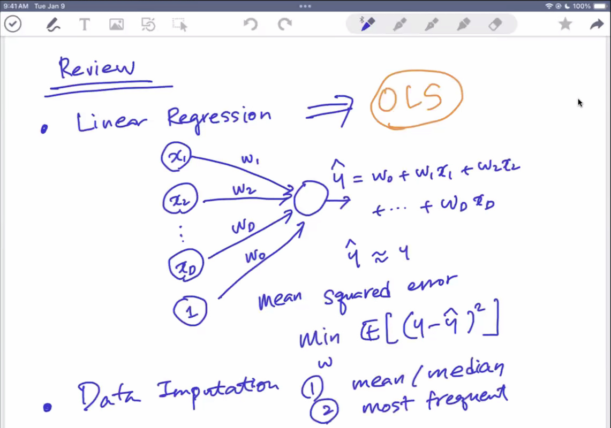

---

# 📌 Maximum Likelihood 관점에서의 OLS

## 📘 모델 가정

- 목표 변수 \( y_n \)은 다음과 같은 선형 모델로 생성된다고 가정합니다:

$$
y_n = \mathbf{w}^\top \phi(\mathbf{x}_n) + \epsilon_n
$$

- 여기서:
  - \( \phi(\mathbf{x}_n) \): 입력 \( \mathbf{x}_n \)에 대한 특성 변환(feature transformation)
  - \( \epsilon_n \sim \mathcal{N}(0, \sigma^2) \): 평균 0, 분산 \( \sigma^2 \)인 가우시안 잡음
  - \( \mathbf{w} \): 학습해야 할 파라미터 벡터

- 벡터 형태로 표현하면:

$$
\mathbf{y} = \Phi \mathbf{w} + \boldsymbol{\epsilon}
$$

- 확률 모델 관점에서는 다음과 같이 표현됩니다:

$$
p(\mathbf{y} | \Phi, \mathbf{w}) = \mathcal{N}(\Phi \mathbf{w}, \sigma^2 \mathbf{I})
$$


## 📈 로그 가능도 함수 (Log-Likelihood)

- 로그 가능도 함수는 다음과 같이 정의됩니다:

$$
\mathcal{L} = \log p(\mathbf{y} | \Phi, \mathbf{w}) = \sum_{n=1}^{N} \log p(y_n | \phi(\mathbf{x}_n), \mathbf{w})
$$

- 이를 정리하면:

$$
\mathcal{L} = -\frac{N}{2} \log \sigma^2 - \frac{N}{2} \log 2\pi - \frac{1}{2\sigma^2} \mathcal{J}_{LS}
$$

- 여기서 \( \mathcal{J}_{LS} \): OLS에서의 제곱합 오차(Sum of Squared Errors)

### 참조
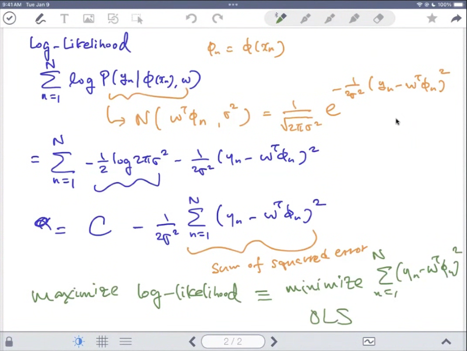

### likelihood가 있는데 log-likelihood를 별도로 쓰는 이유?
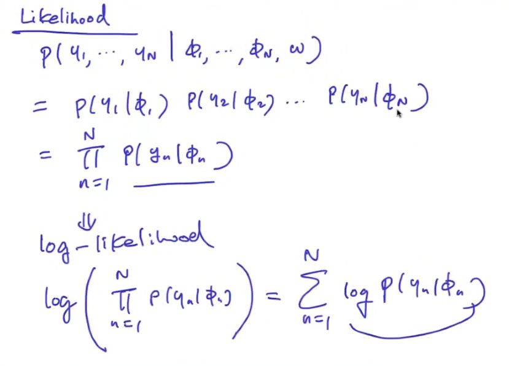


## 🧠 최대우도 추정 (Maximum Likelihood Estimation, MLE)

- MLE는 로그 가능도를 최대화하는 파라미터 \( \mathbf{w} \)를 찾는 것:

$$
\mathbf{w}_{ML} = \arg\max_{\mathbf{w}} \log p(\mathbf{y} | \Phi, \mathbf{w})
$$

- 결과적으로 다음과 같은 결론에 도달합니다:

$$
\mathbf{w}_{ML} = \mathbf{w}_{OLS}
$$

> ✅ 즉, **가우시안 노이즈 가정** 하에서 MLE는 OLS 해와 동일합니다.


---


# 📌 Regularization

- 모든 딥러닝은 기본적으로 깔고 시작한다!!
- **Ridge Regression**: $\ell_2$ norm regularization  
- **LASSO**: $\ell_1$ norm regularization


## ❓ Why Regularization?

- 목적: 과적합 방지를 위해 나온것!!

> 복잡한 모델은 학습 데이터에 과도하게 적합(overfitting)되어 새로운 데이터에 일반화 성능이 떨어질 수 있습니다.  
> Regularization은 이런 **과적합 문제를 완화**하여 더 **일반화 가능한 모델**을 학습하게 도와줍니다.

예시로, 고차 다항식을 사용한 모델은 훈련 데이터에는 완벽하게 맞지만, 테스트 데이터에서는 예측이 크게 벗어날 수 있습니다. 반면, 적절한 정규화를 적용한 모델은 약간의 오차를 감수하더라도 보다 부드럽고 일반화된 함수를 추정하게 됩니다.


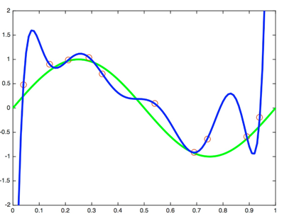
> Regularization은 학습된 모델의 **일반화 성능**(generalization)을 향상시키기 위해 사용됩니다.


## ⚙️ Regularization 개념

### 🧠 목적
- 입력 $\mathbf{x}$에 대한 함수를 추론하고자 합니다.
- 학습 데이터:  
  $$
  \mathcal{D} = \{ (\mathbf{x}_n, y_n) \}_{n=1}^{N}
  $$

### 🧮 손실 함수
- 일반적인 손실 함수: $\ell(f(\mathbf{x}_n; \mathbf{w}), y_n)$  
- 예: Least Squares (LS) 손실 함수는 다음과 같습니다:

$$
\sum_{n=1}^N \ell(f(\mathbf{x}_n; \mathbf{w}), y_n) = \frac{1}{2N} \|\mathbf{y} - \Phi \mathbf{w} \|^2
$$


## 🧩 Regularizer 추가

모델의 **복잡도(complexity)** 를 제한하기 위해, 손실 함수에 패널티 항을 추가합니다:

$$
\underbrace{\sum_{n=1}^N \ell(f(\mathbf{x}_n; \mathbf{w}), y_n)}_{\text{loss}} + \lambda \underbrace{R(f)}_{\text{regularizer}}
$$

- $\lambda$: 정규화 항의 중요도를 조절하는 **하이퍼파라미터**


## 🔍 모델 복잡도와 계수 변화 예시

- 다음 그림은 모델 차수 $M$에 따른 회귀 결과를 보여줍니다:

| 모델 차수 | 예시 |
|-----------|------|
| $M = 1$   | (a) 선형 회귀 (과소적합) |
| $M = 3$   | (b) 적절한 모델 |
| $M = 9$   | (c) 과적합 |
| 계수 변화 | (d) 회귀 계수 크기가 매우 커짐 |

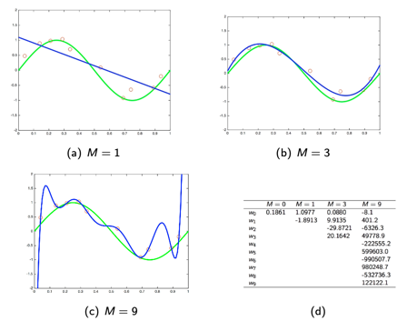

## 📊 회귀 계수 비교 (예시)

| 계수 | $M=0$ | $M=1$ | $M=3$ | $M=9$ |
|------|-------|--------|--------|--------|
| $w_0$ | 0.1861 | 1.0977 | 0.0880 | -8.1 |
| $w_1$ |       | -1.8913 | 9.9135 | 401.2 |
| $w_2$ |       |        | -29.8721 | -6326.3 |
| $w_3$ |       |        | 20.1642 | 49778.9 |
| $w_4$ |       |        |         | -222555.2 |
| $w_5$ |       |        |         | 599603.0 |
| $w_6$ |       |        |         | -990507.7 |
| $w_7$ |       |        |         | 980248.7 |
| $w_8$ |       |        |         | -523726.3 |
| $w_9$ |       |        |         | 122122.1 |

> 높은 차수일수록 계수의 크기가 급격히 커지며, 이는 과적합(overfitting)의 원인이 됩니다.


---


# 📘 Ridge Regression

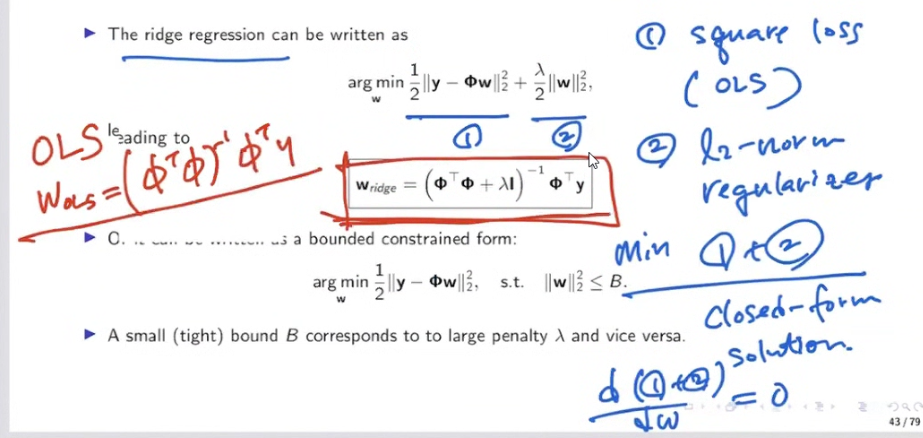

- 람다 $ \lambda $ 가 커질수록 강한 regularization

## 📀 정의

Ridge Regression은 \$\ell\_2\$ norm 정규화를 적용한 선형 회귀입니다.

손실 함수는 다음과 같이 정의됩니다:

$$
\min_{\mathbf{w}} \; \frac{1}{2} \|\mathbf{y} - \Phi \mathbf{w}\|^2 + \frac{\lambda}{2} \|\mathbf{w}\|^2
$$

해당 식으로부터 해는 아래와 같이 유도됩니다:

$$
\mathbf{w}_{\text{ridge}} = \left( \Phi^\top \Phi + \lambda I \right)^{-1} \Phi^\top \mathbf{y}
$$

또는 다음것과 같은 제약조건 하의 최적화 문제로 표현할 수도 있습니다:

$$
\min_{\mathbf{w}} \; \frac{1}{2} \|\mathbf{y} - \Phi \mathbf{w}\|^2 \quad \text{subject to} \quad \|\mathbf{w}\|^2 \leq \delta
$$

* \$\lambda\$: 정규화 강도 (크면 제약이 강함)
* \$\delta\$: \$\ell\_2\$ 제약 조건의 경계

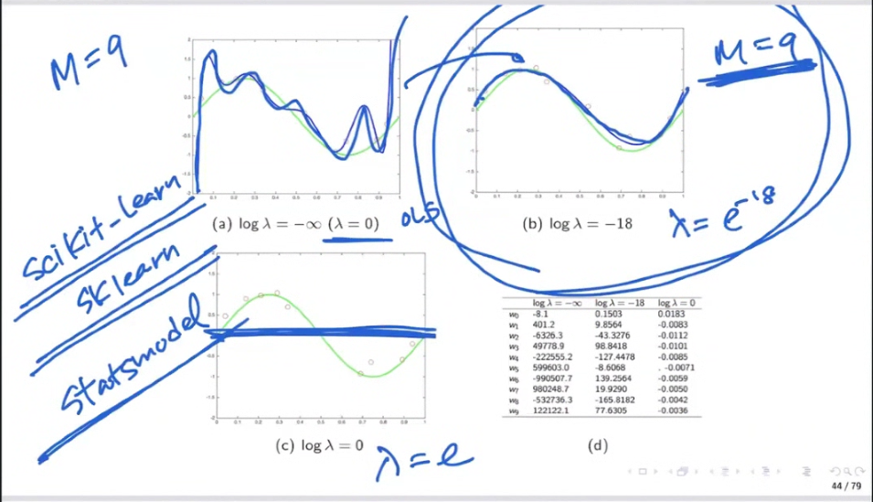

## 📈 정규화 강도에 따른 모델 변화

* **$ \log\_{10} \lambda = \infty $**: 단순한 지선 (\uac00운치 거의 0)
* **$ \log\_{10} \lambda = -10 $**: \uc77c반적인 \uacf5선
* **$ \lambda = 0 $**: 정규화 없음 → 과적합 발생


## 파라미터 값 비교 (Ridge 적용 전후)

| 항목       | OLS 추정치   | Ridge 추정치 |
| -------- | --------- | --------- |
| \$w\_0\$ | -8.1      | -0.2059   |
| \$w\_1\$ | 401.2     | 0.6986    |
| \$w\_2\$ | -6326.3   | -0.8355   |
| \$w\_3\$ | 49778.9   | 0.1882    |
| \$w\_4\$ | -222555.2 | -0.0394   |
| \$w\_5\$ | 599603.0  | -0.1488   |
| \$w\_6\$ | -990507.7 | -0.0717   |
| \$w\_7\$ | 980248.7  | 0.1706    |
| \$w\_8\$ | -523726.3 | -0.0984   |
| \$w\_9\$ | 122122.1  | 0.0165    |

> Ridge를 적용하면 기본기 계수 값이 가변해진다.


## 호환적 설명

Ridge는 다음 두 것을 동시에 최소화합니다:

* LS 손실: $ |\mathbf{y} - \Phi \mathbf{w}|^2 $
* 정규화 항: $ |\mathbf{w}|^2 $

그는 **동고선(Contour)** 형태로 실시간화될 수 있고,\n용적 조건 내부에서 손실이 최소인 지점을 찾는 방식입니다.


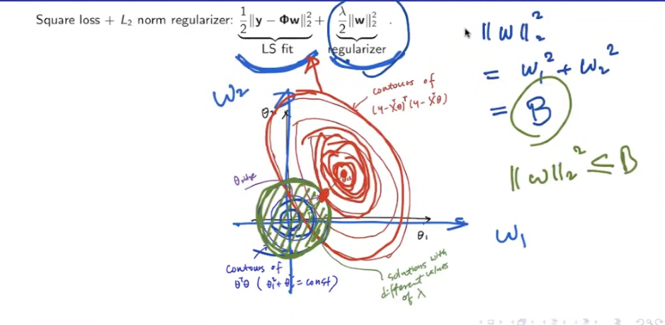

## 학습 알고리드링 (Pseudocode)

```
Algorithm 1: Ridge Regression

Input: X ∈ ℝ^{n×d}, y ∈ ℝ^n, λ ∈ ℝ

1. Initialize Φ ← X,  y ← y
2. Compute w ← (ΦᵀΦ + λI)⁻¹ Φᵀy
3. Return w
```


## 파일 설명: Prostate Cancer Data

* 타겟: PSA(전망선 특이 할아웃) 수치 예측
* 특성:

  * `lcavol`: log cancer volume
  * `lweight`: log prostate weight
  * `age`: age of patient
  * `lbph`: log of benign prostatic hyperplasia
  * `svi`: seminal vesicle invasion
  * `lcp`: log of capsular penetration
  * `gleason`: Gleason score
  * `pgg45`: percent of Gleason 4 or 5

포함 데이터 조직:

* [http://statweb.stanford.edu/\~tibs/ElemStatLearn/](http://statweb.stanford.edu/~tibs/ElemStatLearn/)
* [https://hastie.su.domains/CASI\_files/DATA/prostate.data](https://hastie.su.domains/CASI_files/DATA/prostate.data)


## 📈 Regularization Path [Hastie, Tibshirani, Friedman]

* \$\lambda\$의 값이 증가할수록 각 계수 \$w\_i\$가 0으로 수렴
* Ridge regression의 가운치 초과 결과 간의 관계 시각화

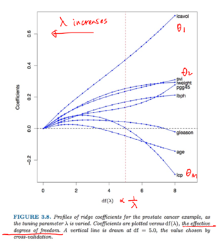

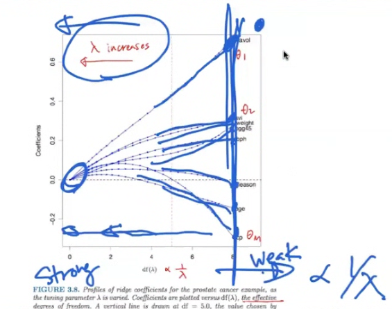


## 🔁 Cross-Validation for Choosing $λ$

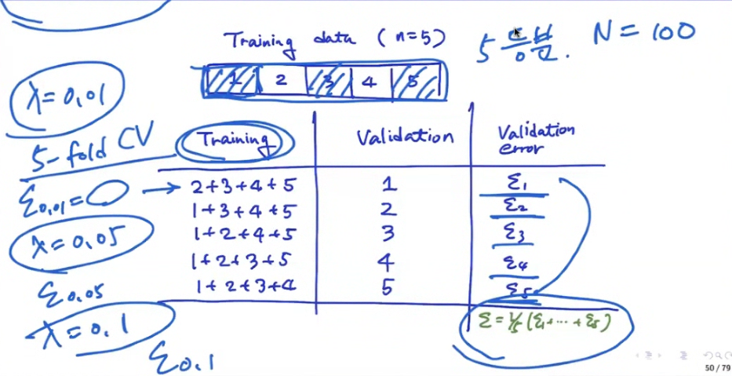

> \$\lambda\$는 모델의 일반화 목표에 관객하기 때문에,
> 대체적으로 **k-fold 교차 검사**로 적절한 값을 선택합니다.

복소:

* 데이터를 K개 분할
* 하나는 validation, 나머지는 training
* 다양한 \$\lambda\$ 값에 대해 validation error 계산
* error가 가장 적은 값을 선택

결과:

```
Training:  1 2 3 4 5
Fold 1 → Train: 2~5, Test: 1
Fold 2 → Train: 1,3~5, Test: 2
...
```

최종 선택: 검증 오류가 최소인 \$\lambda\$

---


# 📘 LASSO (Least Absolute Shrinkage and Selection Operator)

## ✨ 핵심 아이디어

LASSO는 아래의 목적 함수로 정의됩니다:

$$
\min_{\mathbf{w}} \; \frac{1}{2} \|\mathbf{y} - \Phi \mathbf{w}\|^2 + \lambda \|\mathbf{w}\|_1
$$

또는 다음 제약 조건을 만족하는 최적화 문제로 쓸 수 있습니다:

$$
\min_{\mathbf{w}} \; \frac{1}{2} \|\mathbf{y} - \Phi \mathbf{w}\|^2 \quad \text{s.t.} \quad \|\mathbf{w}\|_1 \leq \delta
$$

* \$\ell\_1\$ 정규화를 통해 희소성(sparsity)을 유도합니다.

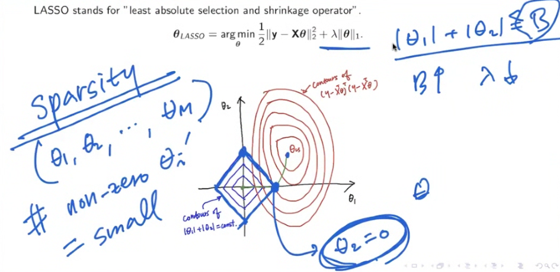


## 🔍 해석적 장점

* **예측 성능**: 모델 복잡도를 제한하여 과적합 방지
* **해석 가능성**: 일부 계수를 0으로 만들어 변수 선택이 가능함

## 📐 시각적 설명

* LASSO는 제약 조건이 다이아몬드 모양 (\$\ell\_1\$ norm ball)
* 경계에서 최적값이 발생 → 일부 계수는 정확히 0이 됨

## 📈 Regularization Path 비교

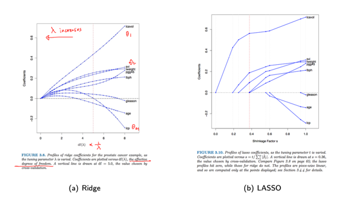

* Ridge: 연속적으로 수렴, 모든 변수 포함
* LASSO: 일부 계수가 정확히 0으로 수렴 → 변수 선택 기능 포함

## 🧮 Gradient 계산

손실 함수의 미분은 다음과 같습니다:

$$
\nabla_w \left( \frac{1}{2} \|y - Xw\|^2 + \lambda \|w\|_1 \right)
$$

* \$|w|\_1\$은 미분 불가능한 지점 존재 → coordinate descent 사용

## 🔁 Coordinate Descent

각 파라미터 \$w\_j\$에 대해 반복적으로 최적화:

$$
w_j \leftarrow S\left( \frac{1}{N} \sum_{i=1}^N x_{ij} (y_i - \hat{y}^{(-j)}_i), \lambda \right)
$$

## 🔻 Soft Thresholding

$$
S(z, \lambda) = \text{sign}(z) \cdot \max(|z| - \lambda, 0)
$$

* 입력값 \$z\$가 \$\lambda\$보다 작으면 0으로 수축
* 큰 값은 \$\lambda\$만큼 감소

## 🧮 Subgradient 계산

\$\ell\_1\$ norm의 서브그래디언트는 다음과 같습니다:

$$
\partial |w_j| = \begin{cases}
1 & w_j > 0 \\
-1 & w_j < 0 \\
[-1, 1] & w_j = 0
\end{cases}
$$

이 개념을 통해 soft-thresholding이 도출됨

## 🔫 Shooting Algorithm

LASSO의 coordinate descent는 shooting 알고리즘이라고도 불림

**Papers**:

* Fu, W. (1998). "Penalized regression: The bridge versus the LASSO"
* Wu and Lange (2008). "Coordinate descent algorithms for LASSO penalized regression"

Pseudocode (Shooting Algorithm):

```
Algorithm: Coordinate Descent for Sparse Regression
Input: X, y, λ, initialize w = 0
repeat until convergence:
  for j = 1 to p:
    compute partial residual r^{(j)}
    update w_j ← S( ... ) using soft-threshold
return w
```

---


# 🎯 Bias-Variance Dilemma

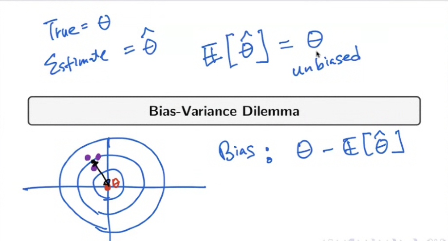

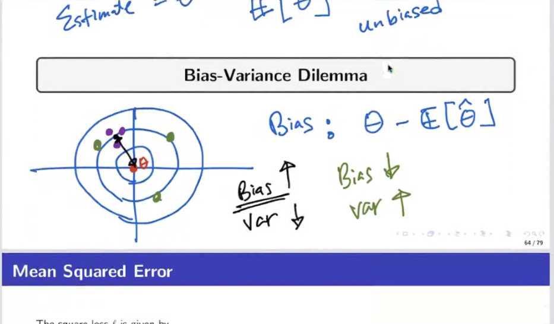

## 📏 Mean Squared Error (MSE)

* 제곱 손실 함수는 다음과 같이 정의됩니다:

$$
\ell(y, f(x)) = (y - f(x))^2
$$

* 평균 제곱 오차(MSE)는 다음과 같습니다:

$$
\mathbb{E}_{(x,y)} \left[ (y - f(x))^2 \right] = \int (y - f(x))^2 p(x, y) dx dy
$$

* \$y = f^\*(x) + \varepsilon\$ 으로 가정하면:

$$
\mathbb{E}_{(x,y)}[(y - f(x))^2] = \underbrace{(f(x) - \mathbb{E}[y])^2}_{\text{bias}^2} + \underbrace{\text{Var}(y)}_{\text{noise}}
$$


## 🧩 Bias-Variance Decomposition

특정 \$x\$에 대한 손실의 기댓값은 다음과 같이 분해됩니다:

$$
\mathbb{E}_{\mathcal{D}} \left[ (f(x; \mathcal{D}) - y)^2 \right] = \left( \mathbb{E}_{\mathcal{D}}[f(x; \mathcal{D})] - f^*(x) \right)^2 + \mathbb{E}_{\mathcal{D}}\left[ \left( f(x; \mathcal{D}) - \mathbb{E}_{\mathcal{D}}[f(x; \mathcal{D})] \right)^2 \right] + \sigma^2
$$

* 첫 번째 항: bias\$^2\$ (예측 평균과 진짜 함수 \$f^\*\$의 차이)
* 두 번째 항: variance (모델의 불안정성)
* 세 번째 항: irreducible noise (데이터의 고유 노이즈)

**요약:**

$$
\text{Expected loss} = \text{Bias}^2 + \text{Variance} + \text{Noise}
$$


## ⚖️ Bias-Variance Trade-off

* 모델의 복잡도가 증가하면:

  * Bias는 감소 (모델이 더 정확하게 예측)
  * Variance는 증가 (모델이 과적합됨)

* 반대로 모델이 너무 단순하면:

  * Bias는 커짐
  * Variance는 작아짐

> 이상적인 모델은 이 둘 사이의 균형(Bias-Variance Trade-off)이 가장 잘 맞는 지점을 찾는 것


## 🔢 예시 시뮬레이션

* \$N=25\$인 샘플을 가진 100개의 데이터셋 생성
* 진짜 함수: \$f^\*(x) = \sin(2 \pi x)\$
* 각 데이터셋에 대해 24개 Gaussian basis로 모델 \$\hat{f}(x)\$ 학습

### Bias 계산:

$$
\text{bias}^2 = \frac{1}{n} \sum_{i=1}^n (\mathbb{E}[\hat{f}(x_i)] - f^*(x_i))^2
$$

### Variance 계산:

$$
\text{variance} = \frac{1}{n} \sum_{i=1}^n \mathbb{E} \left[ (\hat{f}(x_i) - \mathbb{E}[\hat{f}(x_i)])^2 \right]
$$


## 📊 시각적 비교

| 모델 유형                    | 예측 분포        | Bias      | Variance      |
| ------------------------ | ------------ | --------- | ------------- |
| Rigid Model (1st row)    | 단순하고 부드러운 커브 | High Bias | Low Variance  |
| Flexible Model (2nd row) | 복잡하고 세세한 커브  | Low Bias  | High Variance |

> 복잡한 모델은 학습 데이터에는 잘 맞지만, 일반화 성능은 떨어질 수 있음

출처: Bishop's PRML


---

# 🔍 Linear Regression: Explainability

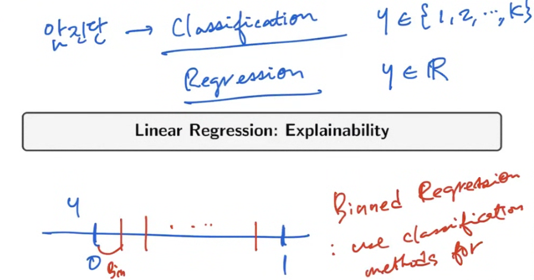

## 📌 Feature Importance (t-statistic)

* 계수의 중요도는 해당 계수의 **표준 오차로 정규화된 값**, 즉 **t-통계량**으로 측정합니다:

$$
t_j = \frac{\hat{\theta}_j}{SE(\hat{\theta}_j)}
$$

* 특성의 중요도는 \$|t\_j|\$ 의 절댓값이 클수록 중요도가 높다고 해석할 수 있습니다.


## 🚲 Example: Bike Rentals Dataset for Regression

* 목표: **날씨와 요일에 따라 자전거 대여 수요를 예측**
* 사용된 특성들:

  * 자전거 수(cnt): target 값
  * 계절(season): 봄, 여름, 가을, 겨울
  * 공휴일 여부
  * 주말 여부
  * 날짜로부터의 경과 일수(days\_since\_2011)
  * 날씨 정보 (good, mist, rain/snow/storm 등)
  * 기온(°C), 습도(%), 풍속(km/h)

데이터 출처: *Molnar's IML book*


## 📊 예측 예시 해석

* 특정 일자의 선형 회귀 계수 예시:

| Feature                 | Weight  | SE    | t    |
| ----------------------- | ------- | ----- | ---- |
| temp                    | 110.7   | 3.4   | 32.5 |
| weather=RAIN/SNOW/STORM | -1901.5 | 282.6 | -6.7 |

* 수치형 변수(temp): 기온이 1도 오르면 대여 수요가 110.7 증가
* 범주형 변수(weather): 날씨가 나쁠 경우 -1901.5명 감소 (다른 조건 동일 시)


## 📈 Effect Plot: \$Effect\_{j,n} = \theta\_j x\_{j,n}\$

* 각 특성이 예측에 얼마나 기여했는지를 시각화
* 예: temp, days\_since\_2011 특성이 가장 큰 영향 미침


## 🧍‍♂️ Explain Individual Predictions

* 특정 인스턴스의 입력 값:

| Feature           | Value       |
| ----------------- | ----------- |
| season            | SPRING      |
| yr                | 2011        |
| mnth              | JAN         |
| holiday           | NO HOLIDAY  |
| weekday           | THU         |
| workingday        | WORKING DAY |
| weather           | GOOD        |
| temp              | 1.6043656   |
| hum               | 51.8261     |
| windspeed         | 6.000688    |
| cnt               | 1606        |
| days\_since\_2011 | 5           |

→ 예측값: 4504, 실제값: 1606 → 오차가 큼 (high bias 사례)


## 📈 Individual Effect Plot

* 각 특성이 예측에 기여한 값 (붉은 선 기준으로 영향 방향 및 크기 표시)


## ⚙️ LASSO: Feature Selection 사례

### 📉 LASSO with 2 Features

| Feature           | Weight |
| ----------------- | ------ |
| temp              | 52.33  |
| days\_since\_2011 | 2.15   |
| others            | 0.00   |

### 📊 LASSO with 5 Features

| Feature                 | Weight  |
| ----------------------- | ------- |
| seasonSPRING            | -389.99 |
| weather=RAIN/SNOW/STORM | -862.27 |
| temp                    | 85.58   |
| hum                     | -3.04   |
| days\_since\_2011       | 3.82    |

→ 불필요한 특성을 제거하고 중요한 feature만 남기는 방식


출처: Molnar's IML book


---


# 번외: 🧬 Elastic Net

## 💡 정의

Elastic Net은 Ridge(\$\ell\_2\$)와 LASSO(\$\ell\_1\$)를 결합한 정규화 방법입니다:

$$
\min_{\mathbf{w}} \; \frac{1}{2} \|\mathbf{y} - \Phi \mathbf{w}\|^2 + \lambda_1 \|\mathbf{w}\|_1 + \lambda_2 \|\mathbf{w}\|_2^2
$$

* \$\lambda\_1\$: LASSO (희소성 유도)
* \$\lambda\_2\$: Ridge (계수 안정화)

## ✅ 장점

* 다중공선성(multicollinearity)에 강건함
* 변수 선택과 계수 축소를 동시에 수행 가능
* LASSO가 변수 수보다 관측치가 적을 때 불안정한 점 보완

## 🔁 표현 방식 (혼합 비율)

보통 하나의 정규화 계수 \$\lambda\$와 혼합 비율 \$\alpha\$를 사용하여 표현:

$$
\lambda \left( \alpha \|\mathbf{w}\|_1 + (1 - \alpha) \|\mathbf{w}\|_2^2 \right)
$$

* \$\alpha = 1\$ → LASSO
* \$\alpha = 0\$ → Ridge
* \$0 < \alpha < 1\$ → Elastic Net

## 📈 사용 예시

* sklearn의 `ElasticNetCV`는 교차 검증으로 최적의 \$\lambda\$, \$\alpha\$를 찾음

## 📌 정리

| 기법          | 정규화 항                                       | 특징            |
| ----------- | ------------------------------------------- | ------------- |
| Ridge       | $\|w\|\_2^2\$                               | 계수 전체 축소, 안정화 |
| LASSO       | $\|w\|\_1\$                                 | 희소성, 변수 선택    |
| Elastic Net | \$\alpha \|w\|\_1 + (1-\alpha) \|w\|\_2^2\$ | 두 장점 결합       |


