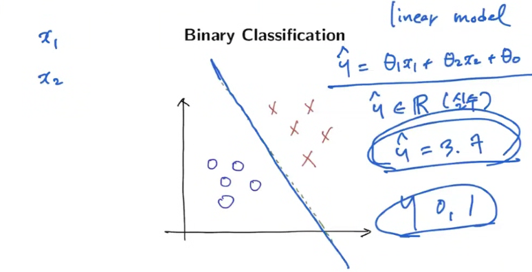
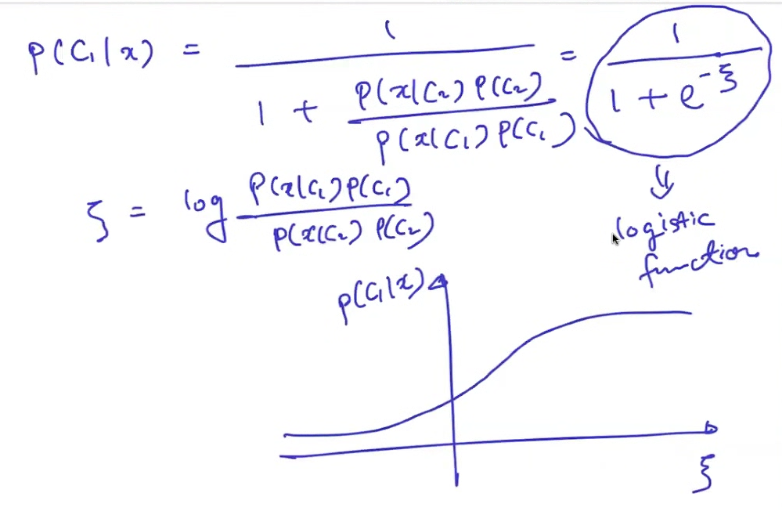
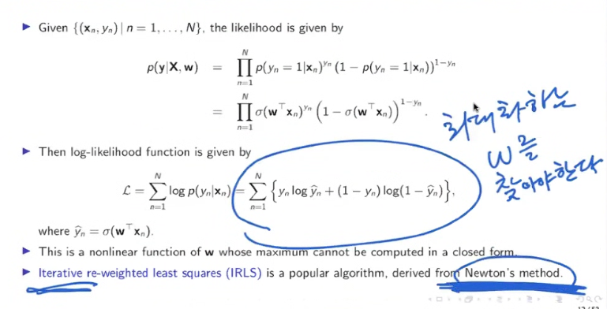
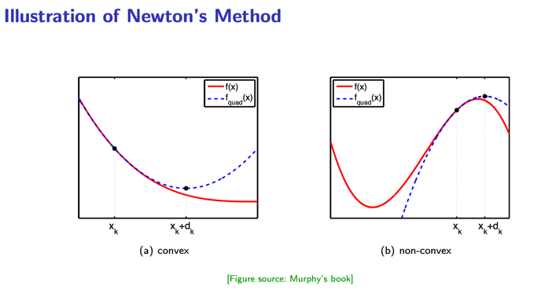

# 11일차 - 250716

# 🔍 Linear Regression: Explainability

## 📌 Feature Importance (t-statistic)

* 계수의 중요도는 해당 계수의 **표준 오차로 정규화된 값**, 즉 **t-통계량**으로 측정합니다:

$$
t_j = \frac{\hat{\theta}_j}{SE(\hat{\theta}_j)}
$$

* 특성의 중요도는 \$|t\_j|\$ 의 절댓값이 클수록 중요도가 높다고 해석할 수 있습니다:

$$
\text{Importance of feature } j = |t_j| = \left| \frac{\hat{\theta}_j}{SE(\hat{\theta}_j)} \right|
$$

## 🚲 Example: Bike Rentals Dataset for Regression

* 목표: **날씨와 요일에 따라 자전거 대여 수요를 예측**
* 사용된 특성들:

  * 자전거 수(cnt): target 값
  * 계절(season): 봄, 여름, 가을, 겨울
  * 공휴일 여부
  * 주말 여부
  * 날짜로부터의 경과 일수(days\_since\_2011)
  * 날씨 정보 (good, mist, rain/snow/storm 등)
  * 기온(°C), 습도(%), 풍속(km/h)

Molnar's IML book 기반 예제

## 📊 예측 예시 해석

- 특정 일자의 선형 회귀 계수 예시:

| Feature | Weight | SE | t |
|---------|--------|------|------|
| (Intercept) | 2399.4 | 238.3 | 10.1 |
| seasonSUMMER | 899.3 | 122.3 | 7.4 |
| seasonFALL | 138.2 | 161.7 | 0.9 |
| seasonWINTER | 425.6 | 110.8 | 3.8 |
| holidayHOLIDAY | -686.1 | 203.3 | 3.4 |
| workingdayWORKING DAY | 124.9 | 73.3 | 1.7 |
| weathersitMISTY | -379.4 | 87.6 | 4.3 |
| weathersitRAIN/SNOW/STORM | -1901.5 | 223.6 | 8.5 |
| temp | 110.7 | 7.0 | 15.7 |
| hum | -17.4 | 3.2 | 5.5 |
| windspeed | -42.5 | 6.9 | 6.2 |
| days_since_2011 | 4.9 | 0.2 | 28.5 |

- **수치형 변수 해석**: 기온이 1도 오르면 대여 수요가 110.7 증가 (다른 변수 고정)
- **범주형 변수 해석**: 나쁜 날씨일 경우 대여 수요가 평균적으로 1901.5명 감소

## 📈 Effect Plot

$$
\text{Effect}_{j,n} = \theta_j x_{j,n}
$$

* 각 특성이 예측에 얼마나 기여했는지를 시각화
* 예: 기온과 날짜 경과 일수(days\_since\_2011)가 큰 영향 미침

## 👤 Explain Individual Predictions

특정 인스턴스:

| Feature           | Value       |
| ----------------- | ----------- |
| season            | SPRING      |
| yr                | 2011        |
| mnth              | JAN         |
| holiday           | NO HOLIDAY  |
| weekday           | THU         |
| workingday        | WORKING DAY |
| weather           | GOOD        |
| temp              | 1.6043656   |
| hum               | 51.8261     |
| windspeed         | 6.000688    |
| cnt               | 1606        |
| days\_since\_2011 | 5           |

예측값: 4504 / 실제값: 1606 → **고편향(high bias)** 예시

## 📉 Individual Effect Plot

* 각 feature의 예측 기여값을 시각화한 그래프
* 실제 값, 평균 예측, 예측 기여를 시각적으로 보여줌

## 🧪 LASSO: Feature Selection

### LASSO with 2 Features

| Feature           | Weight |
| ----------------- | ------ |
| temp              | 52.33  |
| days\_since\_2011 | 2.15   |
| others            | 0.00   |

### LASSO with 5 Features

| Feature                 | Weight  |
| ----------------------- | ------- |
| seasonSPRING            | -389.99 |
| weather=RAIN/SNOW/STORM | -862.27 |
| temp                    | 85.58   |
| hum                     | -3.04   |
| days\_since\_2011       | 3.82    |

* 필요없는 변수는 0으로 만들고, 핵심 feature만 남김

출처: Molnar's IML book

---

# Logistic Regression

- 개요
  - 중요한 알고리즘
  - Binary Classification - 이진분류를 위한것

- 종류
  - Binary classification & logistic function
  - Logistic regression
    - Maximun likelihood formulation
    - Newton's method
    - Iterative re-weighted least squares (IRLS) algorithm
    - Generalized linear model
  - Softmax regression
  - Cross-entropy error
  - Multi-label learning

---

# Binary Classification

* 이진 분류 문제는 두 개의 클래스 \$\mathcal{C} = {C\_1, C\_2}\$ 중 하나에 속하도록 분류하는 문제입니다.
* 주어진 입력 \$\mathbf{x}\$에 대해 베이즈 정리를 사용하여 사후확률(posteriors)을 계산합니다:

$$
P(C_1|\mathbf{x}) = \frac{P(\mathbf{x}|C_1)P(C_1)}{P(\mathbf{x})}
= \frac{P(\mathbf{x}|C_1)P(C_1)}{P(\mathbf{x}|C_1)P(C_1) + P(\mathbf{x}|C_2)P(C_2)}
= \frac{1}{1 + \frac{P(\mathbf{x}|C_2)P(C_2)}{P(\mathbf{x}|C_1)P(C_1)}}
= \frac{1}{1 + \exp \left( - \log \frac{P(\mathbf{x}|C_1)}{P(\mathbf{x}|C_2)} - \log \frac{P(C_1)}{P(C_2)} \right)}
$$

### 예제
- Medical diagnosis: Disease or no disease
- Cancer diagnosis: Benign or mallignant
- Image classification: Cat or dog
- Image classification: Face or non-face
- Image classification: Foreground or background
- Sentiment analysis: Positive or negative
- Name entity recognition: Name or not
- Speech or audio: Voice or not

---

#  Logistic Function

## 🔄 Logistic Function 표현

* 위 결과는 시그모이드 형태의 로지스틱 함수로 표현 가능합니다:

$$
P(C_1|\mathbf{x}) = \frac{1}{1 + e^{-\xi}}
$$

* 여기서:

$$
\xi = \log \left( \frac{P(\mathbf{x}|C_1)}{P(\mathbf{x}|C_2)} \right) + \log \left( \frac{P(C_1)}{P(C_2)} \right)
$$

* 첫 번째 항은 likelihood ratio, 두 번째 항은 prior ratio

## 📐 Multivariate Gaussian Model 가정

* 클래스 조건부 확률 \$P(\mathbf{x}|C\_k)\$를 공통 공분산 행렬 \$\Sigma\$를 가진 다변량 정규분포로 가정:

$$
P(\mathbf{x}|C_i) = \frac{1}{(2\pi)^{d/2} |\Sigma|^{1/2}} \exp \left( -\frac{1}{2} (\mathbf{x} - \mu_i)^T \Sigma^{-1} (\mathbf{x} - \mu_i) \right)
$$

* 이를 대입하여 계산하면 다음과 같은 로지스틱 회귀 형태 유도:

$$
P(C_1|\mathbf{x}) = \frac{1}{1 + \exp \left( - (\mathbf{w}^T \mathbf{x} + b) \right)}
$$

* 여기서:

$$
\mathbf{w} = \Sigma^{-1} (\mu_1 - \mu_2), \quad
b = \frac{1}{2}(\mu_2^T \Sigma^{-1} \mu_2 - \mu_1^T \Sigma^{-1} \mu_1) + \log \left( \frac{P(C_1)}{P(C_2)} \right)
$$

## 📈 Logistic Function의 성질

* 시그모이드 함수 \$\sigma(\xi) = \frac{1}{1 + e^{-\xi}}\$ 의 성질:

  * \$\sigma(\xi) \to 0\$ as \$\xi \to -\infty\$
  * \$\sigma(\xi) \to 1\$ as \$\xi \to +\infty\$
  * \$\sigma(-\xi) = 1 - \sigma(\xi)\$
  * \$\frac{d}{d\xi} \sigma(\xi) = \sigma(\xi)(1 - \sigma(\xi))\$

---

# 🔍 Logistic Regression

## 📘 개요

* **Logistic Regression**은 대표적인 이진 분류(Binary Classification) 알고리즘
* 출력값 \$y \in {0, 1}\$ 에 대한 조건부 확률 \$P(y|\mathbf{x})\$ 를 직접 모델링하는 **Discriminative Model**
* 확률 분포로는 **Bernoulli 분포**, 출력 함수로는 **시그모이드(로지스틱) 함수** 사용

$$
\mathbb{E}[y | \mathbf{x}] = P(y = 1 | \mathbf{x}) = \sigma(\mathbf{w}^T \mathbf{x}) = \frac{1}{1 + e^{-\mathbf{w}^T \mathbf{x}}}
$$

## 🧮 Maximum Likelihood Estimation (MLE)

* 학습 데이터: \${(\mathbf{x}*n, y\_n)}*{n=1}^N\$
* Bernoulli 분포 기반으로 likelihood를 구성하면:

$$
p(\mathbf{y}|\mathbf{X}, \mathbf{w}) = \prod_{n=1}^{N} \sigma(\mathbf{w}^T \mathbf{x}_n)^{y_n} (1 - \sigma(\mathbf{w}^T \mathbf{x}_n))^{1 - y_n}
$$

* 로그 가능도 함수:

$$
\mathcal{L}(\mathbf{w}) = \sum_{n=1}^N \left[ y_n \log \hat{y}_n + (1 - y_n) \log(1 - \hat{y}_n) \right], \quad \hat{y}_n = \sigma(\mathbf{w}^T \mathbf{x}_n)
$$

> 로그 가능도를 최대화하는 방향으로 학습함

## ⚙️ 최적화: Newton's Method & IRLS

- 미분 1번: 경사  Slope - Gradient Descent(경사 하강법)
- 미분 2번: Curvature 

### 🚀 Gradient Descent (경사 하강법)

- **목적:** 함수 \( J(w) \)를 최소화
- **업데이트 공식:**
  \[
  w_{k+1} \leftarrow w_k - \alpha \nabla J(w_k)
  \]
- **설명:**
  - \( \nabla J(w_k) \): 1차 미분, 즉 **기울기 (slope)**
  - \( \alpha \): 학습률 (learning rate)
  - 기울기를 따라 함수값이 줄어드는 방향으로 이동
  - 단순하지만 수렴 속도는 느릴 수 있음

### 🔹 Newton’s Method (뉴턴 방법)

- **목적:** 더 빠르게 최적값에 수렴
- **업데이트 공식:**
$$
  \[
  w_{k+1} \leftarrow w_k - \alpha \left[ \nabla^2 J(w_k) \right]^{-1} \nabla J(w_k)
  \]
$$
- **설명:**
  - $ ( \nabla J(w_k) ) $: 1차 미분 → 기울기
  - $ ( \nabla^2 J(w_k) ) $: 2차 미분 → **곡률 (curvature)**, 즉 헤시안 행렬
  - 기울기 + 곡률 모두 고려하여 더 정확한 방향과 크기로 이동
  - 계산 비용은 높지만 빠른 수렴 가능

* 2차 테일러 전개를 기반으로 한 이차 최적화 기법

$$
\mathbf{w}^{(t+1)} = \mathbf{w}^{(t)} - [\nabla^2 J(\mathbf{w}^{(t)})]^{-1} \nabla J(\mathbf{w}^{(t)})
$$

* $J(\mathbf{w})$는 음의 로그 가능도(negative log-likelihood)

### ✅ 차이점 비교

| 항목              | Gradient Descent                | Newton's Method                      |
|-------------------|----------------------------------|--------------------------------------|
| 사용 미분         | 1차 미분 (Gradient)             | 1차 + 2차 미분 (Gradient + Hessian) |
| 수렴 속도         | 느림                             | 빠름                                 |
| 계산 비용         | 낮음                             | 높음 (헤시안 역행렬 계산 필요)       |
| 적용 가능성       | 고차원 문제에 유리              | 고차원 문제에서는 부담될 수 있음     |

### 🔹 Iterative Re-weighted Least Squares (IRLS)

* Newton's Method를 선형회귀 형태로 계산
* 다음과 같은 선형 시스템으로 정리됨:

$$
\mathbf{w}_{t+1} = (\mathbf{X}^T \mathbf{S}_t \mathbf{X})^{-1} \mathbf{X}^T \mathbf{S}_t \mathbf{z}_t
$$

* 여기서:

  * $\mathbf{S}\_t$는 대각 행렬로 예측값 기반 가중치
  * $\mathbf{z}\_t$는 working response vector

## 🧩 Generalized Linear Model (GLM) 관점

* **GLM**은 선형 모델을 확률 분포 관점으로 확장한 개념

* 3가지 요소로 구성됨:

  1. 출력 변수의 분포 (지수 가족: 예. Bernoulli, Gaussian 등)
  2. 선형 예측기 \$\eta = \mathbf{w}^T \mathbf{x}\$
  3. 링크 함수 \$g(\mathbb{E}\[y]) = \eta\$

* Logistic Regression은 다음 구성에 해당:

  * 분포: Bernoulli
  * 링크 함수: logit (\$\log \frac{\mu}{1 - \mu}\$)
  * 역 링크 함수: 시그모이드

## 🔄 다중 클래스 확장: Softmax Regression

* 클래스가 \$K > 2\$ 개인 경우 사용
* 각 클래스 \$k\$에 대해:

$$
p(y = k | \mathbf{x}) = \frac{\exp(\mathbf{w}_k^T \mathbf{x})}{\sum_{j=1}^K \exp(\mathbf{w}_j^T \mathbf{x})}
$$

* Cross-entropy loss를 사용하여 학습:

$$
\mathcal{L} = -\sum_{n=1}^N \sum_{k=1}^K y_{nk} \log p(y = k | \mathbf{x}_n)
$$

* Multiclass one-hot 레이블 \$\mathbf{Y} \in \mathbb{R}^{N \times K}\$를 사용
* Softmax 회귀도 Newton’s method나 IRLS로 최적화 가능

---

## 🏷️ 기타 확장

* **Cross-Entropy Error**: Bernoulli 또는 softmax 출력에 공통적으로 사용되는 손실 함수
* **Multi-label Learning**: 독립적인 여러 binary classifier를 병렬로 학습하는 형태

---

# Multi-Label Learning (멀티레이블 분류)
- 입력 하나에 여러 레이블이 동시에 붙는 문제 (예: dog, sand, sky)
- 출력 벡터 예:
$$
  \[
  \mathbf{y} = [1, 0, 1, 1, 0]
  \]
$$
- 각 클래스마다 독립적인 로지스틱 회귀 수행
- Loss (Binary Cross Entropy for each label):
$$
  \[
  \mathcal{J} = \frac{1}{N} \sum_{n=1}^{N} \sum_{k=1}^{K} \left[ - y_{k,n} \log \hat{y}_{k,n} - (1 - y_{k,n}) \log (1 - \hat{y}_{k,n}) \right]
  \]
  where \( \hat{y}_{k,n} = \sigma(\mathbf{w}_k^\top \mathbf{x}_n) \)
$$
- 일부 항목이 '?'로 미정인 경우 제외하고 계산

